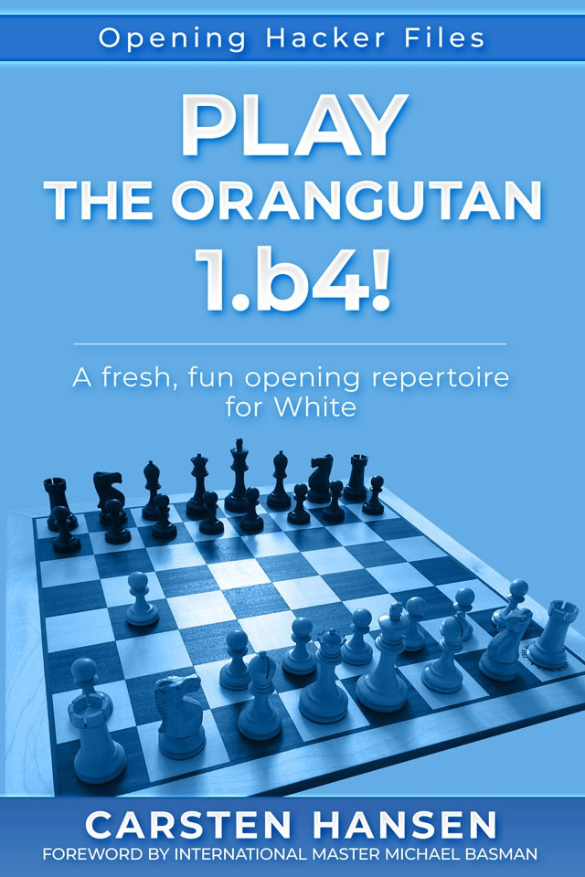

# Дебют орангутанга 1.b4

Карстен Хансен - Дебют орангутанга: 1.b4

[Содержание](contents.md)

Как автор книги взял, казалось бы, безобидный и эксцентричный дебют и набрал 70% очков в своих партиях с ним, в том числе 75% против гроссмейстеров?

Он начал играть орангутангом и за несколько месяцев прошел путь от любопытствующего до увлеченного орангутангом, и по мере дальнейшего изучения дебюта результаты становились все лучше и лучше!

В этой книге автор предлагает полный репертуар, начиная с 1.b4, репертуар, который заставит черных:

* думать самостоятельно с самого начала игры,
* столкнуться с незнакомыми расстановками, структурами и идеями,
* вести нелегкую борьбу.

Благодаря работе автора, в дебют были внесены многочисленные новые идеи и концепции, а также бесчисленные улучшения существующей теории и рекомендации о том, как справиться с наиболее распространенными попытками защиты черных.

Орангутанг, 1.b4, также известен как дебют Сокольского, соответственно названный так по ласковому имени, данному дебюту гроссмейстером Савеллием Тартаковером в 1924 году после посещения нью-йоркского зоопарка Центрального парка, или по имени главного исследователя и практикующего дебют Алексея Сокольского. Дебют бросает вызов обычным традициям, начиная мгновенную атаку на ферзевый фланг черных с самого начала партии, и приводит к интересной игре, где оба игрока с самого начала вынуждены играть творчески.

В этой книге опытного шахматного автора Карстена Хансена представлен репертуар для белых, который поможет сориентироваться в многочисленных хитрых альтернативах черных и привести белых к позиции игры на выигрыш.
