# Глава 1: 1...e5 – Вариант размена

Мы начнем теоретический обзор с линии, которую играют чаще других, как в моих партиях, так и в партиях других игроков - с разменного варианта. Стоит сразу оговориться, что если черные выбирают эту линию, это не значит, что они что-то подготовили; скорее всего, это происходит потому, что она выглядит "нормально", а для достижения играбельной позиции требуются быстрые развивающие ходы.

**Незначительные линии**

**1.b4 e5 2.Bb2**

Должен отметить, что у белых, конечно, есть дополнительная возможность того, что в Базе дебютов _Lichess_ называется _атакой Бугаева_ (подробнее о Бугаеве во Введении). Тем не менее, я называю ее **защитой Басмана** или атакой **Святого Георгия** (многие помнят защиту Святого Георгия 1.e4 a6 2.d4 b5, которую английский гроссмейстер Тони Майлз использовал для победы над действующим чемпионом мира Анатолием Карповым в 1980 году), а именно 2.a3. Это вполне играбельный вариант для белых. Единственная попытка черных продемонстрировать какое-то превосходство в дебюте - 2...d5, но даже в этом случае далеко не очевидно, что черные должны быть лучше, поскольку белые могут пользоваться многими преимуществами "орангутанга" без особых минусов:

**A) 3.e3** - настоящая атака Святого Георгия, и теперь:

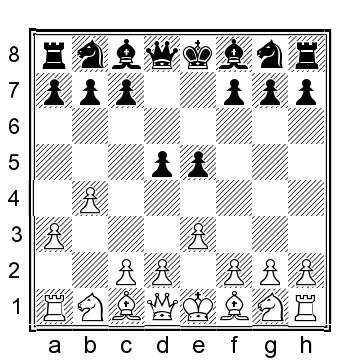

a) 3...Be6 4.Bb2 f6 с переходом на 3.Bb2 f6 4.e3 Be6 ниже.

b) 3...a5 4.Bb2 Nd7 5.c4 axb4 6.axb4 (белые попали в беду после 6.Nf3 e4 7.Nd4 Ngf6 8.axb4 Rxa1 9.Bxa1 Bxb4 в партии Басман - Копец, Лондон 1979) 6...Rxa1 7.Bxa1 Bxb4 8.cxd5 с шансами для обеих сторон.

c) 3...c5 4.Bb2 f6 5.bxc5 Bxc5 6.d4 exd4 7.Bxd4 Bxd4 8.Qxd4 Nc6 9.Qb2 когда у обеих сторон менее чем идеальная пешечная структура, но в перспективе слабость ...f7-f6 может создать проблемы для черных.

d) 3...c6 4.Bb2 Bd6 5.Nf3 Nd7 6.c4 Ngf6 - еще одна перестановка.
e) 3...Nf6 4.Bb2 Bd6 5.c4 c6 6.Nf3 Nbd7

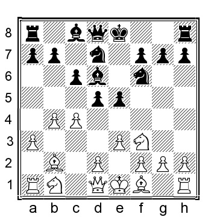

(другая попытка - 6...Qe7 7.cxd5 cxd5 8.Nc3 a6 9.Na4!?? (9.d4 e4 10.Ne5 Nbd7 11.Nxd7 Bxd7 было лучше для черных в онлайн блице) 9...Nbd7 10.Be2 (но не 10.Nh4 g6) 10...0-0 11.0-0 с шансами для обеих сторон), и здесь:

e1) 7.cxd5 cxd5 8.Nc3 (или 8.Be2 e4 9.Nd4 Ne5, S.Schweber-Bulcourf, Lomas de Zamora 1995, и сейчас 10.Qb3 Bb8 11.Nc3 привело бы к интересной позиции с шансами для обеих сторон) 8. ...0-0 (другой вариант 8...a6 9.Qb3 (9.Be2 0-0 10.0-0 (10.Rc1?! b6 11.0-0 Qe7 12.Nh4 Qe6 13.Nf3 Bb7 14.Qb3 Rfc8 и шансы примерно равны, Luzuriaga-Royer, CADAP corr 2000) 10. ...Re8 11.Rc1 Nf8 12.Na4 Ng6 13.d3 h5 14.Nd2 h4 выглядит неплохо для черных Кутузов - Джумабаев, Москва 2011) 9...Nb6 10.Na4 Nxa4 11.Qxa4+ Bd7 12.Qb3 Qe7 13.Be2 0-0 14.0-0 h6 15. d3 Bb5 16.a4 Bd7 с шансами для обеих сторон) 9.Rc1 Re8 10.Qb3 d4 11.Ne2 dxe3 12.dxe3 Nf8 13.Ng3 Be6 14.Bc4 Bxc4 15.Rxc4 и белые получили хорошую позицию в онлайн-блиц партии.

e2) белым, вероятно, следует держаться подальше от 7.d4! e4 8.Nfd2 Nf8!? 9.h3 (или 9.Nc3 Ng6 10.Qb3 Bc7 11.h3 0-0 12.a4 Be6 13.g3 Re8 14.cxd5 cxd5 15.a5 Rc8 дало черным очень удобную позицию в партии Ваструхин - Григорянц, Воронеж 2014) 9. ...Ng6 10.Nc3 0-0 11.g3 Re8 12.c5 Bc7, когда перспективы черных на королевском фланге были явно лучше, чем у белых на ферзевом, Бернадский - Кузубов, Львов 2017.

e3) 7.Be2 0-0 8.0-0 Qe7 9.d3 Re8 10.Nc3 a6 11.Qb3 dxc4 12.Qxc4 Nf8 13.Ne4 Nxe4 14.Qxe4 f5 15.Qh4 Qxh4 16.Nxh4 Be6 было Ooi-Buchenau, Chess.com INT 2020, а теперь 17.e4!? дало бы белым преимущество.

e4) 7.Nc3 0-0 (или 7...dxc4 8.Bxc4 0-0 9.Qc2 Qe7, и здесь у белых интересная идея: 10.Ng5 Nb6 11.Ba2 g6 12.h4 Bf5 13.Nce4 Nxe4 14.Nxe4 с примерно равными шансами, но сейчас черные ошиблись с 14...Rad8? 15.h5 Nd7 16.g4 Bxg4 17.hxg6 hxg6 18.Nc5 Kg7 19.Nxb7 Rh8 20.Rg1 Qh4 21.Qc4 и белые выигрывали в партии Шмиттдиль - Медунова, Лихтенштейн 1994) 8.Be2 Re8 9.d3 Nf8 10. Rc1 Ng6 11.cxd5 cxd5 12.Nb5 Bb8 13.Qc2 Bd7 14.Nc7 Ba4 15.Qxa4 Bxc7 16.0-0 Bd6 17.Rfd1 h5 18.Qb3 с выгодной позицией для белых, как проверено в онлайн партии.

**B) 3.Bb2** - более "орангутанговый" выбор для белых. Теперь черные попробовали несколько вариантов:

a) 3...d4?! 4.Nf3 Nd7 5.e3 dxe3 6.dxe3 устраивает белых.

b) 3...f6 - естественная альтернатива: 4.e3 Be6 5.d4 (5.Nf3 переставляется), и здесь:

b1) 5...e4 6.Nh3 f5 (6...Bxh3 7.Qh5+ g6 8.Qxh3) 7.c4 c6 8.Nc3 Nf6, когда белые могут сыграть 9.c5 (или 9.Qb3) 9...Be7 10.b5 (или 10.a4) 10...h6 11.Nf4 Bf7 12.h4 с шансами для обеих сторон, но где я предпочитаю белых.

b2) После 5...Nd7 я предпочитаю 6.dxe5!? (думаю, черные получают хорошую игру после 6.Nf3 Bd6?! (6...e4!? - лучший ход) 7.dxe5 (7.c4 dxc4 8.d5 Bf7 9.Bxc4 Ne7 10.e4 0-0 11. Nc3 a5 хорошо для черных) 7...fxe5 8.Nbd2 с шансами для обеих сторон) 6...fxe5 (6...Nxe5 7.Nd2 Bd6 8.f4 (или более подходящий вариант 8.Ngf3 Ne7 9.c4 Nxf3+ 10.Nxf3 dxc4 11.Rc1 c3 12. Bxc3 0-0 13.Bd3 Qd7 14.Qc2 с явным позиционным перевесом у белых в партии Д.Мюллер-Понтоппидан, ICCF email 2016) 8...Ng4 (или 8...Nc4 9.Bxc4 dxc4 10.Qh5+ Bf7 11. Qg4 выглядит перспективно для белых) 9.Qf3 и позиция белых выглядит более гармонично, в частности, конь на g4 немного странным) 7.Nf3 Bd6 8.Nbd2 Ngf6 9.c4 c6 10.cxd5 (или 10.Qc2!? 0-0 11.Ng5 Qe7 12.Be2 g6? (12...e4 было гораздо лучшим выбором) 13.Nxe6 Qxe6 14.e4 Rac8 15.cxd5 cxd5 16.Qb3 и у белых явное преимущество в партии Зильберман-Бреннер, Тель-Авив 2011) 10. ..Bxd5 11.Nc4 Qe7 12.Nxd6+ Qxd6 13.Qc2 0-0 14.Be2 давало белым неплохую позицию в партии Летцельтер - Хедин, Херсониссос 2017.

c) 3...Nd7, с очередным раздвоением на пути:

c1) 4.Nf3 Bd6 (4...e4!?? 5.Nd4 Ngf6 6.e3 c6 7.c4 (Стандартный прорыв пешки) 7...dxc4 8.Bxc4 Ne5 9.Be2 Bd6 10.Qc2 с острой позицией, где белые должны быть немного осторожны со своими светлыми клетками, но в остальном имеют отличные шансы) 5.e3 c6 (или 5...f5?! 6.c4 c6 7.cxd5 cxd5 8.Nc3 Ne7 9.Qb3 Nf6 10.Nb5 e4 11.Nxd6+ Qxd6 12.Nd4 Bd7 13.b5 и у белых позиционно намного лучше; отсутствие чернопольного слона станет большой проблемой для черных, Кутузов - Кузнецов, Москва 2011) 6. c4 Ne7 7.Nc3 0-0 8.cxd5 cxd5 9.Qb3 e4 10.Nd4 Nf6 11.Rc1 Bd7 12.Be2 Rc8 13.0-0 Bg4 было сыграно в партии В.Алексеев - Дрямин, Санкт-Петербург 2000, и теперь 14.h3 Bxe2 15.Ncxe2 было бы удачнее для белых.

c2) Критической альтернативой является 4.e3 Ngf6, и сейчас:

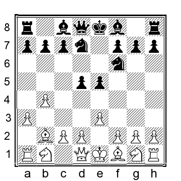

c21) 5.Nf3 Bd6 6.d4 (или 6.c4 dxc4 (6...c6 переходит к линиям, которые мы рассматривали после 3.e3) 7.Bxc4 0-0 8.Qc2 Qe7 9.Nc3 a5 10.b5 Nc5 11. d4 Ncd7, как в партии Poley-J.Akesson, Gothenburg 2004, и здесь белые могли рассмотреть 12.Ng5!? h6 13.Nd5 Qe8 14.dxe5 Bxe5 15.Nxc7!? (15.Nxf6+ Nxf6 16.Nf3 менее компромиссно) 15...Bxc7 16.Nxf7 Rxf7 17.Bxf7+ Qxf7 18.Qxc7 Nd5 19.Qd6 и с ладьей и двумя пешками за две второстепенные фигуры у белых все должно быть в порядке) 6...Qe7 7. c4 c6 8.Nc3 0-0 9.cxd5 cxd5 10.dxe5 Nxe5 11.Nxd5 Nxd5 12.Qxd5 Be6 (12...Rd8!?) 13.Qd4 f6 14.Be2 Rfd8? (14...Rac8!?) 15.Qh4 Ng6 16.Qe4 и у белых лишняя пешка, Xiong-Gupta, Chess.com INT 2015.

c22) 5.c4, с другим набором вариантов:

c221) 5...a5 6.c5 g6 7.Nf3 e4 8.Nd4 Bg7 9.h3 Ne5 10.Be2 0-0 11.Nc3 Nh5 12.Qb3 axb4 13.axb4 Rxa1+ 14.Bxa1 c6 с шансами для обеих сторон, Feist Verhoeven-Pirs, Remote email 2012;

c222) 5...c5 6.cxd5 cxb4 7.Nf3!? (думаю, это лучше, чем 7.axb4 Bxb4 8.Nc3 (можно рассмотреть 8.Bxe5!?) 8 0-0 9.Bc4 Nb6 10.Qb3 Bxc3 11.Bxc3 Nxc4 12.Qxc4 Nxd5 13.Bxe5 Be6 и у белых проблемы, Ваструхин-Журихин, Воронеж 2010) 7...Bd6 8.axb4 Nxd5 9.b5 с типичной позицией орангутанга, где я предпочитаю белых, но где шансы более или менее равны.

c223) 5...c6 6.Qb3 (6.Nf3 переходит к линии 3.e3 выше) 6...a5 (6 Bd6!?) 7.cxd5 cxd5?! (7...Nxd5!?) 8.Nc3 axb4 9.axb4 Rxa1+ 10. Bxa1 d4 11.Bc4 Qe7 12.Nb5 dxe3 13.fxe3 Qxb4 14.Bxf7+ Kd8 15.Nf3 Ne4 16.0-0 Qxb3 17.Bxb3 - ужасно для черных, Пасиев-Бивол, Санкт-Петербург 2014.

**2...e4**

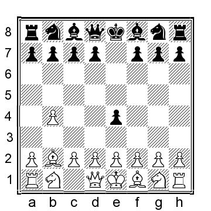

Этот ход выглядит несколько нелепо, потому что он без особых оснований продвигает пешку вперед на территорию противника, где ей вскоре понадобится защита. В то же время, черные больше не угрожают взятием на b4, потому что белые возьмут непосредственно на g7. Конечно, обе эти "проблемы" решаются, если черные сыграют ...Nf6.

Частой ошибкой новичков является 2...Nc6?, при этом пешка теряется после 3.b5 Удивительно, но более чем в 10% партий с ошибкой потери пешки черными, белые не понимают, что возможность выиграть материал существует. (и играют 3.a3 или 3.e3) 3...Nd4 4.e3, и теперь пешка на b5 защищена, а конь вынужден уйти с d4, позволяя белым взять пешку e5... 4...Ne6 5.Bxe5. Против игроков с более низким рейтингом я несколько раз сталкивался с этой ошибкой. Довольно интересно, что в шахматах я видел партии с игроками с рейтингом выше 2600, которые допускали эту ошибку... Нам не нужно анализировать это дальше, так как черные потеряли пешку без тени компенсации.

A) Другая попытка - 2...d5 3.Bxe5, а теперь 3...Nc6

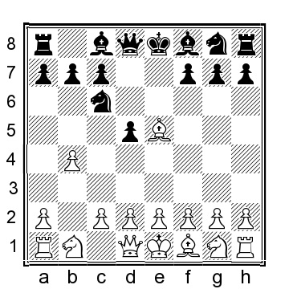

(3...f6?! should not be played as 4.Bc3 d4 5.Bb2 Bxb4 6.Bxd4 Qxd4 7.c3 gives White a clear advantage) 4.Bb2 Nxb4 5.a3 Nc6 (Another try is the peculiar-looking 5...Na6 6.e3 Nc5 (Black aims to control the e4–square with his knights) 7.Nf3 c6 8.d4 (8.Be2 to keep d2–d4 in reserve is also entirely possible) 8...Ne4 9.Bd3 Ngf6 10.0-0 Bd6 11.Ne5 Qb6 12.Qc1 Qc7 13.Nd2 Nxd2 14.Qxd2 Ne4 (14...Be6 15.f4 gives White something resembling a Colle Attack where White has exchanged the b-pawn for Black’s e-pawn, something that does not happen in Colle; I think White chances are preferable) 15.Qe2 and with the option of breaking with c2–c4, White has the somewhat better chances, Hess-Yordanova, ICCF email 2018) 6.e3 Nf6 7.Nf3, and here Black has tried several of alternatives:

a) 7...Be7 8.c4 0-0 9.cxd5 Nxd5 10.d4 and White has an extra pawn in the center and better chances.

b) 7...Na5!?, making it more difficult for White to play c2–c4 and thus preventing the direct exchange of another of Black’s central pawns 8.d3 Be7 9.c4 0-0 (9...dxc4 10.Qa4+ c6 11.dxc4 0-0 12.Nbd2 is probably also close to even though I prefer White’s position) 10.cxd5 (or 10.Qc2 c5 11.Be2 with about even chances) 10...Qxd5 (10...Nxd5!? may improve) 11.Nc3 Qh5 12.d4 Be6 13.Be2 Nc4 14.Qc2 Qa5 15.0-0 Nxb2 16.Qxb2 with a small plus for White who has a nice center whereas Black has the bishop pair, Myrberg-Rohde, Poland 2001.

c) 7...Bd6 (the natural square for the bishop) but 8.c4 0-0 9.d4 Bf5 10.Nbd2 Re8 11.Be2 a6 12.0-0 Rb8 13.Rc1 dxc4 14.Nxc4 and with his extra central pawn, White has the better chances, Poschmann- J.Rodriguez, IECC email 2003.

B) 2...Qf6?! The queen is poorly placed on this square, but it is not an outright mistake, nor does it lose material. 3.Nf3 Nc6 4.b5 Nd4 5.Nxd4 exd4 6.c3!? Bc5 7.cxd4 Bxd4 8.Bxd4 Qxd4 9.Nc3 White has a clear advantage thanks to a small lead in development, the ability to quickly mobilize the remainder of the pieces to start creating threats.

C) 2...Qe7!? Another peculiar-looking move, but this move makes a lot more sense than the
previously covered queen move. 3.b5 d5!

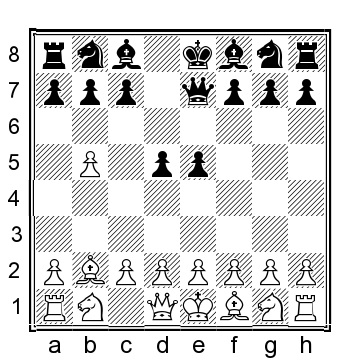

(Best! A player named Ziese has instead opted for 3...f5 instead, for instance, 4.e3 Nf6 5.Be2 d6 6.c4, and we have reached some kind of English Opening where Black has spent time on the unproductive ...Qe7 and White has the better chances. If Black wanted this kind of set-up, then 1.b4 e5 2.Bb2 d6 followed by ...f7–f5 is a better choice. 3...Qb4?! Black should not play this. 4.Bxe5 d6 5.Bc3 Qxb5 6.Nf3 gives White a pleasant edge due to Black’s vulnerable queen) 4.e3 Nf6 5.Nf3 e4 6.Nd4 a6 7.a4 axb5 (or 7...c5 8.bxc6 bxc6 9.Nb3 c5 10.d3 where Black has invested a lot of time in pushing pawns but is actually doing rather well) 8.axb5 Rxa1 9.Bxa1 Nbd7 10.d3 Qe5 11.Nd2 with chances to both sides. Black has to be on the alert to various discovered threats against the queen on e5, but otherwise, Black is doing okay. 2...Bd6 Another ridiculous-looking move, but the idea is to scoot the bishop back to c7 after playing ...c7–c6. 3.c4 c6 4.Nf3 Qe7 5.a3 Nf6 (or 5...Bc7 6.e3 d6 7.d4 e4 8.Nfd2 f5 9.Be2 Nd7 10.Nc3 and White is marginally better, but, of course, Black’s position is entirely playable) 6.e3 Bc7 7.Nc3 (or 7.d4 d6 (7...e4!?) 8.Be2 0-0 9.Nc3 Nbd7 10.d5 and White has a small plus; Black has opted for some sort of Old Indian style set-up where the queen on e7 and the bishop on c7 have switched places, Schulze-Just, Nuremberg 2003) 7...0-0 8.Qc2 d6 9.Be2 Re8 10.0- 0, and White has no more than a tiny plus.

**3.c4 Nf6 4.a3**

White should avoid in this particular position, for example, 4.b5?! a6 5.a4 d5 6.cxd5 (or 6.e3?! Nbd7 7.cxd5 Nxd5 and Black has a good game; the d3–square can quickly become a problem after ...Nb4 and ...Nc5) 6...Nbd7 7.Nc3 Nc5 8.g3 Bf5 9.Bg2 Qd7 and Black has a good position, where White is somewhat cramped. The development of the remaining pieces is far from simple.

**4...a5**

Black is trying to force White to play b4–b5 to provide Black with access to the c5–square. An alternative is 4...c6 5.e3 d5 6.cxd5 (or 6.Nc3 Be7 7.Nge2 dxc4 8.Nd4 Nbd7 9.Bxc4 with an interesting position where both sides have a share of the chances) 6...cxd5 7.Bb5+ Nc6 8.Ne2 (or 8.d3 a5) 8...Bd6 9.d3 0-0 10.dxe4 dxe4 11.Bxc6 bxc6 12.Nd2 a5 13.Nc4 Bc7 with about equal chances.

**5.b5**

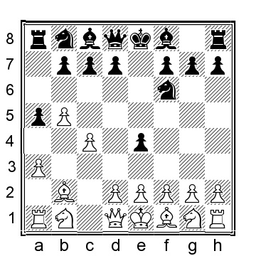

**5...d5**

Two alternatives are 5...Be7 6.e3 0-0 7.d4 c6 8.d5 cxd5 9.Nc3 d6 10.Nxd5 Nxd5 11.Qxd5 Bf6 12.Rb1 Bxb2 13.Rxb2 Qf6 14.Qd4 with a position that is objectively even as seen in Kural-J.Jensen, ICCF email 2018. 5...Bc5 6.e3 0-0 7.Nc3 Re8 8.Nge2 d6 9.Ng3 Nbd7 10.Qc2 Qe7 11.Be2 c6 as played in Lapshun-Papp, Budapest 2007, and now 12.0-0 would have been comfortably better for White.

**6.e3 Nbd7 7.cxd5 Nxd5**

Also, 7...Nc5 has been tried: 8.Nc3 Bf5 9.Bc4 Nfd7 10.Na4 Qg5 11.Kf1 h5 12.Nxc5 Bxc5 13.Qc2 Nb6 14.h4 Qg6 was Muri-Tsygankov, ICCF email 2012, and here 15.Bb3 Bd6 16.a4 would have given White a small plus, but it is clear that Black has decent compensation for the sacrificed pawn.

**8.d3 exd3 9.Bxd3 Nc5 10.Bc2!?**

This is better than 10.Be2 Bf5 11.Nf3 Nb6, which is fine for Black.

**10...Qd7 11.Qe2**

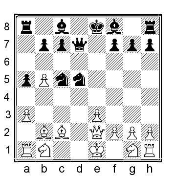

White protects the b5–pawn without allowing Black access to the b4–square and prepares the development of the remaining pieces.
11...Bd6 12.Nd2 0-0 13.Rd1 Nb6 14.Ngf3 and White had a pleasant position in Kural-Selen, ICCF email 2016.

**The Magnus Method**

**1.b4 e5 2.Bb2 Bxb4 3.Bxe5 Nf6 4.c3**

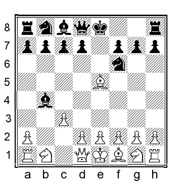

While this move is not new, the concept introduced by Magnus Carlsen in this variation is. White voluntarily hands over his bishop pair; in return, he gets a strong center. It is difficult for Black to use the bishop pair because the center is closed, and White decides when it should be opened. Also, with Black’s dark-squared bishop staring at a wall of white pawns on dark squares, sometimes c3–d4–e3– f2–g3–h2(or -h4), it is not a very good piece, and Black often struggles to figure out what to do with it.

**4...Be7**

Black has several alternatives that we need to discuss at this point:

a) 4...Ba5!?

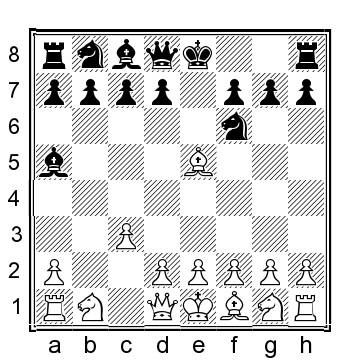

Considering the headaches Black occasionally face, when the bishop ends up on f6, this bishop retreat makes some sense, but this is only so if Black makes a concerted effort to find a use for it on the diagonal because sometimes it is just looking foolish on b6, staring at White pawns on d4–e3–f2, and being in a worse position than on f6. Now White has a few options:

a1) 5.Qa4!? Nc6 6.e3 d6 7.Bg3 Qe7 8.Bb5 Bd7 9.Nf3 Bb6 10.d4 Ne4 11.Qc2, and the chances are close to even, but his bishop on b6 looks quite ridiculous.

a2) 5.g3?! is a move that I have played on several occasions myself. Still, if Black follows up accurately, he gets a reasonable position where White has plenty of opportunities to go wrong. 5...0-0 (or the normal 5...d5 6.Bxf6 Qxf6 7.Bg2 Be6 8.e3 c6 9.Ne2 Nd7 10.d4 0-0 11.0-0 Bf5 12.Nd2 Rfe8 13.Re1 g5 14.Qc1 (or 14.Nb3 Bc7 and Black is ready to attack on the kingside) 14...Rac8 15.Qb2 a6 16.Nc1 c5 and Black has no reason to complain) 6.Bxf6 Qxf6 7.Nf3 Re8 8.Bg2 c5! (Making it difficult for White to play the desired d2–d4 and giving purpose to the bishop on a5, which, if all else fails, can slide back to c7) 9.0-0 Nc6 10.d4 (10.e3 d5 11.d4 Bg4 is annoying for White) 10...b6 and White has a hard time hanging on to his nice center; this line is the reason why I have stopped playing 5.g3.

a3) 5.e3!? 0-0 (If 5...Nc6 then 6.Bxf6 Qxf6 7.Nf3 Ne7 8.d4 0-0 9.Bd3), and here:

a31) 6.Qa4! (This queen move is better than the alternatives) 6...Nc6 7.Bxf6 (of course, White can also retreat with the bishop to g3, but I feel this is not ideal because White will struggle with than bishop if Black plays something like ...d7–d5, ...Ne4, followed by, at some point, ...h7–h5–h4, e.g., 7.Bg3 d5 8.Be2 Re8 9.Nf3 Ne4 10.0-0 a6 11.Rc1 h5 and Black has the initiative) 7...Qxf6 8.Nf3

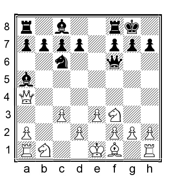

8...d5 (8...Qg6!? is interesting when White can consider 9.h4!? h6 10.h5 Qf5 11.Na3 Bb6 12.Nc4 Bc5 13.d4 d5 14.Ncd2 Bd6 with a position that is probably more or less equal; note how many moves Black have used on the dark-squared bishop, f8–b4–a5–b6–c5–d6, while White has spent a few moves to get the b1–knight to d2 via a3–c4) 9.d4 Bf5 10.Bb5 Bb6! (tempting but terrible is 10...Bxb1 11.Rxb1 Bxc3+ when Black has won a pawn, with a check(!), for the time being, but the bishop on c3 is in serious trouble: 12.Ke2 a5 13.a3 Na7 14.Qb3 Bb4 15.Bd3 Bd6 16.Qxd5 and White has a clear advantage) 11.0-0 Rfd8 12.Nbd2 Ne7 13.Be2 with a position that the computer assesses as approximately equal, but the computer really likes the bishop pair and routinely overestimates those bishops’ value. I like White’s position slightly more.

a32) 6.Bxf6?! Qxf6 7.Nf3 d5 8.Be2 c5 9.0-0 Bc7 10.d4 c4 11.Nbd2 (an improvement over 11.Na3? a6 12.Nc2 Bf5 13.Nd2 b5 14.Bf3 Qd6 15.g3 Ba5 where Black has a massive advantage in Lebel- Gluckman, Bled 2002) 11...Qe7 12.Qb1 a6 13.a4 f5 and White has a passive and depressing position.

a33) 6.Qf3 Ne8! 7.c4 c5 8.Bc3 Nc6! and Black has a lead in development and the overall better position.

b) 4...Nc6 is an interesting move that I have faced a couple of times, but White can reach a good position with accurate play, something I could not figure out until I had analyzed it more carefully: 5.d4!?

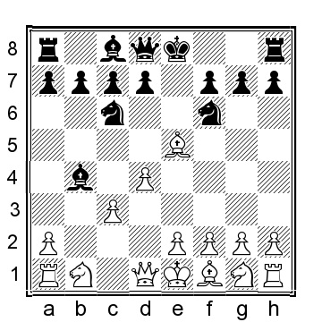

(I think this is best but also 5.Bxf6 is playable, e.g., 5...Qxf6 6.Nf3 d5 7.d4 Ba5 8.e3 Bf5 9.Bd3 0-0-0 10.Bxf5+ (10.0-0?! g5 gives Black the initiative) 10...Qxf5 11.a4 (the cheeky 11.Ke2 may, in fact, be better) 11...g5 12.Ra2 h5 13.Qc2 Qd7 14.Nbd2 with a sharp position and chances to both sides) 5...Ba5 (if 5...Be7 6.Bxf6 Bxf6 7.e3 d5, we are entering positions that White is striving for and that are covered below under 4...Be7) 6.Bxf6 Qxf6 7.e3, and now there are several options for Black:

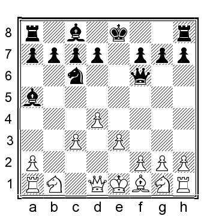

b1) 7...d5 8.Bd3 Be6 9.Ne2 0-0-0 10.Nd2 g5 11.Nb3 Bb6 12.a4 when I prefer White, but the chances are objectively more or less equal.

b2) 7...0-0 8.Bd3 Re8 (or 8...d5 9.Ne2 Ne7 10.Qc2 with an interesting fight ahead, but I prefer White’s position thanks to the extra central pawn) 9.Ne2 d5 10.Qc2! g6 (the other pawn push is almost certainly wrong, for instance, 10...h6?! 11.0-0 Be6 12.Nd2 Rad8 13.Ng3 g6 14.f4! (White achieves less with 14.e4 dxe4 15.Ndxe4 Qg7 when White’s position is no more than marginally better, Hebels-Oomen, Netherlands 1990) 14...Ne7 15.f5 Bxf5 16.Nxf5 Nxf5 17.Bxf5 gxf5 18.Nb3 and White has a clear advantage) 11.0-0 Bd7 12.Nd2 Ne7 was played in Hebels-Abels, Netherlands 1989, and here 13.a4 c6 14.e4 and White has the initiative.

b3) 7...h5 8.Bd3 d5 9.Ne2 h4 10.h3 with about equal chances.

c) 4...Bc5?! makes less sense as it assists White in getting what he wants while not accomplishing anything in its own right, e.g., 5.Bxf6 (or 5.d4 Be7 6.e3 d5 7.Bxf6 Bxf6 8.Ne2 c6 9.Nf4 Bg5 10.Nd3 Bf5 11.Be2 Nd7 12.Nd2 0-0 13.0-0 and White has a pleasant position) 5...Qxf6 6.e3 d5 7.d4 Be7 8.Nd2 c6 9.Bd3 (also 9.g3 can be played, for example, 9...b5 10.Bg2 Nd7 11.Ngf3 (or 11.Ne2 Nb6 12.0-0 0-0 13.e4 with a position that the computer assesses as equal but in praxis, Black has a difficult position to play) 11...0-0 12.0-0 Nb6 13.Ne5 and White has the initiative) 9	0-0 10.Ne2 Rd8 11.0-0 and White has obtained the kind of position that is being strived for in this line.

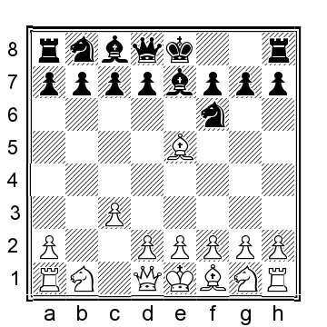

**5.e3**

The text move has been played Magnus himself, whereas I have given preference to 5.g3, and now we have a few options to look at for Black:

a) 5...d5 6.Bxf6 (it is less accurate to play 6.Bg2?! due to 6...Nbd7 because after 7.Bxf6, Black can recapture with the knight when I think Black has the better chances 7...Nxf6) 6...Bxf6 7.e3 (7.d4 c5 8.e3 usually transposes) 7...Nd7 8.d4 Nb6 9.Bg2 0-0 10.Ne2 c6 11.Nd2 Be7 12.0-0 Bd6 13.a4 a5 14.Qc2 h5 15.Rfb1 (15.h4!?) 15...h4 16.gxh4 (in an online game between two strong young players from India, White played the natural but bad 16.e4? and after 16...dxe4 17.Nxe4 Bc7, Black was clearly better, even if White later managed to turn the game around, Gukesh-Vishnu, Tornelo INT 2021) 16...Re8 17.Ng3 Bc7 18.h5 and here White has the better chances.

b) Black can also force the immediate departure of the dark-squared bishop with 5...Nc6 6.Bxf6 Bxf6 7.Bg2 0-0 8.e3 Na5 9.Ne2 d5 10.0-0 Bf5 11.d4 c6 12.Nd2, and here:

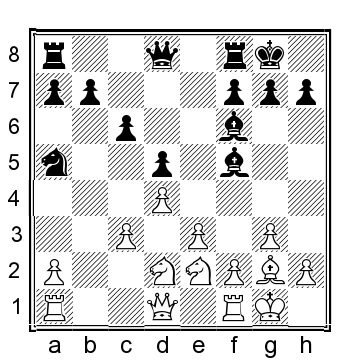

b1) 12...Re8 13.Re1 Rc8 14.Rc1 b5 15.Nf4 g6 16.e4 (interestingly, both 16.a4!? and 16.h4 are decent ideas for White) 16...dxe4 17.Nxe4 Bg7 18.Nc5 Qd6 19.Qf3 (this improves over 19.Nfd3 Nc4 20.a4 Rxe1+ 21.Qxe1 as played in an online game, where 21...a5 would have given Black a comfortable edge) 19...Rxe1+ 20.Rxe1 Nc4 21.g4 followed by h2–h4–h5 and White is command.

b2) 12...h6 13.Nf4 (a high-rated online game saw White continue in a less accurate fashion: 13.Rc1?! b5 14.e4 dxe4 15.Nxe4 Be7 16.Nc5 Bxc5 17.dxc5 Bd3 18.Re1 Bxe2 19.Rxe2 Qxd1+ 20.Rxd1 Rad8 21.Rxd8 Rxd8 22.Bf3?! (22.Re7 is best) 22...Rd3?? (22...Kf8 is best) 23.Re8+ Kh7 24.Be4+, and Black resigned) 13...Re8 14.h4! (14.Qa4?! b5 15.Qd1 Nc4 16.Nxc4 bxc4 was played in an online game that White won, but at this point, Black is doing very well with the control over the b1–square and ability to use the b-file) 14...Qd7 15.Re1 Be7 16.e4 and White has the initiative.

c) 5...0-0 6.Bxf6 (White has to pay attention, for instance, 6.Bg2?! can be met by 6...Ng4!? 7.Bf4 g5 8.Be3 with a ridiculous position for White) 6...Bxf6 7.Bg2 c5 8.e3 d5 9.d4 Nc6 10.Ne2 (10.Nd2 Re8 11.Ne2 transposes) 10...Bg4 11.a4 Rc8 (or 11...h5!? 12.0-0 Re8 13.Ra2 h4 and Black has good position) 12.0-0 Qd7 13.a5 Bd8 and Black has a comfortable game.

d) 5...c5 6.e3 Nc6 7.Bxf6 Bxf6 8.Bg2 d5 9.d4 0-0 transposes.

I am less convinced by 5.d4 0-0 6.Nf3 d5 7.e3 (or 7.Bxf6 Bxf6 8.e3 c5) 7...Nbd7 8.Bd3 Nxe5 9.dxe5 Ne4 10.Qc2 f5 11.0-0 Nc5 12.Rd1 Bd7 (or 12...Qe8 13.Bf1 c6 14.c4 dxc4 15.Bxc4+ Kh8 16.Nd4 and here a draw was agreed upon, ½–½, in Vidonyak-Sadewasser, Germany 2007; according to the computer, the chances are about even) 13.Nbd2 Qe8 14.Nb3 Nxd3 15.Qxd3 c6 16.Nbd4 Rd8 17.a4 f4 with interesting position where both sides have chances, Stefanov-Mlynareik, ICCF email 2008.

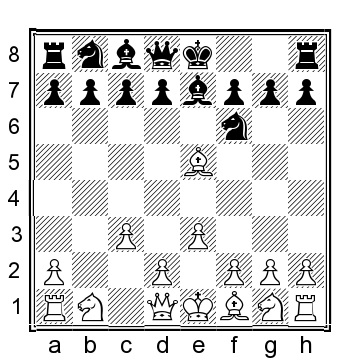

**5...c5!?**

Knowing that White will want to play d2–d4, Nakamura challenges the center in anticipation of this. However, there are some important alternatives to consider at this point:

a) 5...0-0 6.d4 c5 7.Ne2 (if 7.Bxf6 Bxf6 8.Bd3, then Black has the additional option of playing 8...b6 9.Ne2) 7...Nc6 8.Bxf6 Bxf6 9.g3 d5 10.Bg2 (if 10.Nd2 Re8 11.Bg2 then 11...cxd4 12.cxd4 Bxd4 13.Nxd4 Nxd4 14.0-0 Nc6 15.Nb3 Be6 and Black has won a pawn and while White has some compensation, Black is definitely having the better chances) 10...Bg4 11.a4 Re8 (or 11...Rc8 12.0-0 Re8 13.Ra2 Qd7 14.a5 Bd8 15.a6 bxa6 and Black has equalized) 12.Ra2 cxd4 13.cxd4 Qa5+ 14.Qd2 Nb4 15.Rb2 Be7 16.Nbc3 Rac8 with chances to both sides.

b) 5...Nc6 6.Bxf6 Bxf6 7.d4 d5, and now White has a couple of options:

b1) 8.Bd3 0-0 9.Ne2 Re8 10.0-0 g6 (10...Bg5?! to prevent the knight from jumping to f4, but it fails to convince us about its viability: 11.h3 Qd6 12.Qc2 g6 13.Nd2 b6 14.e4 dxe4 15.Nxe4 Qe7 16.Nxg5 Qxg5 17.f4 and White has a strong initiative and the better chances, P.Stefanov-Mrkvicka, ICCF email 2008) 11.Nd2 Ne7 12.Nf4 c6 13.Rb1 Qc7 14.Qf3 Bg5 15.g4!? (A fascinating idea; natural but less accurate is 15.Rfc1 Bxf4 16.exf4 Bf5 17.g3 Bxd3 18.Qxd3 Nf5 19.Re1 Qd7 20.Nf1 Nd6 21.Nd2 and here a draw was agreed upon, ½–½, in Blechar-Cross, ICCF email 2007, but Black has the better pawn structure and the advantage) 15...f5 16.h3 Rf8 17.Rfe1 fxg4 (interestingly, if Black plays 17...Bxf4?, the problems are much bigger than they first appear, for instance, 18.Qxf4 Qxf4? 19.exf4 Re8 20.g5 which is very bad for Black, bordering on losing) 18.hxg4 Qd7 19.Nf1 Qxg4+ 20.Qxg4 Bxg4 21.Rxb7 and White has the initiative but Black should be okay.

b2) 8.Nd2 0-0 9.Bd3 Ne7 10.Ne2!

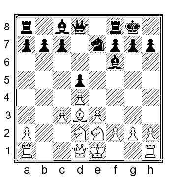

10...b6 (or 10...g6 11.Rb1 c5 12.0-0 Qc7 13.Re1 Rd8 with approximately equal chances, but here White went a little bonkers and went aggressive with 14.e4 cxd4 15.cxd4 dxe4 16.Nxe4 Bg7 17.Qb3 Nd5 18.Ng5 h6 19.Bc4 hxg5 (19...Bf5!?) 20.Bxd5 Bf5 and Black has the marginally better chances, P.Stefanov-Parushev, ICCF email 2008) 11.0-0 c5 12.a4 g6 13.Nf4 Rb8 14.Qf3 with a position that I find easier to play for White; the mostly fixed center makes the value of Black’s bishop pair significantly less.

c) 5...d6 does not make too much sense, e.g., 6.Bxf6 Bxf6 7.g3 0-0 8.Bg2 c6 9.Ne2 Nd7 10.d4 when White has the slightly better chances thanks to the extra central pawn.

d) 5...d5 tends to transpose to other lines. The immediate threat is ...Nbd7, allowing Black to recapture with the knight on f6, when White plays Bxf6 and, therefore, White’s next move is a given: 6.Bxf6 Bxf6 7.d4 0-0 8.Bd3 c5 9.Ne2 g6 10.0-0 Nc6 with approximately equal chances; my preferred continuation is now 11.a4 Qd6 12.Nd2 b6.

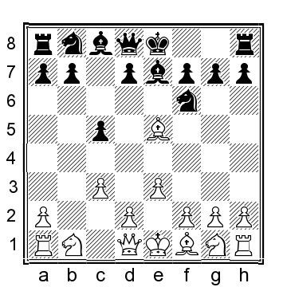

**6.Bxf6 Bxf6 7.g3**

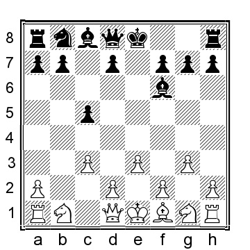

**7...b6?!**

Black aims to play on the light squares in White’s position, a natural consequence of White putting all his pawns on dark squares and developing the bishop to g2. An alternative is 7	0-0 8.Ne2 d5 9.d4 Nc6 10.h3 (stopping the pin on g4; Black seems to have a good position after 10.Bg2 Bg4 11.a4 Rc8) 10...Re8 (10	Qa5 11.Nd2 cxd4 12.Nb3 Qa3 13.cxd4 Nb4 14.Bg2 with more or less equal chances)
11.Bg2 b6 12.0-0 Ba6 13.Re1 and here Black can enter the forced sequence 13...Bxe2 14.Rxe2 cxd4 15.cxd4 Nxd4 16.exd4 Rxe2 17.Qxe2 Bxd4 18.Nc3 Bxc3, winning a pawn, but White should not lose after 19.Rd1 Qe8 20.Qg4.

**8.Bg2 Nc6 9.d4**

The more modest 9.Ne2 is also an option as long as White does not allow Black to put a minor piece on d3, for instance, 9...d5 10.0-0 0-0 11.Nf4 Ne7 12.Qf3 (12.d4 is also fine) 12...Bb7 13.d4 Bg5 14.Nd3 and White has a pleasant position and perhaps somewhat better chances.

**9...Ba6 10.Ne2 0-0 11.0-0 Re8 12.Re1**

White can also play 12.Nd2!? Rc8 13.Re1, transposing back into our main line.

**12...Rc8**

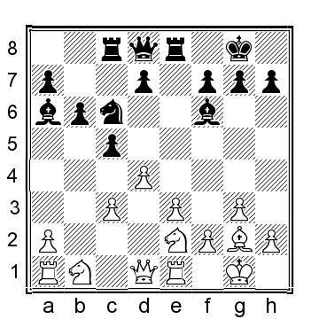

**13.Nd2**

Here Magnus Carlsen played less accurately with 13.a3?!, allowing Nakamura a tactic that he would never miss: 13...Bxe2 14.Rxe2 cxd4 15.cxd4 Nxd4 16.exd4 Rxe2 17.Qxe2 Bxd4 18.Ra2 Rc1+ 19.Bf1 Rxb1, and while Black has two extra pawns at this point, White secured a draw without too many headaches, Carlsen-Nakamura, chess24.com INT 2021.

**13...cxd4 14.cxd4**

White could also play 14.exd4 d5 15.Nf1 with chances to both sides.

**14...Nb4 15.Qa4 Be7 16.Be4 Bd3 17.Bxd3 Nxd3 18.Rf1**

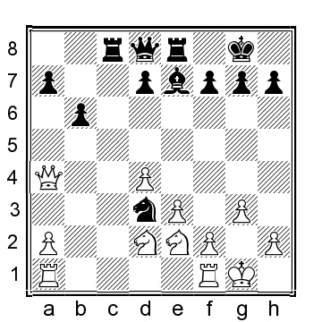

And according to the computer, the chances are about even, but White has the better pawn structure.
