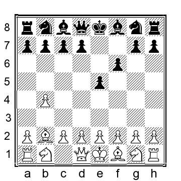
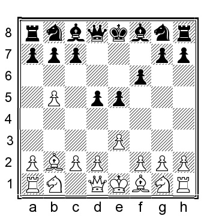
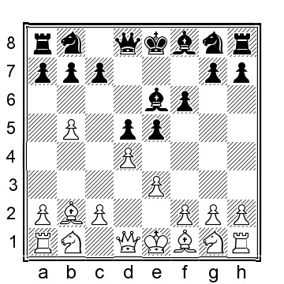
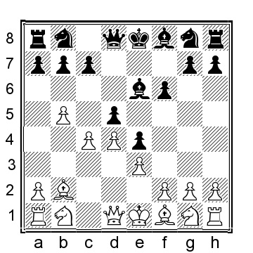
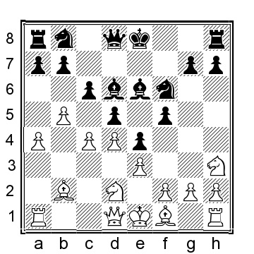
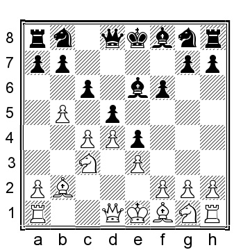

# Глава 2: 1...e5 2.Bb2 f6

В этом варианте черные пытаются поставить заслон на длинной диагонали a1-h8, ставя в тупик слона белых b2. Это немного ослабляет позицию черного короля, а также легкие клетки в целом. Оценка линии зависит от того, смогут ли белые вскрыть позицию настолько, чтобы сделать эту слабость значимой, и, честно говоря, далеко не однозначна.

**1.b4 e5 2.Bb2 f6!?**

**3.b5**

Я думаю, что это лучший выбор белых. Защита пешки путем 3.a3 дает черным комфортную игру, например, 3...d5 4.d4 (или 4.e3 c6) 4...e4 5.c4 (или 5.e3 Be6 6.c4 c6 7.Nc3, оба варианта ведут к более или менее одинаковой позиции, где черные в порядке) 5...c6 6.e3; продолжение гамбита 3.e4 Bxb4 4.Bc4 весело, но не адекватно для белых. Поэтому я не буду рассматривать его как часть нашего репертуара.

**3...d5**

Продвижение центральной пешки имеет больше смысла, чем альтернативные варианты, которые мы, тем не менее, рассмотрим вкратце:

a) 3...a6 4.a4 (4.e4 переводит игру в причудливо выглядящий дебют 1.e4 e5; я не уверен, как точно оценить возникающие позиции, а компьютер называет их примерно равными. В конечном счете, все сводится к тому, нравится ли вам играть такие позиции или нет. Игра может развиваться следующим образом: 4...Nh6 (или 4...axb5 5.Bxb5 c6 6.Bc4 d5 7.exd5 cxd5 8.Bb3 Nc6 и у черных не должно быть проблем) 5.a4 axb5 6.axb5 Rxa1 7.Bxa1 d5 8.exd5 Qxd5 9.Nc3 Qf7 10.Nf3 Be7 11.d4 exd4 12. Qxd4 и здесь мне нравится позиция белых, но объективно говоря, обе стороны имеют свою долю претензий, Balakrishnan-Jakubowski, Chess.com INT 2021) 4...c6 (4...axb5 5.axb5 Rxa1 6.Bxa1 d5 7.e3 c5 8.c4 (возможно, это неправильно и лучше было бы взять на c6, например, 8. bxc6 Nxc6 9.Nf3 Qa5 с шансами для обеих сторон) 8...d4 9.Bd3?! f5 10.exd4 exd4 11.Qf3 Nh6 12.Ne2 g6 и у черных была комфортная игра, G.Gomez-De Lorenzo, ICCF email 2003) 5.e3 d5 6.d4 axb5 7.axb5 Rxa1 8.Bxa1 e4 9.Bb2 Be6 10. Ne2 f5 11.Nf4 Bf7 12.Be2 Nf6 13.0-0 Bd6 14.bxc6 bxc6 15.Ba3 Bxa3 16.Nxa3 Qa5 и шансы близки к равным; белые хотят атаковать центр черных ходом c2-c4, а черные хотят начать атаку на королевском фланге.

б) 3...Bc5 4.e3, готовя d2-d4 и у белых уже позиция лучше, например, 4...d5 5.d4 exd4 6.exd4 Bd6 7.c4 и у белых инициатива.

в) 3...c6 4.a4 d5 5.e3 Be6 6.d4 напоминает то, что можно достичь с нашей главной линии.

d) 3...b6 4.e3 (4.e4 тоже хорошо) 4...Bb7 5.Nf3 d5 6.c4! и у белых уже комфортно лучше.

**4.e3!?**

Главная линия. Белые готовятся бросить вызов черным в центре, либо с помощью d2-d4, либо c2-c4.

**4...Be6**.

Логическое следствие двух предыдущих ходов, защищающих белые поля. В этой позиции черные пробовали несколько других ходов:

a) 4...c5 направлено на построение широкого центра за черных: 5.d4 cxd4 6.exd4 e4?! (часто играется, но почти наверняка не является лучшим; черные должны рассмотреть 6...Bb4+, когда 7.c3 Bd6 8.c4!? при острой позиции, где оба игрока сыграли кучу ходов пешками и развили только своих чернопольных слонов) 7.c4 f5 8.Nc3 (или 8.c5!? Ne7 9.h4, претендуя на контроль над темными полями и сдерживая черных на королевском фланге; думаю, шансы белых выше) 8...Nf6 9.Nh3 Be6 10.c5 и у белых комфортный перевес.

b) 4...Bd6 5.d4 (мы видели, как 5.c4 c6 6.a4 Ne7 играл Бугаев - Стейниц, Москва 1896, в историческом разделе этой книги или 5.Nf3 Ne7 (5...Be6 переходит на нашу главную линию) 6. c4 c6 7.d4 e4 8.Nfd2 0-0 9.Nc3 Be6 10.Qb3 f5 11.g3 Nd7 12.a4 Qe8 13.Ba3 избавляясь от чернопольного слона с комфортной игрой для белых, Осмак-Боммини, Chess.com INT 2021) 5...e4 6.c4 f5 (или 6...c6 7.Qa4 a6 8.c5 Be7 9.Nc3 f5 10.Nh3 и у белых хорошая игра) 7.Nc3 Nf6 8.Nh3 c6 9.Qb3 a6 10. c5 Be7 и теперь моему компьютеру очень нравится 11.b6, утверждая преимущество белых, тогда как мне нравится 11.bxc6 bxc6 12.Be2, когда слабая клетка b6 и открытая b-фигура(?) должны благоприятствовать белым.

c) 4...a6 5.a4;

d) 4...c6 5.c4 (белые могут также сыграть 5.a4 Bd6 6.Nf3 Ne7 7.c4 Be6 8.d4 с шансами для обеих сторон) 5...Be6 переходит на нашу главную линию.

e) 4...Bf5 5.d4 Bb4+ (если 5...exd4, то 6.Bxd4 Bb4+ 7.Bc3 Qd6 8.Nf3 выглядит немного странно, но, вероятно, лучше для белых из-за положения черных в центре) 6.c3 Ba5 7.Nf3 e4 (7...c5!? 8.dxc5 Nd7 9.Ba3 остро, но тоже лучше для белых) 8.Nfd2 c6 9.Nb3 и у белых хороший перевес благодаря возможностям прорыва на ферзевом фланге и игре на темных полях.

f) 4...Nh6 5.d4 (во введении мы видели 5.c4 Be6 6.cxd5 Qxd5, как сыграно в партии Englisch-Pillsbury, Vienna 1896) 5...Bb4+ (если 5...exd4 6.Qxd4 a6 7.a4 Nf5 8. Qd1 с позицией, где я предпочитаю белых, но объективно говоря, она очень близка к равной) 6.c3 Be7 7.c4 (поскольку наша главная линия ведет к большому количеству разменов, белые могут также рассмотреть 7.Nf3 e4 8.Nfd2 Be6 9.c4 c6 10. Qb3, когда я предпочитаю играть белыми благодаря игре на ферзевом фланге и давлению на центр черных, но позиция черных вполне играбельна) 7...exd4 8.Qxd4 dxc4 9.Qxc4 a6 10.a4 c6 11.Nf3 (11.Nd2!?) 11...axb5 12. axb5 Rxa1 13.Bxa1 Qa5+ 14.Bc3 Qxb5 15.Qxb5 cxb5 16.Bxb5+ Bd7 17.Bd3 имеет примерно равную эндшпильную позицию; у черных проходная пешка и некоторые структурные слабости, особенно на белых полях, что может быть проблематично.

**5.d4**

**5...e4**

Черные выбирают закрытие центра, что кажется наиболее разумным ходом, но у черных есть несколько других вариантов:

a) 5...Nd7 6.dxe5 fxe5 7.Nf3 e4 8.Nd4 Bf7 9.Be2 (9.Nd2!? Ne5 10.Be2 также возможно, но, скорее всего, просто перейдет в позицию после 9.Be2) 9...Qg5 (черные сразу идут на королевский фланг, чтобы начать контригру) 10.0-0 Bd6 11.c4 Ngf6 12.Nd2 Ne5 13.Qc2 0-0 14.c5 Be7 15.Qc3 с небольшим позиционным плюсом у белых.

b) 5...exd4 6.Qxd4 Nd7 7.Nf3 Bc5 8.Qc3 (также можно рассмотреть 8.Qd1 и; 8.Qd2) 8...Qe7 9.Nbd2 0-0-0 10.a3 Nb6 11.Qa5 (11.Nd4!?) 11...d4? (лучше было сыграть 11...Kb8, но 12.Bd3 Bd6 13.0-0 приятно для белых) 12.exd4 Bg4+ 13.Be2 Nd5 14.0-0 Bb6 15.Qa4 Nf4 16.Bd1 Qd7 17.c4 и белые выигрывали в партии Филип-Бабун, корр. 1965.

c) 5...Bb4+ 6.c3! (белым лучше играть этот ход, а не Nd2, потому что конь лучше на c3, чем на d2) 6...Bd6 7.dxe5 fxe5 8.c4 (8.Nf3 a6 9. a4 Nf6 10.Be2 c5 11.Nbd2) 8...dxc4 9.Qc2 a6 10.Bxc4 Qd7 11.Bxe6 Qxe6 12.Nc3 Nf6 13.Nf3 0-0 14.a4 (белым необязательно спешить с рокировкой: 14.0-0 e4 15.Nd4!?? (если 15.Nd2, то черные могут форсировать ничью путем 15...Bxh2+ 16.Kxh2 Qe5+ 17.Kg1 Ng4 18.f4! exf3 19.Nxf3 Qxe3+ 20.Kh1 Qh6+ с вечным шахом) 15...Qe5 16.g3 Nbd7 с шансами для обеих сторон) 14...Nbd7 15.Nd2 и у белых незначительное позиционное преимущество.

d) 5...Bd6? 6.dxe5 fxe5 7.Bxe5 Nf6 (или 7...Bxe5 8.Qh5+ g6 9.Qxe5 и у белых позиция гораздо лучше) 8.Bxd6 Qxd6 9.Nd2 и белые выиграли пешку с явным преимуществом.

**6.c4**

Сразу бросает вызов центру черных.

Интересной альтернативой является 6.Nd2 c6 7.a4 Bd6 (или 7...a6 8.Ne2 Bd6 9.c4 Nd7 10.c5 Bb8 при обоих 11.Nb3 и 11.b6, когда я предпочитаю белых; ферзевый фланг черных еще некоторое время останется запертым) 8.c4 f5 9.Nh3 Nf6

10.Ba3 (мне также нравится 10.Qb3 0-0 11.Ba3 за белых, даже если объективно близко к равенству) 10...Bxa3 (если 10...0-0, то 11.Nf4 Bf7 12.Bxd6 Qxd6 13.c5 Qc7 14.h4 выглядит достаточно хорошо для белых) 11.Rxa3 0-0 12.c5 a6 13.b6 Nbd7 (13...Qe7!?) 14. Nf4 Bf7 15.h4 Re8 16.Be2 Nf8 17.Nf1 (или 17.g3 Ne6 18.Nb3 Nxf4 19.gxf4 но только белые могут сыграть лучше) 17...Ne6 18.Ng3 Nxf4 19.exf4 с лучшими шансами у белых, но прорыв - другое дело, Ванточ Рековски-Митреску, ICCF email 2008.

**6...c6**

Черные должны удержать пешку d5, защищая ее пешкой c6. Конечно, возможны и другие ходы, но я думаю, что белые получат преимущество, например,

a) 6...dxc4 7.Qc2 (этот маленький ход ферзем, угрожающий и c4, и e4, вероятно, лучший. Другой вариант - 7.Nd2 Bb4 8.Rc1 a6 9.Bxc4?! (9.Bc3!? Bxc3 10.Rxc3 axb5 11.Qh5+ Kf8 12.Qxb5 Rxa2 13.Bxc4 Ra1+ 14.Ke2 Bxc4+ 15.Rxc4 Qc8 16.h3 с еще одной странной позицией, где компьютеру нравятся белые, но играть действительно сложно для обеих сторон) 9...Bxc4 10.Rxc4 Bxd2+ 11. Kxd2 axb5 (альтернативами являются 11...Qd5 12.Rxc7, что выигрывает за белых или 11...Ne7 12.Nh3 0-0 13.Qb3 Rf7, где черные не могут быть хуже) 12.Qh5+ Kf8 13.Qxb5 Rxa2 14.Qxb7 и белые выигрывают) 7...a6 8.Bxc4 Bb4+ 9.Kf1! (белые могут даже рассмотреть нелепо выглядящее 9.Kd1 Bxc4 10.Qxc4 Qe7 11.Ne2 с безумной позицией, в которой я не уверен, что она однозначно лучше для обеих сторон) 9...Bxc4+ 10.Qxc4 Qe7 11.a3! (или 11.Bc3 Bd6 12.Qd5 c6 13.bxc6 Nxc6 14.Nd2 с беспорядочной позицией, в которой белые должны быть в связи со слабой ситуацией черных в центре) 11...Bd6 12.Nc3 и белые в выигрыше _(возможно "центре")_.

б) 6...f5 7.Nh3!? Nf6 8.Nf4 Bf7 9.cxd5 Nxd5 10.Nxd5 Bxd5 11.Nc3 Bb4 12.Qa4!?? (или 12.Be2 0-0 13.0-0 и у белых неплохая позиция) 12...Bxc3+ 13.Bxc3, когда я предпочитаю белых, но очень близко к равенству.

**7.Nc3**

Последовательность: давление на центр черных.

Аналогично 7.Qb3 f5 (или 7...Ne7 8.Nc3 Nd7 9.Nh3!? с хорошей позицией для белых) 8.Nc3 Nf6 9.Nh3 Bd6 10.a4 Nbd7 11.Ba3 и теперь размен чернопольных слонов поможет белым, но шансы близки к равным.

Совершенно иной подход - 7.c5 Ne7 8.Qb3 Nd7 9.Nd2 f5 10.a4 (10.Nh3!?) 10...Nf6 11.Nh3!? (или 11.h4) 11...Ng6 12.a5 a6 13.b6 Be7 14.g3 Qd7 15.Be2, когда у белых больше пространства, но прорваться будет очень трудно.

**7...Bb4 8.Qb3 Ba5 9.bxc6**.

Белые также могут сыграть 9.Nh3, не беспокоясь о сдвоенной пешке, так как центр черных теперь менее защищен: 9...Bxh3 10.gxh3 Ne7 11.Be2 Nd7 12.cxd5 cxd5 13.0-0 Nb6 14.Rac1 с лучшими шансами для белых.

**9...Nxc6**.

Захват пешки также лучше для белых: 9...bxc6 10.cxd5 Bxd5 (или 10...cxd5 11.Bb5+ Kf7 12.Nge2 с солидным преимуществом у белых) 11.Bc4 и у белых явно лучше.

**10.Nh3 g5**.

Задерживая коня на f4 и оставляя его на некоторое время припаркованным на h3.

**11. Be2 dxc4 12.Bxc4 Bxc4 13.Qxc4 Nge7 14.0-0** и у белых безопаснее король, лучше пешечная структура и общая позиция.
