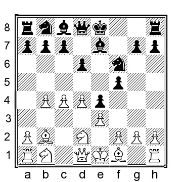
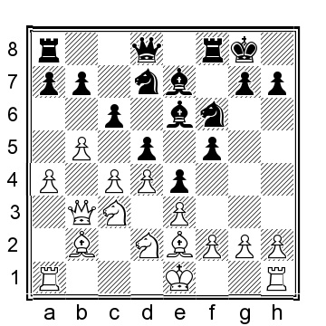

# Chapter 3: 1...e5 2.Bb2 d6

This set-up tends to lead to positions that resemble the English Opening with 1...e5. White will typically continue his attack on the queenside, whereas Black should be seeking his fortune on the kingside.

 **1.b4 e5 2.Bb2 d6 3.c4**

**3...f5**

Black has a few alternatives that we need to consider as well:

a) 3...Be6 4.e3 Nd7 and now:

a1) 5.Nf3 f5 6.d4 (White can also play 6.Nc3 Be7 7.Be2 Bf6 8.d4 e4 9.Nd2 Ne7 10.h4 d5 11.g4 g6 12.b5 and White has a strong initiative) 6...Be7 (Black should avoid 6...e4? 7.d5 Bf7 8.Nd4 Nh6 9.Qa4 was played in S.Lalic-Milligan, Eastbourne 1990, 9...Qc8 10.Be2 Be7 11.Ne6 and White is winning) 7.Qc2 (or 7.dxe5 dxe5 8.c5 Bf6 9.Nbd2 e4 10.Nd4 Bd5 11.Nc4 Ne7 12.Be2 and White is better) 7...Bf6 8.dxe5 Nxe5 9.Nd4 Bf7 10.Nd2 Ne7 11.Rd1 and White has a little plus.

a2) 5.a4 f5 6.a5 (or 6.Nf3 Ngf6 7.Ng5 Bg8 8.a5 a6 9.Be2 g6 10.d4 h6 11.Nf3 e4 12.Nfd2 Bf7 13.Nc3 h5 14.b5 and White is better) 6...Be7 7.Be2 Nh6 8.d4 0-0 9.d5 Bf7 10.Nf3 a6 11.Nc3 Bf6 12.0-0 Kh8 13.Rc1 and White has a plus on the queenside.

b) 3...Nf6 4.e3, and now:

b1) 4...Bf5 5.Nf3 Be7 6.Be2 0-0 7.0-0 e4 (or 7...Nbd7 8.d4 exd4 9.Nxd4 Bg6 10.b5 Nc5 11.Nc3 and White has the better position) 8.Nd4 Bg6 9.b5 a6 10.a4 and White has some pressure.

b2) 4...Be6 5.Nf3 Be7 6.Be2 c6 7.a4 0-0 8.0-0 a5 9.b5 Bf5 10.Nc3 Nbd7 11.d4 and White has a space advantage.

b3) 4...Nbd7 5.Nf3 Be7 6.Qc2 c6 7.Nc3 0-0 8.Be2 (8.d4!?) 8...d5 9.a3 with more or less even chances.

b4) 4...c6 5.Nf3 Be7 6.Nc3 0-0 7.Be2 Nbd7 8.Qc2 and White has a space advantage and the better chances.

b5) 4...g6 5.Nf3 Bg7 6.Nc3 is likely to transpose to the King’s Indian chapter.

b6) 4...Be7 5.Nc3 0-0 (or 5...Be6 6.Be2 (6.d4 or) 6...Nbd7 7.Nf3 0-0 8.d4 when Black has an Old Indian position with the bishop rather awkwardly placed on e6) 6.Nf3 Bg4 7.Be2 c6 (or 7...Nbd7 8.d4 exd4 9.exd4 d5 10.c5 Bxf3 11.Bxf3 c6 12.0-0 Re8 13.Qc2 Qc7 14.Rae1 Nf8 15.Re3 Ng6 16.g3 and while the chances are close to even, White has more space Trokenheim-Ahlstroem, Sweden 1988) 8.h3 (also 8.0-0 Nbd7 9.a4 e4 10.Nd4 Bxe2 11.Ncxe2 and White has some more space) 8...Bxf3 9.Bxf3 d5 10.cxd5 cxd5 11.Qb3 e4 12.Bd1 Nc6 13.a3 a5 14.b5 and White has the better chances.

**4.e3 Nf6 5.Nf3 Be7**

An alternative is 5...g6 6.Be2 Bg7 7.Qb3 (or 7.b5 e4 8.Nd4 Qe7 9.0-0 Nbd7 10.Nc3 0-0 11.f4 Nc5 12.a4 with a small plus for White) 7...Qe7 8.d3 0-0 9.0-0 and White has some pull.

**6.d4**

White does not necessarily need to play d2–d4 right away. The alternative is 6.Nc3 0-0, and now:

a) 7.Qb3 Kh8 8.d4 e4 9.Ng5 c6 10.h4 Ng4 11.Ne2 Na6? (or 11...h6 12.d5 gives White the initiative; the knight cannot be captured: 12...hxg5? 13.hxg5+ Kg8 14.c5 and White is much better) 12.Nf4 Nc7 13.a4 (13.b5!?) 13...d5 14.b5 Bxg5?! (14...Bd6 was better) 15.hxg5 Qxg5 16.Ba3 Re8 17.Bd6 and White had a clear advantage in Sokolsky-Persits, USSR 1965.

b) 7.d4 transposes to the main line.

c) 7.Be2 Kh8 8.0-0 c6 9.b5 e4?! (or 9...Be6 10.a4 a5 11.Rb1 with a slight plus for White) 10.Ng5 Qe8 11.d3 h6 12.Nh3 Nbd7 13.Nf4 Ne5? 14.dxe4 fxe4 15.bxc6 bxc6 16.c5 and White was winning, Panno-Rubinetti, Mar del Plata 1971.

**6...e4 7.Nfd2**

**7...0-0**

Black can also play for the center in a couple of ways:

a) 7...c6 8.Nc3 (White can stop Black from playing ...d6–d5 with 8.d5 0-0 9.Nc3 which should be better for White) 8...d5 9.b5 0-0 10.Be2 (10.a4!?) 10...Be6 (10...cxb5!? would have been more accurate) 11.a4 g5 12.Qb3 Bf7?! 13.h4? (13.f3!) 13...gxh4 14.Rxh4 Qc7? (Black plays too slowly, it was better to play 14...a6 15.Ba3 dxc4 16.Bxc4 axb5 17.axb5 cxb5 18.Bxf7+ Rxf7 19.Nxb5 and White has some pressure) 15.Rc1?! (15.Rf4!) 15...Nbd7 16.cxd5 Nb6 17.Rh3 Nfxd5?? (a bad blunder; Black would have been okay after 17...Nbxd5 18.Nc4) 18.Rg3+ Kh8 19.a5! Nxc3 20.d5 Nbxd5 21.Qxc3+ and Black resigned, 1–0, Teichmann-Gorka, Canterbury 2010.

b) 7...d5 was featured in several games of Sokolsky’s, so we know his thoughts about this move: b1) 8.b5 c6 9.a4 0-0 10.Qb3 Be6 11.Nc3 Nbd7 12.Be2

12...Kh8 (this is better than 12...c5 13.Nxd5 Nxd5 14.cxd5 Bf7 15.Rc1 Rc8 16.0-0 Nb6 17.dxc5 Nxd5 18.Bc4 Rxc5 19.Rfd1 and White was winning in Sokolsky-Samarian, World ch semifinal corr 1957) 13.Ba3 (13.c5 Bg8 14.Ba3?! Nxc5 15.Bxc5 Bxc5 16.dxc5 d4 17.Bc4 dxc3 18.Qxc3 Qc7 19.Bxg8 Kxg8 20.0-0 with, at most, a fractional advantage for White, Muri-Boschma, ICCF email 2003) 13...c5 14.Nxd5 Nxd5 15.cxd5 Bg8 16.dxc5 Rc8 17.c6 bxc6 18.bxc6 Rxc6 19.Bxe7 Qxe7 20.0-0 Rb6 21.Qa2 and White has a slight pull, Muri-Egan, ICCF email 2012.

b2) 8.Qb3 c6 9.Nc3 0-0 10.g3?! (it would have been better to play 10.b5 a6 11.a4 with chances to both sides) 10...Kh8 11.h4 dxc4 12.Bxc4 b5 13.Be2 Na6 14.a3 Nc7 15.Qc2 Be6 16.Nb3 Bxb3 17.Qxb3 was played in Sokolsky-Suetin, Leningrad 1953, and now 17...Qe8 would have been clearly better for Black.

**8.Nc3 a5**

As mentioned throughout the book, we normally welcome this advance. Another move is 8...c6, aiming to play ...d6–d5, but White should not allow that: 9.d5! cxd5?! 10.Nxd5 (10.cxd5! is much better, keeping Black cramped) 10...Nxd5 11.cxd5 Bf6 12.Qb3 a5 13.Be2 axb4 14.0-0 Nd7 15.Bxf6 Rxf6 16.Qxb4 Rh6?! 17.g3 Nf6?! 18.Rfc1 and White is clearly better, Lapshun-Vila Gazquez, Barcelona 2007.

**9.b5 c5**

Black tries to seal the queenside and center. Another approach is 9...Nbd7 10.Be2 Nb6 11.Qc2 Qe8 12.a4 Be6 13.Ba3 Nfd7 14.0-0 Qg6 15.Rac1 (15.f4!? Bf7 16.Kh1 may be an improvement) 15...Qh6 and the chances are about even, although I would prefer to play White with his opportunity to play on the queenside, Muri-Copar, ICCF email 2008.

**10.d5**

White obliges as it also opens the opportunity to castle queenside.

**10...Nbd7 11.h3**

**11...Ne5 12.Na4**

It is not entirely necessary to block the advance of the a-pawn, and therefore, White can go ahead with 12.Qc2!? Nfd7 13.0-0-0 with a good game.

**12...Nfd7 13.Be2 Bf6 14.Qc2 b6 15.0-0-0 Nf7 16.Rdg1 Bxb2+ 17.Kxb2 Qf6+ 18.Kb1**
White can improve with 18.Kb3!? Rb8 19.Nc3 Qe7 20.g4 and White has an attack on the kingside and the better chances.

**18...Rb8 19.Nc3 Qe7 20.g4 Nf6 21.g5 Nd7**

Thus far, Muri-Cvetnic, ICCF email 2008, and now 22.h4 would have been White’s best chance, although breaking through is not going to be easy.
