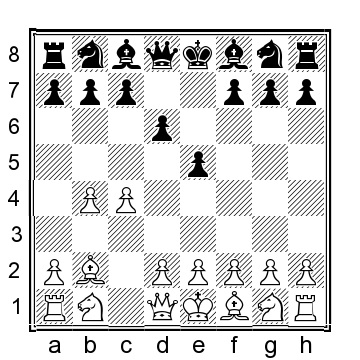
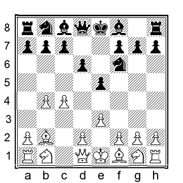
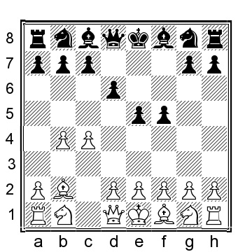
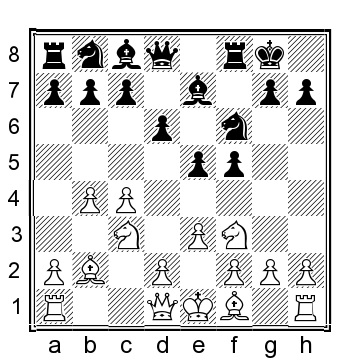
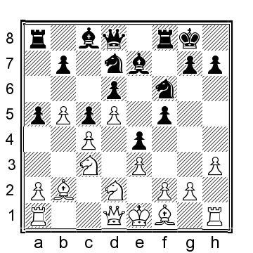

# Глава 3: 1...e5 2.Bb2 d6

Эта расстановка, как правило, приводит к позициям, напоминающим английское начало с 1...e5. Белые обычно продолжают атаку на ферзевом фланге, в то время как черные должны искать удачу на королевском фланге.

 **1.b4 e5 2.Bb2 d6 3.c4**.

**3...f5**

У черных есть несколько альтернатив, которые мы также должны рассмотреть:

a) 3...Be6 4.e3 Nd7 и теперь:

a1) 5.Nf3 f5 6.d4 (белые могут также сыграть 6.Nc3 Be7 7.Be2 Bf6 8.d4 e4 9.Nd2 Ne7 10.h4 d5 11.g4 g6 12.b5 и у белых сильная инициатива) 6...Be7 (черным следует избегать 6...e4? 7.d5 Bf7 8.Nd4 Nh6 9.Qa4 было сыграно в партии С. Lalic-Milligan, Eastbourne 1990, 9...Qc8 10.Be2 Be7 11.Ne6 и белые выигрывают) 7.Qc2 (или 7.dxe5 dxe5 8.c5 Bf6 9.Nbd2 e4 10. Nd4 Bd5 11.Nc4 Ne7 12.Be2 и у белых позиция лучше) 7...Bf6 8.dxe5 Nxe5 9.Nd4 Bf7 10.Nd2 Ne7 11.Rd1 и у белых небольшой перевес.

a2) 5.a4 f5 6.a5 (или 6.Nf3 Ngf6 7.Ng5 Bg8 8.a5 a6 9.Be2 g6 10.d4 h6 11.Nf3 e4 12.Nfd2 Bf7 13.Nc3 h5 14.b5 и у белых лучше позиция) 6. ...Be7 7.Be2 Nh6 8.d4 0-0 9.d5 Bf7 10.Nf3 a6 11.Nc3 Bf6 12.0-0 Kh8 13.Rc1 и у белых плюс на ферзевом фланге.

б) 3...Nf6 4.e3, и теперь:

b1) 4...Bf5 5.Nf3 Be7 6.Be2 0-0 7.0-0 e4 (или 7...Nbd7 8.d4 exd4 9.Nxd4 Bg6 10.b5 Nc5 11.Nc3 и у белых лучшая позиция) 8.Nd4 Bg6 9.b5 a6 10.a4 и у белых некоторое давление.

b2) 4...Be6 5.Nf3 Be7 6.Be2 c6 7.a4 0-0 8.0-0 a5 9.b5 Bf5 10.Nc3 Nbd7 11.d4 и у белых перевес в пространстве.

b3) 4...Nbd7 5.Nf3 Be7 6.Qc2 c6 7.Nc3 0-0 8.Be2 (8.d4!?) 8...d5 9.a3 с более-менее равными шансами.

b4) 4...c6 5.Nf3 Be7 6.Nc3 0-0 7.Be2 Nbd7 8.Qc2 и у белых преимущество в пространстве и лучшие шансы.

b5) 4...g6 5.Nf3 Bg7 6.Nc3, вероятно, переходит в главу про индийскую королевскую.

b6) 4...Be7 5.Nc3 0-0 (или 5...Be6 6.Be2 (6.d4 или) 6...Nbd7 7.Nf3 0-0 8.d4, когда у черных староиндийская позиция с довольно неудобным расположением слона на е6) 6. Nf3 Bg4 7.Be2 c6 (или 7...Nbd7 8.d4 exd4 9.exd4 d5 10.c5 Bxf3 11.Bxf3 c6 12.0-0 Re8 13.Qc2 Qc7 14.Rae1 Nf8 15.Re3 Ng6 16. g3 и хотя шансы близки к равным, у белых больше пространства Трокенхайм-Альстрём, Швеция 1988) 8.h3 (также 8.0-0 Nbd7 9.a4 e4 10.Nd4 Bxe2 11.Ncxe2 и у белых еще немного пространства) 8...Bxf3 9.Bxf3 d5 10.cxd5 cxd5 11.Qb3 e4 12.Bd1 Nc6 13.a3 a5 14.b5 и у белых лучшие шансы.

**4.e3 Nf6 5.Nf3 Be7**.

Альтернатива - 5...g6 6.Be2 Bg7 7.Qb3 (или 7.b5 e4 8.Nd4 Qe7 9.0-0 Nbd7 10.Nc3 0-0 11.f4 Nc5 12.a4 с небольшим плюсом для белых) 7...Qe7 8.d3 0-0 9.0-0 и у белых есть некоторые шансы.

**6.d4**

Белым необязательно сразу играть d2-d4. Альтернатива - 6.Nc3 0-0, и сейчас:

a) 7.Qb3 Kh8 8.d4 e4 9.Ng5 c6 10.h4 Ng4 11.Ne2 Na6? (или 11...h6 12.d5 дает белым инициативу; коня нельзя взять(?): 12...hxg5? 13.hxg5+ Kg8 14.c5 и у белых позция гораздо лучше) 12.Nf4 Nc7 13.a4 (13.b5!?) 13...d5 14.b5 Bxg5?! (14...Bd6 было лучше) 15.hxg5 Qxg5 16.Ba3 Re8 17.Bd6 и у белых явный перевес в партии Сокольский - Персиц, СССР 1965.

б) 7.d4 переводит на главную линию.

c) 7.Be2 Kh8 8.0-0 c6 9.b5 e4?! (или 9...Be6 10.a4 a5 11.Rb1 с небольшим плюсом у белых) 10.Ng5 Qe8 11.d3 h6 12.Nh3 Nbd7 13.Nf4 Ne5? 14.dxe4 fxe4 15.bxc6 bxc6 16.c5 и белые выигрывали, Панно-Рубинетти, Мар-дель-Плата 1971.

**6...e4 7.Nfd2**.

![] (pics/pic-3-5.png)

**7...0-0**

Черные также могут играть за центр несколькими способами:

a) 7...c6 8.Nc3 (белые могут помешать черным играть ...d6-d5 путем 8.d5 0-0 9.Nc3, что должно быть лучше для белых) 8...d5 9.b5 0-0 10.Be2 (10.a4!?) 10...Be6 (10...cxb5!? было бы точнее) 11.a4 g5 12.Qb3 Bf7?! 13.h4? (13.f3!) 13...gxh4 14.Rxh4 Qc7? (черные играют слишком медленно, лучше было сыграть 14...a6 15.Ba3 dxc4 16.Bxc4 axb5 17.axb5 cxb5 18.Bxf7+ Rxf7 19. Nxb5 и у белых есть некоторое давление) 15.Rc1?! (15.Rf4!) 15...Nbd7 16.cxd5 Nb6 17.Rh3 Nfxd5?? (грубая ошибка; черные были бы в порядке после 17...Nbxd5 18.Nc4) 18.Rg3+ Kh8 19.a5! Nxc3 20.d5 Nbxd5 21.Qxc3+ и черные сдались, 1-0, Тейхманн - Горка, Кентербери 2010.

b) 7...d5 фигурировало в нескольких партиях Сокольского, поэтому мы знаем его мысли по поводу этого хода: b1) 8.b5 c6 9.a4 0-0 10.Qb3 Be6 11.Nc3 Nbd7 12.Be2

![] (pics/pic-3-6.png)

12...Kh8 (это лучше, чем 12...c5 13.Nxd5 Nxd5 14.cxd5 Bf7 15.Rc1 Rc8 16.0-0 Nb6 17.dxc5 Nxd5 18.Bc4 Rxc5 19.Rfd1 и белые выигрывали в партии Сокольский - Самарян, полуфинал ЧМ корр 1957) 13.Ba3 (13.c5 Bg8 14.Ba3?! Nxc5 15.Bxc5 Bxc5 16.dxc5 d4 17.Bc4 dxc3 18.Qxc3 Qc7 19.Bxg8 Kxg8 20.0-0 с, максимум, дробным преимуществом белых, Мури-Бошма, ICCF email 2003) 13. ..c5 14.Nxd5 Nxd5 15.cxd5 Bg8 16.dxc5 Rc8 17.c6 bxc6 18.bxc6 Rxc6 19.Bxe7 Qxe7 20.0-0 Rb6 21.Qa2 и у белых небольшой перевес, Мури-Еган, ICCF email 2012.

b2) 8.Qb3 c6 9.Nc3 0-0 10.g3?! (лучше было бы сыграть 10.b5 a6 11.a4 с шансами для обеих сторон) 10...Kh8 11.h4 dxc4 12.Bxc4 b5 13. Be2 Na6 14.a3 Nc7 15.Qc2 Be6 16.Nb3 Bxb3 17.Qxb3 было сыграно в партии Сокольский - Суэтин, Ленинград 1953, а сейчас 17...Qe8 было бы явно лучше для черных.

**8.Nc3 a5**.

Как уже говорилось в книге, мы обычно приветствуем это наступление (?развитие). Другой ход - 8...c6, с целью сыграть ...d6-d5, но белые не должны этого допускать: 9.d5! cxd5?! 10.Nxd5 (10.cxd5! гораздо лучше, держа черных в тесноте) 10...Nxd5 11.cxd5 Bf6 12.Qb3 a5 13.Be2 axb4 14.0-0 Nd7 15.Bxf6 Rxf6 16.Qxb4 Rh6?! 17.g3 Nf6?! 18.Rfc1 и у белых позиция явно лучше, Lapshun-Vila Gazquez, Barcelona 2007.

**9.b5 c5**

Черные пытаются запечатать ферзевый фланг и центр. Другой подход - 9...Nbd7 10.Be2 Nb6 11.Qc2 Qe8 12.a4 Be6 13.Ba3 Nfd7 14.0-0 Qg6 15.Rac1 (15.f4!? Bf7 16.Kh1 может быть улучшением) 15...Qh6 и шансы примерно равны, хотя я бы предпочел играть белыми с их возможностью играть на ферзевом фланге, Мури-Копар, ICCF email 2008.

**10.d5**

Белые поддаются(?), так как это также открывает возможность рокировки на ферзевом фланге.

**10...Nbd7 11.h3**.

**11...Ne5 12.Na4**.

Блокировать продвижение пешки "а" совсем необязательно, и поэтому белые могут пойти вперед 12.Qc2!? Nfd7 13.0-0-0 с хорошей игрой.

**12...Nfd7 13.Be2 Bf6 14.Qc2 b6 15.0-0-0 Nf7 16.Rdg1 Bxb2+ 17.Kxb2 Qf6+ 18.Kb1**.
Белые могут улучшить ситуацию путем 18.Kb3!? Rb8 19.Nc3 Qe7 20.g4 и у белых атака на королевском фланге и лучшие шансы.

**18...Rb8 19.Nc3 Qe7 20.g4 Nf6 21.g5 Nd7**.

Пока что Мури-Цветник, ICCF email 2008, и теперь 22.h4 было бы лучшим вариантом для белых, хотя прорваться будет нелегко.
