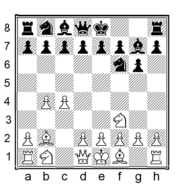
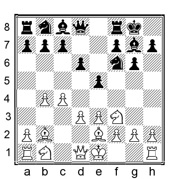
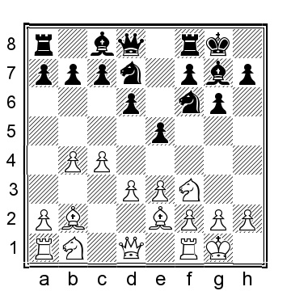
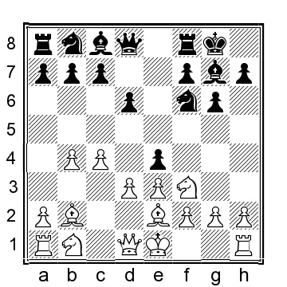
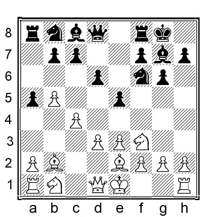
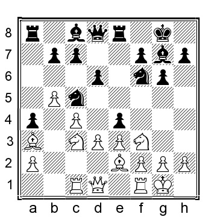

# Глава 4: Индийская королевская позиция (?расстановка)

**1.b4 Nf6 2.Bb2 g6 3.c4**

В этот момент у белых есть несколько альтернатив, включая 3.Nf3, 3.e3 и 3.g3. Два первых варианта обычно переходят в линии после 3.c4, а последний, на мой взгляд, не является разумной заявкой на преимущество белых. После такого хода мы быстро достигнем линий, которые классифицируются под английским дебютом в энциклопедии дебютов и в шахматных базах данных. Объективно, белые вряд ли получат преимущество от дебюта. Тем не менее, с практической точки зрения, белые достигнут позиций, с которыми они сталкивались больше раз, чем любой человек, играющий черными фигурами, а это уже само по себе преимущество.

**3...Bg7 4.Nf3**.

**4...0-0**

На этом этапе у черных есть несколько разумных альтернатив:

a) 4...c6 5.e3 0-0 переходит в 4...0-0 5.e3 c6, о чем мы расскажем в следующей главе.

b) 4 a5 (обычно играется либо здесь, либо позже. Как правило, белые приветствуют это продвижение пешки, которое помогает продвинуть пешку на b5) 5.b5 (5.a3 также может быть сыграно, но представляет меньше проблем для черных; в любом случае, белые захотят продвинуться вперед позже):

b1) 5...0-0 6.e3 d6 (6...c6 рассматривается в главе Грюнфельда) 7.d4 (7.Be2 переходит ниже) 7...a4

8.Be2 c6 9.bxc6 (9.Na3!?) 9 bxc6 10.0-0 Ne4?! 11.Qc2 Qb6?! 12.Ba3 и белые были явно лучше в партии Брызгалин - Ли Д, Инсбрук 2018.

b2) 5...a4 6.e3 c6 7.Na3 d6 8.d4 0-0 9.Be2 весьма похоже на линии, приведенные после 5...0-0.

b3) 5...c5 6.g3 d6 (или аналогично 6 0-0 7.Bg2 d6 8.0-0 Nbd7 9.e3 Nb6 10.d3 e5 11.Nbd2 Ne8 было видно в партии Панченко-Борисенко, Казань 2008, а теперь 12.Qc2 дает белым более легкую позицию для игры)

7.Bg2 Be6 8.d3 h6 9.Nc3 0-0 10.0-0 Nbd7 11.Qc2 Nb6 12.h3 Qc8 13.Kh2 g5? (или 13...d5 14.Nxd5 Nbxd5 15.cxd5 Bxd5 16.e4 Be6 17.a4 с большим перевесом у белых) 14.e4 Re8 15.Rae1 и белые уже были близки к решающему перевесу в партии Гривас - М.Бах, Орхус 2019.

c) 4...b6 5.e3 c5 6.b5 d6 7.Be2 Nbd7 8.0-0 0-0 9.d3 Bb7 10.Nc3 e6 11.a4 d5 12.Qc2 Qc7 13.h3 с позицией, где у белых обычный перевес на ферзевом фланге, но шансы очень близки к равным; тем не менее, позицию белых легче играть, Каенель-Цугер, Швейцария 1989.

d) 4...c5 - обычная идея для достижения позиций типа Бенони, но здесь белые будут стремиться наказать черных за этот преждевременный натиск: 5.bxc5! Qa5 (черным придется использовать ферзя, чтобы вернуть пешку, иначе белые могут просто сохранить ее! К сожалению для черных, ферзь плохо расположен на c5 и вскоре будет вынужден отступить в безопасное место) 6.e3 (или 6.Nc3 Qxc5 7.e3 0-0 8.d4 Qa5 9.Bd3 с хорошей игрой для белых) 6... .0-0 (также 6...Qxc5 7.d4 Qa5+ 8.Nbd2 d6 9.Be2 0-0 10.0-0 Bd7 11.Qb3 Qc7 12.h3 Nc6 13.Bc3 лучше для белых) 7.Be2 Na6 (альтернативы не лучше, например, 7. ...Nc6 8.0-0 Qxc5 9.d4 Qb6 10.Qb3 Qxb3 11.axb3 d6 12.Nc3 дает белым хорошее преимущество в пространстве и гораздо более легкую позицию для игры, тогда как 7...Qxc5 8.0-0 d6 9.Nc3 Nc6 10.Rb1 неудобно для черных, которым сначала приходится тратить время на возвращение ферзя в безопасное место, а затем отбивать инициативу белых на ферзевом фланге) 8. Bc3 Qxc5 9.d4 (на мой взгляд, это лучший вариант для белых, чем 9.0-0, который, тем не менее, также дает белым преимущество, например, 9...Qc7 10.d3 d6 11.a4 Nc5 12.Nbd2 e5 13.Qc2 (13.Ra3!?) 13...Bf5 14.Rfd1 Rac8 15.a5 Rfe8 16.e4 и белые были чуть лучше, Анастасян - Т. Петросян, Степанакерт 2004) 9...Qc7 10.Nbd2 d6 11.0-0 Bf5 12.Qb3 и у белых комфортно лучше; пока черные завершают развитие, белые имеют преимущество в пространстве и легче придут к конкретным планам, тогда как черным придется попытаться разменять фигуры, напр, ...Ne4, чтобы ослабить давление.

e) 4...Na6 выглядит немного странно, но у черных есть конкретная идея в голове. 5.a3 c5 6.Qb3 (порядок последних двух ходов также можно поменять местами) 6...cxb4?! (или 6 0-0 7.e3 b6 8.Nc3 Bb7 9.Be2 e5 10.d3 Qe7 11.0-0 Rfe8 12.b5 Nc7 13. e4 Nh5 14.g3 и у белых несколько лучшие шансы, Ленич-Аль Хувар, Ханты-Мансийск ол 2010) 7.axb4 Qb6 8.Bc3 0-0 9.Qb2 d6 10.e3 e5 11.d3 Nc7 12.Nbd2 Qc6 13.d4! (это гораздо сильнее, чем 13.b5, сыгранное в партии Арутинян - Аль-Хувар, Дубай 2010) 13.exd4 14.Bxd4 Nfe8 15.h4 Bg4 16.Bxg7 Nxg7 17.Nd4 Qd7 18.g3 и, согласно компьютеру, у белых в этот момент большой перевес: структурные слабости черных гораздо важнее, чем временный перевес в развитии.

**5.e3**

Белые также могут выбрать 5.g3, как сыграл Рети в своей блестящей победе над Капабланкой, партию, которую мы рассматривали во введении. Хотя этот вариант вполне жизнеспособен, в нашем репертуаре я предпочитаю держаться от него подальше.

**5...d6**

Здесь и 5...c6, и 5...d5 рассматриваются в следующей главе.

5...a5 6.b5 обычно переходит в нашу главную линию ниже.

5...b6 6.Be2 Bb7 (главная альтернатива - 6...c5 7.a3 Nc6 8.b5 Na5 9.d3 (или 9.0-0 d5 10.cxd5 Nxd5 11.Bxg7 Kxg7 12.d4 cxd4 13.Qxd4+ Nf6 14.Qe5 Be6 15.Nbd2 Rc8 16. Qb2 и у белых некоторое давление и больше пространства, но шансы близки к равным, А.Александров-Яндемиров, Москва 1996) 9...Bb7 (или 9...d5 10.Nbd2 Bb7 11.Qc2 Ne8 12.Bxg7 Nxg7 13.cxd5 Bxd5 14.0-0 Ne6 15.Rfd1 Qc7 16.Qc3 Rac8 17.Ne5 и у белых лучшие шансы, В.Сергеев-Нойман, Чехия 2009) 10.Nbd2 e6 11.0-0 d6 12.Qc2 Qe7 было сыграно в Тимофеев-Инаркиев, Санкт-Петербург 2001, и сейчас 13.h3 Rad8 14.a4 дает белым небольшой плюс, но объективно шансы близки к ровным) 7.0-0 c5 и здесь у белых несколько вариантов (7...d6 8.d4 Ne4 9.Qc2 c5 10.bxc5 dxc5 11.d5 Bxb2 12.Qxb2 e6 13.dxe6 f6? (13...f5 улучшает, но позиция у белых все же лучше) 14.a4 Nc6 15.a5 Nb4 16.Rd1 было явно лучше у белых в партии Дамлянович-Вучинич, Белград 2018):

a) 8.a3 d6 перетекает к позициям(?) в следующем примечании.

b) 8.bxc5 bxc5 9.d3 d6 10.Nc3 Nc6 11.Rb1 Rb8 12.Ba1 e6 13.Nd2 Qe7 14.Nb3 Rfd8 и черные уравняли в партии N.J.Fries Nielsen-Elwert, corr 1994.

c) 8.Qb3 cxb4 9.Qxb4 Nc6 10.Qa3 d5 11.cxd5 Qxd5 12.Nc3 Qa5 и черные уравняли, но в итоге проиграли против американского короля блица и пули, Накамура-Тимофеев, Chess.com INT 2021.

**6.Be2**

6.d4, конечно, тоже возможно, но, как правило, приводит к строкам, приведенным ниже. Тем не менее, не стоит так рано соглашаться на d2-d4.

**6...e5**

Давайте посмотрим на многочисленные альтернативы черных:

a) 6...Nbd7 7.d4 (7.0-0 переходит в следующую позицию) 7...e5 8.dxe5 Ng4 (черные также могут сыграть 8...dxe5 9.0-0 e4 10.Nd4 Ne5 11.Qc2 Qe7 12.Nd2 Qxb4?! 13.c5 Bd7?! 14.a4 Rfd8 15.a5! и у белых большой перевес) 9.0-0 Ngxe5 10.Nxe5 Nxe5 11.Qc2 Bf5 (или 11...Qe7 12.Nd2 b6 13.a4 a5 14.b5 Bb7 15.Bxe5 Bxe5 16.Rac1 f5 17.Bf3 Bxf3 18. Nxf3 Bf6 19.Rfd1 и у белых небольшой перевес, так как конь несколько лучше слона в этой пешечной структуре) 12.e4 Be6 13.f4 с явным преимуществом у белых.

b) 6...c5 7.a3 b6 8.0-0 Bb7 (8...Nc6 9.Qb3 d5 10.cxd5 Qxd5 11.Qxd5 Nxd5 12.Bxg7 Kxg7 13.bxc5 bxc5 14.Ra2 Na5 15.Rb2) 9.d3 Nbd7 10.Nc3 e6 11.Qb3 Qe7 12. d4 Rab8 было сыграно в партии Накамура - Топалов, Рига 2019, и здесь 13.dxc5 bxc5 14.b5 с некоторым давлением для белых, но шансы объективно примерно равны.

c) 6...a5 7.b5 e5 переходит в нашу главную линию.

г) 6...c6 7.0-0 переносит(?).

e) 6...b6 7.d4 c5 8.a3 Bb7 9.0-0 Nbd7 (взятие на d4 естественно, но и кажется приятным для белых, например, 9...cxd4 10.Nxd4 Nbd7 11.Nc3 Rc8 12.Qb3 a6 13.Rfd1 e6 14.Bf3 Bxf3 15.Nxf3 Qc7 16.Qa4 Qb7 было сыграно в партии Галченко-К.С.Холм, Норвегия 2020, а теперь 17.b5 Qc7 18.bxa6 Nc5 19.Qb5 Ra8 20.Qb4 с некоторым давлением для белых) 10.Qb3 Rb8 11. Rd1 (белые также могут сыграть 11.Nc3 cxd4 12.Nxd4 Ne4 13.Nxe4 Bxe4 14.Nb5 a6 15.Bxg7 Kxg7 16.Nc3 Bb7 17.Rad1 и у белых больше пространства и явно лучшие шансы, Харика-Сумья, Ханты-Мансийск 2012) 11...cxd4 (11...Ne4 12.dxc5 Bxb2 13. Qxb2 bxc5 и, несмотря на комфортное преимущество белых, в этой позиции была зафиксирована ничья, Виртенсон-Цугер, Швейцария 1989) 12.Nxd4 a6 (12...Ba8 13.Nc3 Qc8 14.Rac1 a6 15.Nd5 Re8 16.Qa2 Qb7 17.Bf3 Qa7 18.a4 Ne5 19. Be2 и у белых явное преимущество, Kaenel- Zueger, Швейцария 1993) 13.Nc3 e6 14.h3 (14.Rac1 Qe7 15.Bf3 Ne5 16.Bxb7 Qxb7 17.b5 Rfc8 было близко к равенству в партии Шенгелиа-Харика, Дубай 2010) 14...Qe7 15.Bf3 Bxf3 16.Nxf3, у белых небольшой плюс благодаря пространственному перевесу на ферзевом фланге.

**7.d3**

**7...a5**

В этой позиции черные пробовали множество других ходов и сейчас мы рассмотрим эти варианты:

a) 7...Nbd7 8.0-0, и после традиционной индийской королевской позиции у черных есть еще один вариант ходов на выбор:

a1) 8...Re8 9.Nc3 c6 10.Qc2 Qe7 11.Rfd1 Nh5 (или 11...Nf8 12.a4 Bg4 13.h3 Bd7 14.a5 h5 15.d4 e4 16.Nh2 a6 17.d5 cxd5 18.Nxd5 Nxd5 19.Rxd5 и белые явно лучше, Ту,Х-Елснесс, Истанбул ol 2000) 12. b5 Nf8 13.bxc6 bxc6 14.Ba3 f5 15.Rab1 Ne6 16.Qa4 Qd7 17.Qa5 Nf6 18.d4 и у белых большой перевес, так как ферзевый фланг черных рушится, Боенш-Bielczyk, Polanica Zdroj(?) 1978.

a2) 8...Ne8 9.Nc3 (другой подход - 9.Qb3 Kh8 10.Nbd2 Qe7 11.Rac1 b6 12.c5?! bxc5 13.bxc5 Nxc5 14.Qa3 Nd7 с равными шансами, как в партии Csom-Ваганян, Ереван 1976) 9. ..f5 10.Qb3 (белые могут также рассмотреть 10.d4!? c6 (или 10...e4 11.Nd2 a5 12.bxa5 Rxa5 13.a4 Ra8 14.a5 Ndf6 15.Qc2 h5 16.Nb3 Qe7 17.c5 d5 18.c6! bxc6 19. Na2 и у белых лучшие шансы) 11.a4 a5 12.b5 e4 13.Nd2 Ndf6 14.Qb3 g5 15.Rab1 Rf7 16.Ba3 и белые прорвутся на ферзевый фланг по своему желанию) 10... Kh8 11.d4 e4 12.Nd2 Ndf6 13.Rac1 Be6 14.d5 Bg8 было сыграно в партии Espig-Podgaets, Ybbs 1968, и при 15.a4 a6 16.a5 Nd7 17.Rfd1 белые имели бы явный перевес.

a3) 8...Qe7 9.Nc3 c6 10.a4 a5 11.b5 Nc5 12.d4 и у белых солидный перевес.

a4) 8...c6 9.Nc3 Re8 10.Qc2 (10.Rc1 d5) 10...d5 (10...Qe7 переходит в партию Боенш-Бельчик ниже) 11.h3 Nf8 12.cxd5 cxd5 13.Nb5 и у белых инициатива.

a5) 8...b6 9.Nfd2 Bb7 10.Nc3 c6 (также 10...a5 ведет к преимуществу белых после 11.b5 (11.a3!?) 11...Nc5 12.Qc2 Ne8 13.Bf3 Bxf3 14.Nxf3 f5 15.d4 e4 16.dxc5 exf3 17.cxb6 (или 17. gxf3 Qg5+ 18.Kh1 Qh5 19.Qe2 dxc5 с примерно равными шансами в партии Панцар - Фоминых, Chess.com INT 2020) 17...fxg2 18.Rfd1 cxb6 19.Nd5 Nf6 20.Rac1 и у белых небольшой, но явный перевес) 11.Bf3!?? (или 11.a4 a5 12.b5 d5 13.bxc6 Bxc6 14.Nb5 Re8 15.Rc1 с перевесом у белых) 11...d5 12.Qb3 dxc4 13.Nxc4 Qb8 14.a4 Rd8 15.Ne4 Nxe4 16.Bxe4 и у белых явно лучше в партии А.Александров - Сокко, Абу-Даби 2019.

б) 7...Re8 8.0-0 a5 рассматривается ниже.

c) 7...Nc6 8.b5 Ne7 9.Nc3 (9.0-0 просто переставляется) 9...h6 10.0-0 c5 11.bxc6 Nxc6 12.Qb3 b6 13.Nd2 Bb7 14.Ba3 Re8 15.Nde4 Nxe4 16.dxe4 (это точнее, чем 16. Nxe4 Re6 17.Nc3 Kh7 18.Rad1 f5 19.Nd5 с небольшим плюсом для белых в партии Иванчук - Ли Чао, Доха 2016) 16...Na5 17.Qc2 Bf8 18.Rad1 и белые явно доминируют.

d) 7...e4!?

вероятно, самый надежный подход черных, ведущий к размену и почти навернякаму равенству, например, 8.dxe4 Nxe4 9.Bxg7 Kxg7 10.Qd4+ (или 10.Nbd2 Nc3 11.Qb3 Nxe2 12.Kxe2 a5 13.a3 Re8 14.Qc3+ Qf6 15.Qxf6+ Kxf6 16.Nd4 Nc6 17. Nb5 и здесь шансы очень близки к равным, но белые могут еще поднажать, Круз Эстрада-Белтран Руеда, Каталония 2014) 10...Qf6 11.Qxf6+ (11.Bd3 Nc6 12. Qxf6+ и здесь была согласована ничья, ½-½, в Кемпински-Налбандян, Варшава 2005, хотя у черных удобная позиция) 11...Nxf6 12.Nc3 a5 13.b5 b6 14.Nd4 Bb7 15. f3 Nbd7 16.e4 Nc5 17.Kf2 Rae8 18.Rhe1 Nfd7 19.Rad1 Ne6 20.Bf1 с равными шансами, и здесь была согласована ничья, ½-½, в партии Ермолинский - В.Михалевский, Лос-Анджелес 2003.

e) 7...Nfd7 8.Nc3 Nc6 9.b5 Ne7 10.0-0 a6 11.a4 и у белых инициатива на ферзевом фланге и в целом лучшие шансы.

f) 7...c6 8.Nbd2 a5 9.a3 Re8 10.0-0 Nbd7 11.Ne4 Qe7 12.Qb3 Nxe4 13.dxe4 Nf6 14.Qc2 Bg4 15.Rfd1 Qc7 16.h3 Bxf3 17.Bxf3 с чуть лучшей позицией у белых в партии Кемпински-Мозер, Дейзисау 2005.

g) 7...Qe7 8.0-0 Nc6 9.b5 Nd8 10.Nc3 Re8 11.Nd5 Nxd5 12.cxd5 Bd7 13.a4!? (это лучше, чем 13.d4?! e4 14.Nd2 Qg5, что было явно лучше для черных в Аркелл-Sowray, Лондон 1988) 13...c6 14.d4 e4 15.dxc6 bxc6 16.Nd2 и у белых несколько лучшие шансы.

**8.b5**

**8...Nbd7**

Естественно и соответствует индийской расстановке короля. Тем не менее, в этой позиции черные пробовали и несколько других вариантов:

a) 8...e4 в отличие от 7...e4, белые приветствуют этот вариант за черных, например, 9.dxe4 Nxe4 10.Bxg7 Kxg7 11.0-0 Qf6 12.Nd4 Nd7 13.Bf3!? (или 13.f3 Nec5 14.Nc3 Nb6 15.Qd2 (15.Rc1!?) 15...Be6 16.Nxe6+?! Qxe6 и черные уже развили небольшой плюс в партии Свидлер - Непомнящий, chess24.com INT 2020) 13...Ndc5 14.Nd2 Nxd2 15.Qxd2 и у белых некоторое давление и чуть лучшие шансы.

b) 8...b6 9.Nc3! (9.Nbd2?! Bb7 10.Qc2 Nbd7 11.0-0 Qe7 12.Rfe1 Rae8 13.Rad1 Nh5 14.Nb1 f5 и здесь черные уже оказывали давление на белых, Поли-Нильсен, Ааланд/Стокгольм 1997) 9...Re8 10.Qc2 Bb7 11.0-0 Nbd7 12.d4 Rc8 13.Rad1 и белые командуют.

c) 8...Re8 9.Nc3 e4 10.Nd4 exd3 (если 10...c5 11.bxc6 bxc6? (этот естественный захват - явная ошибка, вместо этого 11...exd3 12.Qxd3 Nxc6 13.Ncb5 и белые командуют) 12. dxe4 a4 13.Rb1 Qc7 14.0-0 Nxe4 15.Nxe4 Rxe4 16.Bf3 Re8 17.Nb5 и белые уже выигрывали, Хурцидзе - Виденова, Пловдив 2014) 11.Qxd3 Nbd7 12.0-0 Nc5 13. Qc2 Ne6 14.Nxe6 (также можно рассмотреть 14.Nf3 Nc5 15.Rad1 b6 16.Nd4 Bb7 17.Bf3 Bxf3 18.Nxf3 Nce4 19.Rfe1 с небольшим плюсом для белых, Хасангатин - Мрва, Пьештяны 2005) 14...Bxe6 15.Rad1 c6 (15...Qe7 16.Na4 Bf5 17.Qc1 b6 18.Bd4 и у белых больше пространства и легче позиция для игры) 16.h3 с хорошим давлением для белых.

d) 8...a4 9.0-0 Nbd7 10.Ba3!? (если 10.a3, то 10...Nc5 11.Nbd2 Re8 12.Qc2 Bf5 13.Rad1 c6 и у черных выгодная позиция, Анастасян-И.Гуревич, Глендейл 1994) 10...e4 11.Nd4 exd3 12. Qxd3 Nc5 13.Qc2 Nfe4 14.Nd2 Ng5 15.Rad1 Qe7 16.Nb1 и я предпочитаю позицию белых, так как в позиции черных есть несколько слабостей, против которых можно играть.

**9.0-0 Re8 10.Nc3 Nc5 11.Rc1**

Белые также могут попробовать 11.Qc2 e4 12.dxe4 Nfxe4 13.Nxe4 Nxe4 14.Bxg7 Kxg7 15.Nd2 Nxd2 16.Qxd2 было сыграно в партии Лендерман - Чигаев, chess24.com INT 2020; белые, похоже, имеют небольшое давление, но ничего слишком серьезного для черных.

**11...a4**

11...e4 12.Nxe4! (это гораздо лучше, чем 12.Ne1 Bf5 13.Ba1 h5 14.h3 b6 15.dxe4 Nfxe4 16.Nxe4 Bxe4 17.Bxg7, когда была согласована ничья, ½-½, Хасангатин - Мрва, Зволен 2008, но у черных на данный момент все достаточно хорошо) 12. ...Nfxe4 13.Bxg7 Kxg7 14.dxe4 Rxe4 15.Nd2 (15.Nd4!?) 15...Re8 16.Nb1 с последующим Nc3 и у белых лучшие шансы.

**12.Ba3 e4**

**13.Nd4! **.

В недавнем чемпионате мира белые вместо этого пошли на 13.dxe4 Nfxe4 14.Nxe4 Nxe4 15.Nd4 h5 16.Bf3 Qg5 17.Bxe4 Rxe4 18.Nf3 Qd8 (черные могли улучшить путем 18. ...Qf5 19.Qd5; или 18...Qf6!? 19.h3) 19.Qd5 Re8, как сыграно в партии Андрейкин - Ивич, Красная Поляна 2021, а здесь 20.Ng5 Qd7 21.h4 и у белых небольшой плюс.

**13...exd3 14.Bxd3 Bg4 15.Be2 Bxe2 16.Ndxe2 h5 17.Qc2 Qe7 18.h3** и у белых небольшой перевес благодаря пространственному преимуществу.
