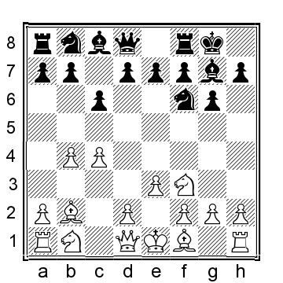
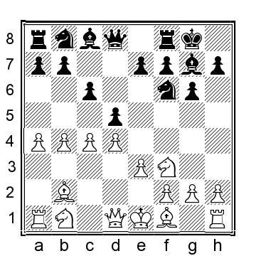
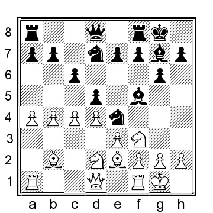
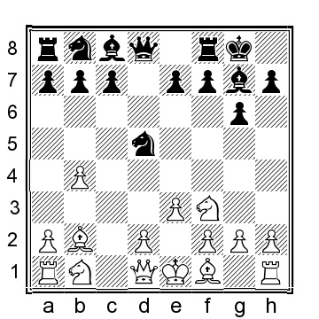
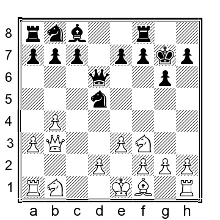
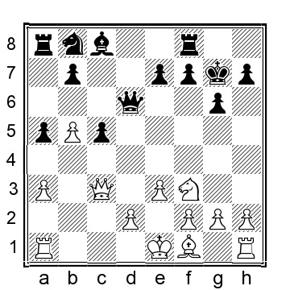

# Глава 5: Индийские расстановки Грюнфельда

Некоторые позиции переходят в другие дебюты, некоторые классифицируются как английский дебют, а некоторые, технически говоря, являются собственно грюнфельдовскими. Позиции, приведенные в этой главе, в других работах часто рассматривались вместе с индийскими позициями, но поскольку они весьма своеобразны и очень похожи на Грюнфельда, имеет смысл рассказать о них отдельно. Тем не менее, я выбрал довольно редкие позиции, но при этом дающие белым отличные шансы на преимущество.

**1.b4 Nf6 2.Bb2 g6**.

Другой порядок ходов: 2...d5 3.e3 g6 4.Nf3 Bg7 5.c4 dxc4 (и 5...0-0, и 5...c6 ведут нас к позициям, которые будут рассмотрены ниже) 6.Bxc4 0-0 7.0-0 Nbd7 (или 7...c6 8.a4 Nbd7 9.d4 Nd5 10.b5 N7b6 11.Be2 cxb5 12.axb5 Bg4 13.Nbd2 h6 14.h3 Be6 15.Nb3 Nf6 16.Nc5 и у белых большой перевес, Кэнел-З.Илич, Бёрн 1989) 8.d4 b6 9.Qe2 c6 10.a4 Nd5 11.b5 было сыграно в партии Кэнель-Георгиу, Ленк 1995, и здесь игроки довольствовались ничьей, ½-½, но у белых уже комфортно лучше, например, 11...Bb7 12.bxc6 Bxc6 13.e4 Nc7 14.Rc1 Bb7 15.h4 Nf6 16.Nbd2 и очевидно, что у черных жалкая позиция.

**3.c4 Bg7 4.Nf3 0-0**

4...c6 5.e3 0-0 перекликается с 4...0-0 5.e3 c6.

**5.e3 d5**

Другая индийская расстановка Грюнфельда - 5...c6, нацеленная на расстановку типа вариации Шлехтера.

A) 6.d4!? переводит игру в позиции, которые классифицируются как английский дебют. Теперь 6...d5 7.a4!?

У белых есть две альтернативы, которые многие сильные игроки играли много раз, 7.Nbd2 и 7.Nc3, но я не думаю, что они что-то предлагают белым. Поэтому я рекомендую эту атаку ферзевого фланга с четырьмя пешками, специализацию швейцарского международного мастера Хансюрга Кенеля.

Объективно говоря, черные должны быть в состоянии уравнять. Тем не менее, мой опыт показывает, что позиция черных не так проста, как позиция белых, что дает нам прекрасную возможность переиграть черных, даже когда они играют лучшее продолжение.

Несмотря на то, что продолжение белых встречается относительно редко, черные в этой позиции пробовали несколько разных вещей:

a) 7...Bf5 8.a5!? (не опробовано; более распространенный вариант - 8.Nbd2!? Nbd7 (8...Ne4 9.Be2 Nxd2 10.Qxd2 dxc4 11.Bxc4 Be4 12.Qe2 Nd7 13.0-0 и у белых было больше пространства и чуть лучшие шансы, Уланов-Корнюшин, Екатеринбург 2013) 9.Be2 Ne4 (после 9...a5 я предпочитаю 10.b5 cxb5 11.axb5 dxc4 12.Nxc4 за белых) 10.0-0

и теперь 10...Nxd2 (10...Re8 11.cxd5! cxd5 12.Nxe4 Bxe4 13.Qb3 Rc8 14.Rac1 Nf6 15.Ne5 Bf5 16.f3 и француз №1 явно боролся черными, Со-Вашье Лаграв, Chess.com INT 2017; 10...Ndf6 11.a5! или 11.b5!?, в обоих случаях инициатива у белых) 11.Nxd2 e5 12.cxd5 cxd5 13. dxe5 Nxe5 14.Bd4 Re8 - Морович Фернандез - Дарсил, Буэнос-Айрес 2017, и теперь 15.Nb3 Rc8 16.Ra2 Qc7 17.Qa1 у белых был бы перевес) 8. ...Ne4 9.Qb3 Na6 10.Nc3 (белые также могут рассмотреть 10.cxd5 Qxd5 11.Bc4 Qd6 12.Ra4 с интересной позицией) 10...Nxc3 11.Bxc3 Be4 12.h4!? (забавная альтернатива 12.Be2 dxc4 13.Bxc4 Bxf3 14.gxf3 с шансами для обеих сторон) 12...dxc4 13.Bxc4 Nc7 14.h5 Qd7 15.Rh4 и пока шансы более-менее равны, мы развлекаемся.

b) 7...Bg4 8.Nbd2 a5 9.b5 dxc4 10.Bxc4 cxb5 11.Bxb5 Nc6 12.0-0 Rc8 13.h3 и у белых приятное преимущество с лишней центральной пешкой, М.Рихтер-Крефенштейн, Берлин 2014.

c) 7...Nbd7 8.Nbd2 (или 8.Nc3 a5 9.b5 c5 10.Nxd5 Nxd5 11.cxd5 Nb6 12.e4 e6 13.d6 cxd4 14.e5 f6 15.Bxd4 fxe5 16.Bxe5 Bxe5 17.Nxe5 Qh4 18.Nf3 Qb4+ 19. Qd2 оценивается компьютером как равная, но я считаю, что у белых лучшие шансы из-за разреженной пешечной структуры черных) 8...e5 (или 8...Re8 9.Be2 Ne4 10.0-0 (белые добиваются меньшего при 10.Nxe4 dxe4 11.Nd2 e5 12.dxe5? (12.d5!? было бы приличной попыткой добиться большего; после взятия на e5 у черных просто лучше) 12...Nxe5 13.Nxe4 Bf5 14.Nd6 Nd3+ 15.Bxd3 Qxd6 16.Bxg7 Bxd3 17.Bc3 Rad8 с явным перевесом у черных, Г.Сзабо-Драгомиреску, Сарата Монтеору 2012) 10. ..Nxd2 11.Nxd2 e5 12.cxd5 cxd5 13.dxe5 Nxe5 14.Bd4 и у белых позиционный плюс) 9.dxe5 Ng4 10. cxd5 (10.Bd4!?) 10...Ngxe5 11.Qb3 (11.Qc2!?) 11...a5 12.Be2 axb4 13.Qxb4 Nxf3+ 14.Nxf3 Bxb2 15.Qxb2 Qa5+ 16.Qd2 Qxd5 17.Qxd5 cxd5 18.Nd4 Nc5 19.Bb5 и у белых лишь небольшой плюс за счет изолированной d-пешки черных.

d) 7...a5 8.b5 cxb5 9.axb5 dxc4 10.Bxc4 b6? (это выглядит нормально, но оставляет черным структурную слабость на c6) 11.0-0 Bb7 12.Nbd2 Ne4 13.Nxe4 Bxe4 14.Ne5 Ra7 15.Qb3 с явным преимуществом белых, Кэнель-Зольбрехт, Биль 2004.

e) 7...dxc4 8.Bxc4 a5 (если 8...Nd5, то 9.b5 a6 10.Nbd2 axb5 11.axb5 Rxa1 12.Qxa1 лучше у белых) 9.bxa5 Qxa5+ 10.Nbd2 c5 11.0-0 cxd4 12.Nxd4 Bd7 13.Nb5 и у белых небольшой плюс.

B) Белые могут сыграть и немедленное 6.a4!? d5 7.Be2 dxc4 8.Bxc4 Bg4 9.0-0 с удобной позицией для белых, которые рано или поздно могут решиться на d2-d4 с пространственным преимуществом для белых.

C) Гораздо более распространенный вариант - 6.Be2 d5 (другая идея - 6...a5 7.b5 cxb5 8.cxb5 d5 (или 8...d6 9.0-0 Nbd7 10.d3 Nb6 11.a4 Nfd5 12.Qd2 Bxb2 13.Qxb2 Nb4 14.h3 и шансы примерно равны) 9.a4 (или 9.0-0!? Nbd7 10.d4 Nb6 11.Nbd2 Ne8 12.a4 Nd6 13.Rc1 f6 было сыграно в партии МакНаб-Хенниган, Остров Мэн 1993, и теперь 14.Ba3 дало бы белым приятное преимущество) 9...Ne4 10.Bxg7 Kxg7 11.Qb3 Qd6 12.Qb2+ Nf6 13.h3 Nbd7 14. 0-0 и шансы более или менее равны) 7.cxd5 (7.0-0 - главный линейный ход, который был сыгран в более чем 100 партиях, и черные, вероятно, прекрасно справляются после 7...dxc4 8.Bxc4 b5 9.Be2 a5; забавная альтернатива - 7. Na3 Bg4 8.h3 Bxf3 9.Bxf3 a5 10.b5 dxc4 11.bxc6 Nxc6 12.Nxc4 Rc8 было сыграно в партии Кряквин - Дужаков, Санкт-Петербург 2019, и теперь 13.Qb3 Nb4 14.d4 дает белым небольшой перевес) 7... Nxd5 (если черные играют на уравнивание, то возврат пешки - лучший вариант, например, 7...cxd5 8.0-0 Bg4 9.a4 Nc6 10.b5 Na5 11.d3, когда я предпочитаю белых, но черные не должны быть хуже) 8.Bxg7 Kxg7 9.Qc2 Kg8 10.a3 a5 11.bxa5 Rxa5 12.d4 Bg4 13.Nbd2, когда я предпочитаю белых, но черные должны быть близки к равенству.

**6.cxd5 Nxd5**

Взятие коня - более логичный вариант из всех возможных вариантов черных. Теперь чернопольные слоны будут разменяны. В чью пользу это произойдет? Я думаю, что размен в пользу белых, даже если в нем нет ничего драматичного.
Альтернатива - 6...Qxd5 7.Nc3, и здесь:

a) 7...Qd8 8.Be2 (это, вероятно, лучше, но белые могут рассмотреть и 8.Bc4 Nc6 9.b5 Na5 10.Be2 Bg4?! (10...a6!?) 11.0-0 Bxf3 12.Bxf3 e5 13.d3 c6 14.a4 и у белых небольшой, но явный перевес благодаря паре слонов и давлению на ферзевый фланг черных, Г.Джонс-Ааканкша, Chess.com INT 2020) 8...Nbd7 (как обычно, некоторые черные игроки будут рассматривать 8...a5 9.b5 Nbd7?! (если черные играют на размен двух комплектов второстепенных фигур на с3, то 9. ...Nd5 10.d4 c6 11.0-0 Bf5 12.a4 оставляет белым приятную позицию) 10.0-0 Nb6 11.Na4 Nbd5 12.Be5 Bg4 13.h3 Bxf3 14.Bxf3 e6 15.Rc1 Ne8 16.Bxg7 Kxg7 17.Nc3 и белые прочно контролируют игру, если не сказать, что у черных ужасная позиция, М.Жировски-Решке, Германия 2004) 9.0-0 e5 10.d3 c6 11.a4 (подготавливая поход белых на ферзевом фланге) 11...b6 (11...a5 12.b5 хорошо для белых) 12.Qb3 Re8 13.Rfd1 Qe7 14.d4! (можно сыграть и 14.Nd2!?) 14...exd4 15.exd4 Nf8 16.Ne5 Be6 17.Qa3 Rac8 было сыграно в партии Кураица - Фират, Измир 2016, и здесь 18.b5 Qxa3 19.Rxa3 c5 20.d5 Bd7 21.f4 дало бы белым приятное преимущество.

b) 7...Qd6 8.a3 (или 8.Nb5 Qd8 9.Bc4 c6 10.Na3 Nbd7 11.0-0 Nb6, что было сыграно в партии Сидор - Золтек, Быдгощ 1976, и теперь 12.Be2 Be6 13.h3 Qd7 было бы очень близко к равенству) 8...Bg4 9.Be2 Nc6?! (коню почти наверняка не место на этой клетке; более солидным и лучшим вариантом было 9...c6 10.d4 Nbd7 11.0-0, что выгодно для белых и довольно неприятно для черных, что часто случается в этой позиции) 10.d4 e6? (10...Rfd8 все еще играбельно для черных) 11.h3 Bxf3 12.Bxf3 a6 13.0-0 Rab8 14.Rc1 Rfc8 15.Na4 и черные близки к поражению, Лебредо Зарагойтиа-ДеВинтер, Мексико Сити 1978.
**7.Bxg7 Kxg7 8.Qb3 Qd6**.

Две альтернативы:

a) 8...c6 9.Nc3 Qd6 10.Bc4 Nxc3 11.Qxc3+ f6 12.a4 Bg4 13.Be2 e5 14.0-0 Nd7 15.h3 Be6 16.d4 и у белых инициатива, Тряпишко-Мирзаев, Ярославль 2019.

б) 8...Nb6 9.Qb2+ f6 10.d4 (или 10.Be2 c6 11.0-0 и у белых положение лучше) 10...Qd6 11.Nbd2 a5 12.b5 Be6 13.Be2 и позиция белых и лучше, и играть легче.

**9.a3**

**9...a5**

Возможны и другие варианты:

a) 9...c5 10.Nc3 Nf6 11.Be2 cxb4 12.Qxb4! и у белых сильная инициатива на ферзевом фланге.

b) 9...e5 10.Nc3 Nxc3 11.Qxc3 Re8 12.Rc1 (или 12.Be2 Nd7 13.0-0 Nf6 14.d3 Bg4 15.b5 h6 16.Rfc1 и у белых давление на ферзевом фланге, Штейнбахер-Ван Вессель, Гронинген 1994) 12...c6 13.d4 Nd7 14.dxe5 Nxe5 15.Be2 и у белых инициатива.

**10.b5 c5**

Или 10...c6 11.d4 cxb5 12.Bxb5 Bd7 13.Be2 b5 14.Nbd2, и хотя позиция объективно ровная, позиция белых кажется более легкой.

**11.Nc3 Nxc3 12.Qxc3+**

**12...f6 13.h4**

13.Be2!? Be6 14.0-0 Nd7 15.Rac1 Rfc8 16.d3 Nb6 17.Nd2, когда у белых должно быть хоть на йоту лучше, но явно не на много.

**13...h5**

До сих пор мы следили за партией Константинов - Фелетер, ICCF email 2018, которая была более или менее ровной, но мне нравится позиция белых после

**14.Bd3 Bg4 15.Be4 Ra7 16.d3 Nd7 17.Nd2** и фигуры белых оставляют лучшее впечатление.
