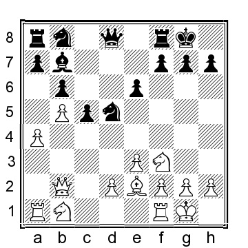

# Глава 6: Ферзевая индийская защита

Ферзевая индийская защита - настолько разумный дебют, что трудно поверить, что он должен быть подходящим вариантом для черных. Но оказывается, что для черных все далеко не так просто.

**1.b4 Nf6 2.Bb2 e6 3.b5 b6 4.e3 Bb7 5.Nf3 Be7**

И 5...d5, и 5...c5 имеют тенденцию переходить в другие позиции, либо в этой главе, либо в главе об основной позиции.
Четвертый вариант - 5...a6 6.a4 axb5 (или 6...Be7 7.Be2 0-0 8.0-0 c6 9.c4 d6 10.d4 axb5 11.axb5 Rxa1 12.Bxa1 cxb5 13.cxb5 Nbd7 было сыграно в партии Гленне-Т.Ернст, Гаусдаль 1994, а сейчас лучше было бы 14.Bb2; позиция белых несколько проще) 7. axb5 Rxa1 8.Bxa1 d6 9.Be2 Nbd7 10.c4 Qa8 11.Nc3 Be7 12.0-0 0-0 13.Bb2, и здесь была согласована ничья, ½-½, в партии Орнштейн-Р.Акессон, Стокгольм 1998, но у белых больше пространства и чуть лучшие шансы.

**6.c4 0-0**

Пока все хорошо. Черные сыграли стандартные ферзевые индийские ходы, которые выглядят немного пассивными в данном контексте, но это, конечно, может скоро измениться, так как черные готовятся к удару в центре.

**7.Be2**

**7...d6?!**
Называть этот ход сомнительным, пожалуй, несколько грубовато, но неизменно после него черные оказываются в затруднительном положении.

**8.0-0 Nbd7 9.a4 a6**

Если черные пытаются остановить игру белых на ферзевом фланге путем 9...a5, то неопробованное 10.Nd4! неудобно для черных: слабая клетка c6 становится целью при Bf3. (менее эффектно, но все же в пользу белых 10.d3 d5 11.Nbd2 c6 12.bxc6 Bxc6 13.Nd4 Bb7 14.Nb5 и инициатива у белых) 10...e5 11.Nf5 (выигрывая пару слонов у белых) 11...Re8 12.Nxe7+ Qxe7 (или 12...Rxe7 13. d3 и черным будет трудно развить какую-либо контригру, тогда как белые угрожают сыграть e3-e4 с последующим f2-f4 с атакой на королевском фланге) 13.d3 d5 14.Nd2 Nc5 15.Nb3 dxc4 (также 15...Nxb3 16. Qxb3 dxc4 17.Qxc4 комфортно лучше для белых) 16.Nxc5 Qxc5 17.dxc4 Qe7 18.Ba3 Qe6 19.f3!? c5 20.bxc6 Bxc6 21.Qb3 и у белых пара слонов и слабая отсталая пешка на поле b6 для атаки.

**10.Nc3**.

У белых есть несколько альтернатив:

a) 10.a5? сыграно в правильном духе, но не особенно хорошо в этой позиции: 10...axb5 11.axb6 (или 11.cxb5 Rxa5 12.Rxa5 bxa5 13.Bc3 c5 14.Qa4 Qa8 15.Qxa5 Qxa5 16.Bxa5 Ra8 и у черных лучшие шансы) 11...Rxa1 12.Bxa1 bxc4 13.bxc7 Qxc7 и белые потеряли пешку без компенсации.

b) 10.d4, и здесь:

b1) 10...Ne4 11.Qc2 axb5 12.Bd3 Ndf6 13.cxb5 Qd7 14.Nbd2 Nxd2 15.Nxd2 и у белых давление и больше пространства.

b2) 10...axb5 11.axb5 Rxa1 12.Bxa1 Ne4 13.Nfd2 f6 14.Nxe4 Bxe4 15.Nc3 Bb7 16.Bf3 Qa8 17.Bb2 Bxf3 18.Qxf3 (18.gxf3 f5 19.Qe2 h6 20.h3 Qe8 (если 20...Rf6, то 21.Ra1 удачно для белых) 21. f4 Qg6+ 22.Kh2 Ra8 23.Qf3 Ra7 с примерно равными шансами) 18...Qxf3 19.gxf3 Ra8 20.Ra1 Rxa1+ 21.Bxa1 Kf7 22.Kf1 f5 с равным эндшпилем, Осмак-Мамедова, Chess.com INT 2021.

**10...Re8**

Несколько важных альтернатив:

a) 10...axb5 11.cxb5 (или 11.axb5 Rxa1 12.Qxa1 Qa8 13.d3 Ne5 14.Qxa8 Rxa8 15.Nd4 и у белых чуть больше пространства, но черные должны держать равновесие) 11...Ne5 12.Nd4 d5 13.Qb3 c5 14.bxc6 Nxc6 15.Nxc6 Bxc6 16.Nb5 и у белых чуть более легкая позиция для игры.

b) 10...c5 11.bxc6!? (заманчиво сыграть 11.d4, но у черных не должно быть больших проблем с удержанием равновесия, например, 11...Ne4 12.Qc2 Nxc3 13.Bxc3 axb5 14.axb5 Qc7 15.Bb2 Bf6 16.Rfd1 было примерно равным в партии Грунд-Бальтасар, Германия 1986) 11...Bxc6 12.Qc2 (12.d4! ? также можно рассмотреть) 12...Re8 13.h3 Bb7 14.Rfb1 h6 15.Ba3 (15.d4!? снова стоит рассмотреть) 15...d5 16.Bxe7 Rxe7 17.cxd5 Nxd5 18.Nxd5 Bxd5 19.Rc1 Nc5 20.Ra3 и у белых небольшая инициатива, но по сути шансы более-менее равны.

c) 10...d5 11.cxd5 exd5 12.Qc2 Re8 13.Rfb1 Nb8 14.Nd4 и с лучшим контролем над центром у белых явное преимущество.

**11.Nd4!?**

Данный ход - один из моих любимых в игре белых против ферзевой индийской защиты. Он почти всегда застает черных врасплох, и против него сложно играть. Тем не менее, у белых есть два других варианта, один из которых одобрил сам маэстро:

a) 11.d4 Bf8?! (или 11...axb5 12.axb5 Rxa1 13.Bxa1 Qa8 14.Bb2 Ne4 15.Qb3 и у белых небольшой плюс) 12.Qc2 g6 13. Rfd1 Qc8 в некоторых базах данных, цитируя Сокольский-Чукаев, СССР 1959, дается как ничья, но хотя это и был конечный результат партии, у белых лучшие шансы, например, 14.d5 Bg7 15.dxe6 Rxe6 16.Nd4 Re8 17.Bf3 Bxf3 18.Nxf3 axb5 19. axb5 Rxa1 20.Bxa1 Qa8 21.Bb2 Ne4?? (это грубая ошибка; черные должны были выбрать 21...Nc5, хотя 22.h3 h5 23.Nd4 более выгодно для белых) 22.Nd5 Qb7 23. Bxg7 и эта позиция приводится как финальная, ничья ½-½ в Боснер-Гафнер, корр 1997, но белые выигрывают после 23...Kxg7 24.Qb2+ f6 25.Nd4 Nec5 26.Nc6 Rf8 27.f4 и черные полностью разбиты.

б) 11.Qc2 c6 (или 11...c5 12.bxc6 Bxc6, что приводит к той же позиции, что и после 11...c6) 12.bxc6 Bxc6 13.d4! (это лучше всего; но интересная альтернатива - 13.a5!? bxa5 14.Nd4 Bb7 15.Nb3 a4 16.Nxa4 Qc7 17.Bc3 и у белых перевес, Росин-Шрайбер, ICCF corr 1996) 13...d5 14.cxd5 Nxd5 15.Nxd5 Bxd5 16.Bd3! Bxf3 17.gxf3 Bd6 18.f4 Qh4 19.Qc6 Nf6 20.Qf3 и у белых небольшой перевес.

**11...axb5**.

Естественное решение за черных, но давайте посмотрим на альтернативы:

a) 11...e5? играет на руку белым 12.Nc6 Bxc6 13.bxc6 Nc5 14.f4 exf4 15.Rxf4 Ne6 (или 15...d5 16.Nxd5 Nxd5 17.cxd5 и белые выигрывают) 16.Rf5 с почти решающим преимуществом у белых.

б) 11...Nc5 12.Nc6 (белые могут также рассмотреть 12.d3 axb5 13.cxb5 Qd7 14.Qc2 Bf8 15.Rfc1 с небольшим плюсом; или 12.Bf3 Bxf3 13.Qxf3 Nd3 14. Nc6 Qd7 15.Ba3 Ne5 16.Nxe7+ Qxe7 17.Qe2 axb5 18.cxb5 с хорошим перевесом в пространстве и отличным давлением на ферзевый фланг черных) 12...Bxc6 13.bxc6 d5 14.d4 Nce4 15.Nxe4 Nxe4 16.a5 Qd6 17.axb6 Qxc6 18.cxd5 exd5 19.bxc7 Rec8 20.Qd3 и черным не удастся удержать пешку "а", если они хотят выиграть и пешку "с7".

**12.cxb5!**

Белые также могут забрать пешку "а", но слабость на поле с6 вместе с открытой вертикалью "с" доставит черным головную боль надолго.

**12...e5?!**

Лучшим выбором является 12...d5, хотя 13.Nc6 Bxc6 14.bxc6 Ne5 15.Rc1 Nxc6 16.Nxd5 Nxd5 17.Rxc6 более комфортно для белых.

**13.Nc6 Bxc6 14.bxc6 Nf8 15.Nb5** и у белых большой плюс за счет пространственного преимущества, пары слонов и атакующего потенциала на обоих флангах; действительно удручающая позиция для черных.

B) **7...d5!?**

Этот ход приводит к позициям, часто напоминающим позиции из главы "Основные позиции".

**8.0-0**

Белые вполне обоснованно могут рассмотреть и 8.cxd5, и теперь:

a) 8...exd5 9.a4 c5 (черные сдают изолированную d-пешку, чтобы избежать очень пассивной позиции с задней c-пешкой на открытой вертикали) 10.bxc6 Nxc6 11.0-0 Bc5 12.d4 (или 12.Bb5 a6 13.Bxc6 Bxc6 14.Qb3 Re8 15.d3 Nd7 16. d4 Bd6 17.Rc1 Rc8 18.Nc3 Nf6 19.h3 h6 20.Ba3 с близкими к равным шансами) 12...Bd6 13.Ba3 Na5 14.Nc3 Rc8 15.Bxd6 Qxd6 16.Nb5 Qb8 17.Qb1 и пока черные близки к уравниванию, но позиция белых легче.

b) 8...Bxd5 (вряд ли это правильно, так как черным придется снова отступить слоном, если они хотят избежать получения белыми пары слонов) 9.a4 a6 10.Nc3 Bb7 11.0-0 и у белых лишняя центральная пешка, больше пространства и более легкая позиция для игры.

c) 8...Nxd5 9.0-0 c5 10.a4 Bf6 11.Qb3 (в качестве альтернативы, 11.Bxf6!? Qxf6 12.Na3 Nd7 13.Nc4 выглядит благоприятно для белых) 11...Bxb2 12.Qxb2

12...a5 (или 12...Nd7 13.Na3 Nb4 14.h3 a5 15.bxa6 Bxa6 16.Nb5 Qe7 17.d4 и у белых инициатива и лучшие шансы) 13.Na3 Nb4 14.d3 Bxf3? (это попытка выиграть пешку для черных, но при этом создает множество проблем для черных; лучший выбор - 14...Nd7 15.Rad1 Qc7 16.e4 Rad8 и у белых более легкая позиция для игры 17.Nc4) 15.Bxf3 Ra7 16.Rad1 Rd7 17.Nc4 Nxd3? (или 17...Qc7 18.Qe5! Qxe5 19.Nxe5 Rdd8 20.Nc4 с явным преимуществом белых) 18.Qc3 Nb4 19.Rxd7 Nxd7 20.Rd1 и белые позиционно выигрывают.

**8...c5 9.d3**

**9...Nbd7**

Некоторые альтернативы таковы:

a) 9...dxc4 (этот ход можно принять за легкое уравнивание для черных, но на самом деле все далеко не так просто...) 10.dxc4 Qxd1 (или 10...Nbd7 11.a4 Ne4 12.Qc2 Bf6 13.a5 и у белых давление на ферзевом фланге) 11.Rxd1 Rd8 12.Nbd2 и позиция белых легче; идея состоит в том, чтобы продвинуть пешку a2 на a5, и если черные сыграют ...a7-a5, то у белых Ne5, когда размен на e5 даст белым угрозу Bc7, нацеленную на пешку b6, а если размена не будет, то Bf3, смягчает защиту клетки c6, которая может стать раздражающей для черных.

б) 9...a6 10.a4 dxc4?! (или 10...axb5 11.axb5 Rxa1 12.Bxa1 - близко к равенству, но вертикаль а скорее пригодится белым, чем черным) 11.dxc4 Qc7 12.Qc2 Nbd7 13. Nbd2 Bd6 14.h3 Rfe8 15.Bd3 Ne5 было сыграно в партии Рус-Хорт, DESC email 2001, и здесь белые могут получить преимущество после 16.Nxe5 Bxe5 17.Bxe5 Qxe5 18.a5 и у белых положение лучше.

**10.a4 Qc7 11.Nbd2**

Важная позиция для этой партии.

**11...Rad8**.

В этой позиции черные пробовали несколько других ходов:

a) 11...a5 12.Rc1 Rad8 13.Qc2 Rfe8 14.Rfd1 и фигуры белых расположены немного лучше.

б) 11...a6 12.Qb3 Rfc8 13.Bc3 Ne8 14.Qb2 Bf6 15.Bxf6 Nexf6 16.h3 с типичной позицией, где шансы у обеих сторон.

c) 11...Ng4 12.h3 (выбивая коня и избегая потенциальных хитростей, позволяя мат на h2; также 12.Rc1 a6 13.d4 (или 13.h3 Ngf6 14.Qb3 Rfc8 - примерно ровно) 13...axb5 14.axb5 Ra2 15.Qb3 с шансами для обеих сторон) 12. ...Nge5 (или 12...Ngf6 13.Qc2 Rfc8 14.a5 bxa5 15.Bc3 с приятной игрой для белых) 13.Nxe5 Nxe5 14.a5 bxa5 15.cxd5 exd5 16.d4 и у белых лучшая пешечная структура и лучше расположены фигуры.

**12.Qc2 e5 13.cxd5 Nxd5 14.Qb3 Nb4 15.Rfc1 Qb8 16.e4 Bd6 17.Nc4 a5 18.Nh4** и все фигуры белых находятся на лучших клетках, в то время как пешки черных сдерживаются странным образом.
