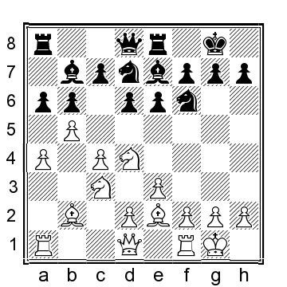

# Chapter 6: Queen’s Indian Set-ups

The Queen’s Indian Defense is such a sensible opening that it is difficult to believe it should be a proper set-up for Black. But it turns out that things are far from that simple for Black

**1.b4 Nf6 2.Bb2 e6 3.b5 b6 4.e3 Bb7 5.Nf3 Be7**

Both 5...d5 and 5...c5 tend to transpose to other lines, either in this chapter or the main line chapter.
A fourth option is 5...a6 6.a4 axb5 (or 6...Be7 7.Be2 0-0 8.0-0 c6 9.c4 d6 10.d4 axb5 11.axb5 Rxa1 12.Bxa1 cxb5 13.cxb5 Nbd7 was played in Glenne-T.Ernst, Gausdal 1994, and now 14.Bb2 would have been best; White’s position is a little easier to play) 7.axb5 Rxa1 8.Bxa1 d6 9.Be2 Nbd7 10.c4 Qa8 11.Nc3 Be7 12.0-0 0-0 13.Bb2, and here a draw was agreed upon, ½–½, in Ornstein-R.Akesson, Stockholm 1998, but White has more space and the slightly better chances.

**6.c4 0-0**

So far, so good. Black has played the standard Queen’s Indian moves, which look a bit passive in this context, but this can, of course, soon change as Black prepares to strike in the center.

**7.Be2**

**7...d6?!**
Calling this move dubious is perhaps a little harsh, but invariably, Black seems to end up in trouble after this move.

**8.0-0 Nbd7 9.a4 a6**

If Black attempts to stop White’s play on the queenside with 9...a5, then the untried 10.Nd4! is uncomfortable for Black: the weak c6–square is the target with Bf3. (less consequential but still favoring White is 10.d3 d5 11.Nbd2 c6 12.bxc6 Bxc6 13.Nd4 Bb7 14.Nb5 and White has the initiative) 10...e5 11.Nf5 (winning the bishop pair for White) 11...Re8 12.Nxe7+ Qxe7 (or 12...Rxe7 13.d3 and Black will be struggling to develop any counterplay whereas White threatens to play e3–e4 followed by f2–f4 with a kingside attack) 13.d3 d5 14.Nd2 Nc5 15.Nb3 dxc4 (also 15...Nxb3 16.Qxb3 dxc4 17.Qxc4 is comfortably better for White) 16.Nxc5 Qxc5 17.dxc4 Qe7 18.Ba3 Qe6 19.f3!? c5 20.bxc6 Bxc6 21.Qb3 and White has the bishop pair and a weak backward pawn on b6–pawn to attack.

**10.Nc3**

White has a couple of alternatives:

a) 10.a5? is played in the right spirit but is not particularly good in this position: 10...axb5 11.axb6 (or 11.cxb5 Rxa5 12.Rxa5 bxa5 13.Bc3 c5 14.Qa4 Qa8 15.Qxa5 Qxa5 16.Bxa5 Ra8 and Black has the better chances) 11...Rxa1 12.Bxa1 bxc4 13.bxc7 Qxc7 and White has lost a pawn without compensation.

b) 10.d4, and here:

b1) 10...Ne4 11.Qc2 axb5 12.Bd3 Ndf6 13.cxb5 Qd7 14.Nbd2 Nxd2 15.Nxd2 and White has pressure and more space.

b2) 10...axb5 11.axb5 Rxa1 12.Bxa1 Ne4 13.Nfd2 f6 14.Nxe4 Bxe4 15.Nc3 Bb7 16.Bf3 Qa8 17.Bb2 Bxf3 18.Qxf3 (18.gxf3 f5 19.Qe2 h6 20.h3 Qe8 (if 20...Rf6 then 21.Ra1 is pleasant for White) 21.f4 Qg6+ 22.Kh2 Ra8 23.Qf3 Ra7 with about even chances) 18...Qxf3 19.gxf3 Ra8 20.Ra1 Rxa1+ 21.Bxa1 Kf7 22.Kf1 f5 with an equal endgame, Osmak-Mammadova, Chess.com INT 2021.

**10...Re8**

Some important alternatives:

a) 10...axb5 11.cxb5 (or 11.axb5 Rxa1 12.Qxa1 Qa8 13.d3 Ne5 14.Qxa8 Rxa8 15.Nd4 and White has bit more space but Black should hold the balance) 11...Ne5 12.Nd4 d5 13.Qb3 c5 14.bxc6 Nxc6 15.Nxc6 Bxc6 16.Nb5 and White has the slightly easier position to play.

b) 10...c5 11.bxc6!? (it is tempting to play 11.d4, but Black should not have too much trouble holding the balance, for instance, 11...Ne4 12.Qc2 Nxc3 13.Bxc3 axb5 14.axb5 Qc7 15.Bb2 Bf6 16.Rfd1 was about equal in Grund-Balthasar, Germany 1986) 11...Bxc6 12.Qc2 (12.d4!? can also be considered) 12...Re8 13.h3 Bb7 14.Rfb1 h6 15.Ba3 (15.d4!? is again worth considering) 15...d5 16.Bxe7 Rxe7 17.cxd5 Nxd5 18.Nxd5 Bxd5 19.Rc1 Nc5 20.Ra3 and White has a little initiative but in essence the chances are more or less even.

c) 10...d5 11.cxd5 exd5 12.Qc2 Re8 13.Rfb1 Nb8 14.Nd4 and with his better control over the center, White has a clear advantage.

**11.Nd4!?**

The text move is one of my favorite things about the White play against the Queen’s Indian set-up. It almost always takes Black by surprise, and it is challenging to play against. Nevertheless, White has two other options, one of which was endorsed by the maestro himself:

a) 11.d4 Bf8?! (or 11...axb5 12.axb5 Rxa1 13.Bxa1 Qa8 14.Bb2 Ne4 15.Qb3 and White has a slight plus) 12.Qc2 g6 13.Rfd1 Qc8 is given as a draw in some databases, quoting Sokolsky-Chukaev, USSR 1959, but while that was the eventual outcome of the game, White has the better chances, for instance, 14.d5 Bg7 15.dxe6 Rxe6 16.Nd4 Re8 17.Bf3 Bxf3 18.Nxf3 axb5 19.axb5 Rxa1 20.Bxa1 Qa8 21.Bb2 Ne4?? (this is a bad blunder; Black should have opted for 21...Nc5 although 22.h3 h5 23.Nd4 is pleasant for White) 22.Nd5 Qb7 23.Bxg7 and this position is given as the final position, a draw ½–½ in Rosner-Hafner, corr 1997, but White is winning after 23...Kxg7 24.Qb2+ f6 25.Nd4 Nec5 26.Nc6 Rf8 27.f4 and Black is completely busted.

b) 11.Qc2 c6 (or 11...c5 12.bxc6 Bxc6, leading to the same position as after 11...c6) 12.bxc6 Bxc6 13.d4! (this is best; but an interesting alternative is 13.a5!? bxa5 14.Nd4 Bb7 15.Nb3 a4 16.Nxa4 Qc7 17.Bc3 and White has upper hand, Rosin-Schreiber, ICCF corr 1996) 13...d5 14.cxd5 Nxd5 15.Nxd5 Bxd5 16.Bd3! Bxf3 17.gxf3 Bd6 18.f4 Qh4 19.Qc6 Nf6 20.Qf3 and White has slight advantage.

**11...axb5**

A natural decision for Black, but let us have a quick look at the alternatives:

a) 11...e5? plays into White’s hands 12.Nc6 Bxc6 13.bxc6 Nc5 14.f4 exf4 15.Rxf4 Ne6 (or 15...d5 16.Nxd5 Nxd5 17.cxd5 and White is winning) 16.Rf5 with a near-decisive advantage for White.

b) 11...Nc5 12.Nc6 (White can also consider 12.d3 axb5 13.cxb5 Qd7 14.Qc2 Bf8 15.Rfc1 with a small plus; or 12.Bf3 Bxf3 13.Qxf3 Nd3 14.Nc6 Qd7 15.Ba3 Ne5 16.Nxe7+ Qxe7 17.Qe2 axb5 18.cxb5 with a nice advantage in space and excellent pressure against Black’s queenside) 12...Bxc6 13.bxc6 d5 14.d4 Nce4 15.Nxe4 Nxe4 16.a5 Qd6 17.axb6 Qxc6 18.cxd5 exd5 19.bxc7 Rec8 20.Qd3  and Black will not be able to hang on to the a-pawn if also wanting to win the c7–pawn.

**12.cxb5!**

White can also recapture with the a-pawn, but the weakness on c6 along with the open c-file will give Black long-term headaches.

**12...e5?!**

A better choice is 12...d5 although 13.Nc6 Bxc6 14.bxc6 Ne5 15.Rc1 Nxc6 16.Nxd5 Nxd5 17.Rxc6 is comfortably better for White.

**13.Nc6 Bxc6 14.bxc6 Nf8 15.Nb5** and White has a big plus thanks to the space advantage, bishop pair, and attacking potential on both flanks; a truly depressing position for Black.

B) **7...d5!?**

This move leads to positions that frequently resemble those in the main line chapter.

**8.0-0**

White can reasonably consider 8.cxd5 as well, and now:

a) 8...exd5 9.a4 c5 (Black accepts an isolated d-pawn to avoid a very passive position with a back c- pawn on an open file) 10.bxc6 Nxc6 11.0-0 Bc5 12.d4 (or 12.Bb5 a6 13.Bxc6 Bxc6 14.Qb3 Re8 15.d3 Nd7 16.d4 Bd6 17.Rc1 Rc8 18.Nc3 Nf6 19.h3 h6 20.Ba3 with close to equal chances) 12...Bd6 13.Ba3 Na5 14.Nc3 Rc8 15.Bxd6 Qxd6 16.Nb5 Qb8 17.Qb1 and while Black is close to equalizing but White’s position easier to play.

b) 8...Bxd5 (this can hardly be correct because Black will have to retreat the bishop again if wanting to avoid White getting the bishop pair) 9.a4 a6 10.Nc3 Bb7 11.0-0 and White has an extra central pawn, more space, and an easier position to play.

c) 8...Nxd5 9.0-0 c5 10.a4 Bf6 11.Qb3 (Alternatively, 11.Bxf6!? Qxf6 12.Na3 Nd7 13.Nc4 looks pleasant for White) 11...Bxb2 12.Qxb2

12...a5 (or 12...Nd7 13.Na3 Nb4 14.h3 a5 15.bxa6 Bxa6 16.Nb5 Qe7 17.d4 and White has the initiative and better chances) 13.Na3 Nb4 14.d3 Bxf3? (this attempts to win a pawn for Black, but it causes a world of trouble for Black; a better choice is 14...Nd7 15.Rad1 Qc7 16.e4 Rad8 and White has the easier position to play 17.Nc4) 15.Bxf3 Ra7 16.Rad1 Rd7 17.Nc4 Nxd3? (or 17...Qc7 18.Qe5! Qxe5 19.Nxe5 Rdd8 20.Nc4 with a clear advantage for White) 18.Qc3 Nb4 19.Rxd7 Nxd7 20.Rd1 and White is positionally winning.

**8...c5 9.d3**

**9...Nbd7**

Some alternatives are:

a) 9...dxc4 (this move could be mistaken for an easy equalizer for Black, but matters are, in fact, far from easy..) 10.dxc4 Qxd1 (or 10...Nbd7 11.a4 Ne4 12.Qc2 Bf6 13.a5 and White has pressure on the queenside) 11.Rxd1 Rd8 12.Nbd2 and White’s position is easier to play; the idea is to push the a2– pawn to a5, and if Black plays ...a7–a5, then White has Ne5 when an exchange on e5 will give White the threat of Bc7, targeting the b6–pawn and if no exchange, then Bf3, softening the protection the c6–square can become annoying for Black.

b) 9...a6 10.a4 dxc4?! (or 10...axb5 11.axb5 Rxa1 12.Bxa1 is close to equal, but the a-file is more likely to become useful for White than for Black) 11.dxc4 Qc7 12.Qc2 Nbd7 13.Nbd2 Bd6 14.h3 Rfe8 15.Bd3 Ne5 was played in Roos-Hort, DESC email 2001, and here White can obtain advantage after 16.Nxe5 Bxe5 17.Bxe5 Qxe5 18.a5 and White is better.

**10.a4 Qc7 11.Nbd2**

An important position for this line.

**11...Rad8**

Black has tried several other moves in this position:

a) 11...a5 12.Rc1 Rad8 13.Qc2 Rfe8 14.Rfd1 and White’s pieces are marginally better placed.

b) 11...a6 12.Qb3 Rfc8 13.Bc3 Ne8 14.Qb2 Bf6 15.Bxf6 Nexf6 16.h3 with a typical position where both sides of the chances.

c) 11...Ng4 12.h3 (kicking the knight and avoiding potential tricks, allowing a mate on h2; also 12.Rc1 a6 13.d4 (or 13.h3 Ngf6 14.Qb3 Rfc8 is about even) 13...axb5 14.axb5 Ra2 15.Qb3 with chances to both sides) 12...Nge5 (or 12...Ngf6 13.Qc2 Rfc8 14.a5 bxa5 15.Bc3 with a pleasant game for White) 13.Nxe5 Nxe5 14.a5 bxa5 15.cxd5 exd5 16.d4 and White has the better pawn structure and better-placed pieces.

**12.Qc2 e5 13.cxd5 Nxd5 14.Qb3 Nb4 15.Rfc1 Qb8 16.e4 Bd6 17.Nc4 a5 18.Nh4** and all of White’s pieces are on better squares, while Black’s are oddly restrained by his pawns.
