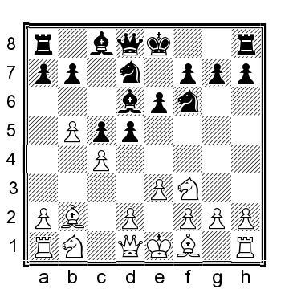
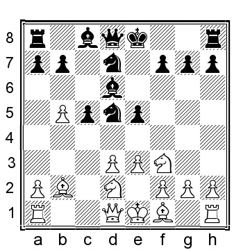
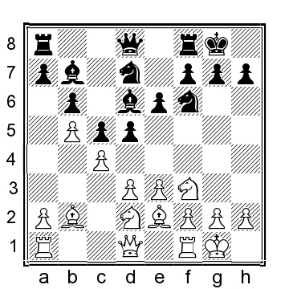
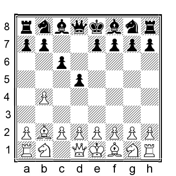
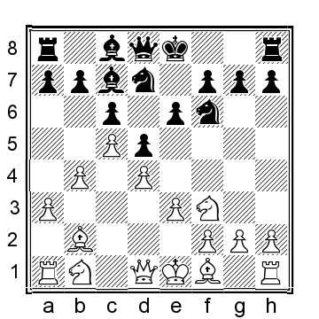
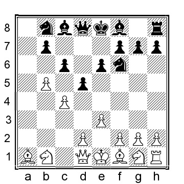
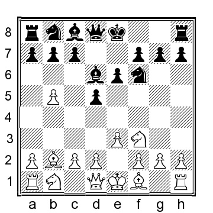
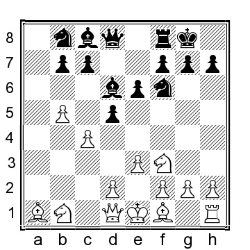
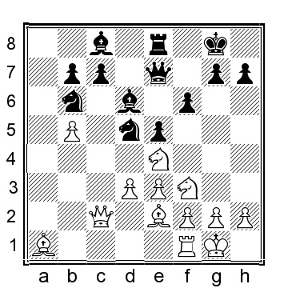

# Глава 7: Основные позиции с 1...Nf6 2.Bb2 e6 и 3...d5

Эти позиции, возможно, не являются основными после 1.b4, но они естественны и часто встречаются, когда черные отвечают 1...Nf6, 1...d5 или 1...e6. Расстановка черных естественна и не требует долгих размышлений в течение первых нескольких ходов, что является привлекательной перспективой. Если белые не будут действовать точно, черные получат хорошую игру. Тем не менее, если белые будут осторожны, позиция черных будет удивительно сложной для игры, особенно в практических шахматах.

**1.b4 e6 2.Bb2 Nf6 3.b5 d5 4.e3 c5 5.Nf3**.

Другой вариант для белых - 5.f4, но черные получают отличную позицию после 5...Nbd7 6.Nf3 Bd6 7.Be2 0-0 8.0-0 Qc7.

**5...Nbd7 6.c4 Bd6**

6...Be7 переходит в позиции, рассмотренные в главе "Индийская ферзевая".

Черные также могут попытаться взять на с4 до того, как белые сыграют d2-d3, но белые легко получают лучшую позицию: 6...dxc4 7.Bxc4 (или 7.a4 b6 8.Na3 c3 9.Bxc3 Be7 10.Nc4; после белые обычно продолжают d2-d3, e3-e4 и Be2) 7...Nb6 8.Be2 a6 9.Ne5 Bd6 10.bxa6 bxa6 11.Na3 и у белых позиционное преимущество.

**7.d3!?**

Этот терпеливый маленький ход кажется лучшим. После альтернативных вариантов у черных нет заметных проблем, например, 7.Nc3 0-0 8.Qb3 d4! или 7.Be2 e5, в обоих случаях у черных преимущество.

**7...0-0**

У черных есть несколько альтернатив:

a) 7...b6 переводит на главную позицию.

b) 7...e5?! - обычная идея для черных, но она ведет к более легкой игре для белых: 8.cxd5 Nxd5 9.Nbd2, с другой развилкой:

b1) 9...0-0 10.Be2 Re8 11.a4 (или 11.Qb3 N7b6 12.Ne4 Bf8 13.Nxe5 Be6 14.Qc2 Nb4 и у черных отличная игра за пешку) 11...Nf8 12.0-0 Bc7 13.g3 и у белых удобная перевернутая позиция сицилианского типа.

b2) 9...Qe7 10.Be2 (10.Nc4 Bc7 11.Be2 (белые также могут фианкеттировать слона, например, 11.g3 0-0 12.Bg2 N5b6 13.Nfd2 Nf6 14.0-0 Rd8 15.Nxb6 axb6 как сыграно в партии Мелих-Баумгартнер, Ческе Будейовице 1992, когда 16.Qc2 h5 17.Nc4 с перевесом у белых) 11...0-0 12.0-0 N7b6 13.Qc2 Nxc4 14.Qxc4 Nb6 15.Qc2 Bf5 16. e4 Bg4 17.h3 Bxf3 18.Bxf3 и белые контролируют игру, Дзинижевски-Пельш, Миколайки 1991) 10...b6 11.0-0 0-0 12.Qb3 Bb7 13.g3 a6 14.a4 Bc7 15.Nc4 Nb4 16.e4 Bc8 17.Bc3 и белые полностью контролируют игру.

c) 7 a6 8.a4 axb5 9.axb5 Rxa1 10.Bxa1 0-0 11.Be2 и у белых больше пространства и небольшой перевес.

**8.Nbd2!?**.

Или 8.Be2 b6 9.0-0 Bb7 10.Nbd2 с переходом на нашу основную позицию.

**8...b6 9.Be2 Bb7 10.0-0**

**10...Qe7**

У черных есть несколько альтернатив:

a) 10...Qc7 11.Qc2 Rfe8 12.h3 Rad8 13.a4 a5 14.Rac1 Qb8 15.Qb1 h6 16.Qa1 Qc7 17.Rfe1 Rc8 18.Rc2 и белые фигуры расположены почти идеально, и у них небольшой перевес, Дегтерев-Кэллоу, LSS email 2008.

b) 10...Rc8 11.a4 a6 (если 11...Bb8, то 12.g3!?, намереваясь Re1, Bf1, cxd5, а затем, если черные отыграют пешку е, белый слон переместится на h3) 12.Re1 Qc7 13.g3 и у белых больше пространства и возможность постепенно улучшить позицию, в то время как черные практически застряли, ожидая, пока белые что-то предпримут.

**11. a4 Rad8**.

В партии, вдохновившей меня на использование этого варианта, Пол Керес пошел на 11...a5!? 12.bxa6?! (12.Rc1, 12.Qb3 и 12.Qc2 - лучшие варианты для белых, играющих менее форсированно и оставляющих хорошую позицию с отличными шансами претендовать на перевес) 12...Rxa6 13.d4 (13.Qb3?! Rfa8 14.Ra2 Bc6 15.Rfa1 e5?! 16.cxd5 Bxd5 17.Nc4 играбельно для белых, но в значительной степени беспроблемно для черных, Чащев-Аманов, Элиста 2008) 13...Ra7 14.Ne5 Rfa8 15.f4?! cxd4 16.exd4?! Bb4 17.Ndf3 Ne4 18.Qb3 Nxe5 19.fxe5 Rc8, и хотя белым в итоге удалось добиться ничьей, в этот момент у них положение гораздо хуже, Сокольский-Керес, Москва 1950.

**12.a5 Bb8**

**13.axb6**

Разумной альтернативой для белых является 13.g3 Ne8 14.Qa4 Nd6 15.Rfd1 и у белых больше пространства и хорошая игра. Также можно рассмотреть вариант 13.Qa4!?, например, 13...e5 14.cxd5 Nxd5, как это было в партии Дж.О.Фрис Нильсен-Дж.Кристиансен, Дания 1989, и теперь 15.axb6 axb6 16.Rfe1 f5 17.Rad1 дало бы белым небольшой, но приятный перевес.

**13...axb6 14.Qc2! **.

В другой партии Сокольский пошел на 14.d4 e5 15.dxe5 Nxe5 16.Nxe5 Bxe5 17.Bxe5 Qxe5 18.Ra7?! (лучше было сыграть 18.Qc2 d4 19.Ra3 с игровой позицией у белых) 18...d4 19. exd4 Qb8 20.Qa1? (белым следовало играть 20.Ra3, хотя 20...Rxd4 21.Qc1 Re8 лучше для черных) 20...Rxd4 21.Bf3 Bxf3 22.Nxf3 Rxc4 23.Ng5 Qf4 24.Qa2 Ng4 25.g3 Qd4 26.Re1 Qd5 27.Ra4 Ne5 и белые сдались, 0-1, Сокольский-Ефремов, советский корр. 1952.

**14...Ne8**.

Несколько альтернатив для черных:

a) 14...e5 15.cxd5 Nxd5 16.Nc4 f6 17.Qb3 Kh8 было сыграно в партии Шулер-Коллоуа, Восточная Германия 1980, и здесь 18.Rfe1 f5 19.g3 e4 20.Nh4 Nb4 21.d4 и у белых несколько лучшие шансы.

b) 14...Ng4 15.h3 Nge5 16.Nxe5 Nxe5 17.Nf3 f6 18.Nxe5 fxe5 19.Bg4 Qd6 20.e4 Rf4 21.g3 и у белых явное преимущество в партии Зеннер-Вайницке, Восточная Германия 1970.

**15.Qc3 f6 16.d4 Nd6 17.dxc5 bxc5 18.Qc2** и у белых немного лучшие шансы, хотя черные должны быть в состоянии уравнять.

## Другие расстановки ферзевого гамбита

**1.b4 Nf6**.

Черные, конечно, могут также войти в расстановку ферзевого гамбита, не играя сразу ...Nf6: 1...d5 2.Bb2 c6

3.e3 (или 3.a4 Nf6 4.Nf3 Bg4 5.e3 e6 6.b5 a6 7.c4 с шансами для обеих сторон), а теперь:

a) 3...f6 4.c4 e5 5.Qb3 Na6 6.a3 Nc7 7.Nf3 Be6 8.Be2 Nh6 9.Nc3 Bd6 10.0-0 0-0 11.b5 Bf7 12.a4 (или 12.cxd5 cxd5 13.b6 Na6 14.d4 e4 15.Nd2 с шансами для обеих сторон) 12...e4 13.Nd4 c5 14.Nc2 dxc4 15.Bxc4 Qe7 16.a5 и инициатива у белых.

б) 3...Nd7 4.Nf3 Ngf6 5.c4 e6 6.a3 Bd6 7.c5 Bc7 8.d4, и здесь:

b1) 8...Ne4 9.Nc3 f5 10.Ne2 0-0 11.Nf4 Qe7 12.Be2 g5 13.Nd3 и у белых лучшие шансы благодаря контролю над полем e5 и потенциалу на ферзевом фланге.

b2) 8...Qe7 9.Be2 e5 10.Nxe5 Nxe5 11.dxe5 Bxe5 12.Bxe5 Qxe5 13.Nd2 и шансы близки к равным, если черные вынуждены играть агрессивно для сохранения равновесия.

b3) 8...0-0 9.Nbd2 b6 10.Be2 a5 11.0-0 bxc5 12.bxc5 и у белых хорошие возможности на ферзевом фланге, но шансы примерно равны.

c) 3...e6 4.c4 Nf6 5.a3 dxc4 6.Bxc4 Be7 7.Nf3 0-0 8.0-0 b5 9.Be2 a5 10.bxa5 Bb7 11.d4 Qxa5 12.Nbd2 Nbd7 13.Nb3 Qb6 14. Qc2 Rfc8 15.Ne5?? (15.h3 h6 16.Rfc1 c5 17.dxc5 Nxc5 18.Bd4 Nxb3 19.Qxb3 Rxc1+ 20.Rxc1 Bd5 приводит к совершенно равным шансам) 15...c5 (черные могли улучшить путем 15...Nxe5 16.dxe5 Nd5 17.Nd4 Nc7 и у черных положение ощутимо лучше) 16.Nxd7 Nxd7 17.dxc5 Nxc5 18.Bd4 e5 19.Bxc5 Bxc5 20.Nxc5 Rxc5 было сыграно в партии Стрипунский-Гесс, ICC INT 2009, и теперь 21.Qb1 было бы примерно равно.

**2.Bb2 e6 3.b5 d5**.

Черные часто играют 3...a6 4.a4, и сейчас:

a) 4...d5 5.e3 Be7 (5...Bd6 проигрывает(?) переносит) 6.Nf3 0-0 7.Be2 c5 8.0-0 axb5 9.axb5 Rxa1 10.Bxa1 Nbd7 11.c4 dxc4 12.Bxc4 Nb6 (или 12...b6 13. d3 Bb7 14.Nbd2 Qc7 15.e4 Ng4 16.Qe2 Bd6 17.g3 Nge5 18.Bb3 Rd8 19.Ne1 Be7 было сыграно в партии Тейхманн - Руевич, Мельбурн 1998, а сейчас 20.Bb2 Ra8 21.h3 h6 22.Kh2 и у белых явное преимущество) 13.Be2 Bd7 14.d4 cxd4 15.Qxd4 Nbd5 16.Nc3 Nxc3 17.Bxc3 Bc8 18.Qe5 Qd5 19.Rd1 Qxe5 20.Nxe5 и у белых лучшие шансы благодаря лучше расположенным фигурам, Осьмак-Во, Chess.com INT 2021.

b) 4...c6 5.e3 axb5 6.axb5 Rxa1 7.Bxa1 d5 (или 7...cxb5 8.Bxb5 Qa5 9.Nc3 Bb4 10.Qb1 0-0 11.Nf3 с позицией, которую мы рассмотрим в главе 8) 8.c4, и здесь черные попробовали несколько ходов в этой позиции:

b1) 8...Qa5 9.Bc3 Bb4 10.cxd5 Bxc3 11.Nxc3 Nxd5 12.Nxd5 exd5 13.bxc6 Nxc6 14.Nf3 и у белых лучшая пешечная структура, но шансы примерно равны.

b2) 8...Nbd7 9.cxd5 exd5 10.bxc6 bxc6 11.Nf3 Qa5 12.Bc3 Bb4 13.Be2 и у белых снова лучшая пешечная структура. 8...Bd6 9.Nf3 переходит в нашу основную позицию.

b3) 8...dxc4 9.Bxc4 Bd7 10.Nc3 Qa5 11.Qb1 Bb4 12.bxc6 Bxc6 13.Nf3 и у белых лучшие шансы.

b4) 8...Be7 9.Nf3 0-0 10.Be2 cxb5 11.cxb5 Nbd7 12.0-0 Nb6 13.Qb3 (если 13.d4, то 13...Bd7 14.Nbd2 Qb8 15.Ne5 Rc8 дало черным приемлемую позицию в партии Тиммерманс - Канакарис, Chess.com INT 2021) 13...Ne4 14.Rc1 Bd7 15.Bd4 Nd6 16.h3 (также можно рассмотреть 16.Ne5 Be8 17.Nc3) 16...Nf5 17.Bc3 и у белых лучше расположены фигуры.

**4.e3 Bd6**.

Конечно, черные могут также выбрать развитие слона на е7: 4...Be7 5.Nf3 0-0 6.c4 c6 7.a4 a6 (или 7...Nbd7 8.Be2 с вероятной перестановкой) 8.Nc3 Nbd7 9.Be2 e5 10. bxc6 (это лучше, чем 10.d4 exd4 11.Nxd4 dxc4 12.Bxc4 Ne5 13.Be2 axb5 14.axb5 Rxa1 15.Bxa1 c5, что дало черным хорошую игру в партии Мираллес-Франик, Гронинген 1982 или 10. 0-0 Re8 11.cxd5 cxd5 12.a5 Bf8 13.b6 и черные долго будут бороться с давлением на ферзевый фланг белых) 10...bxc6 11.cxd5 cxd5 12.d4 e4 13.Nd2 Re8 14.Ba3 Bxa3 15.Rxa3 Nf8 16.a5 и белые оказывают давление на ферзевый фланг черных, особенно долгосрочной целью будет пешка a6.

**5.Nf3**

**5...a6**

Этим ходом черные показывают свои намерения разменяться на b5, а затем ладьи на a1. У черных есть несколько дополнительных вариантов:

a) 5...Nbd7 6.c4 0-0, и здесь мы можем рассмотреть несколько альтернатив:

a1) 7.Nc3 c6 8.a4 (8.Qc2 Re8 9.Rc1 a6 10.bxc6 bxc6 11.Be2 e5 12.cxd5 cxd5 было хорошо для черных в партии Босбум-Пикет, Роттердам 2000) 8...a5 9.Qc2 h6 10.Be2 с шансами для обеих сторон.

a2) 7.d4 (это приводит к позиции славянского типа, где белые преждевременно продвигают пешку на b5) 7...dxc4 (или 7...c5 8.bxc6 bxc6 9.c5 Bc7 10.Be2 Ne4 11.0-0 Rb8 12.Qc2 Qf6 13. Nbd2 с шансами для обеих сторон) 8.Bxc4 Nb6 (или 8...Qe7 9.Nbd2 e5 10.Nxe5 (10.Qc2? e4 11.Ng1 Nb6 12.Bb3 Bf5 13.Ne2 c6 и у черных была очень хорошая позиция в Хорт-Куйперс, Москва 1963) 10. ..Nxe5 11.dxe5 Bxe5 12.Bxe5 Qxe5 13.0-0 и у белых более легкая позиция) 9.Bd3 c5 10.bxc6 bxc6 11.0-0 Bb7 12.e4 (12.Nbd2!? тоже выглядит интересно) 12...Be7 13.Nbd2 c5 14. e5 Nfd7 15.a4 cxd4 16.a5 Bxf3 17.Nxf3 Nd5 18.Bxd4, когда у белых больше пространства и немного инициативы, но черные близки к уравниванию, Фирузджа-Х.Гарсия, Xingtai 2019.

a3) 7.cxd5 exd5 8.Qc2 Re8 9.Be2 Ne5 10.Bxe5 Bxe5 11.Nxe5 Rxe5 12.0-0 Bf5 13.Qc5 b6 14.Qd4 Re4 с шансами для обеих сторон, Дегтерев-Дель Веччио, ICCF email 2007; белым нужно немного точно защищаться на королевском фланге, но у черных есть, что находится под контролем, серьезные структурные проблемы.

б) 5...c6 6.a4 0-0 7.Be2, скорее всего, переходит в одну из других позиций, где черные выбирают вариант с ...Bd6.

c) 5...Qe7 6.c4 Nbd7 7.d4 (или 7.cxd5 exd5 8.Be2 0-0 9.Qc2 с последующим d2-d3 и Nbd2) 7...b6 8.Nbd2 Bb7 9.Be2 a6 10.a4 с типичной позицией, где у белых больше пространства, но у черных прочная позиция.

**6.a4 0-0 7.c4 axb5 8.axb5 Rxa1 9.Bxa1**

**9...Nbd7**

Здесь у черных есть несколько ходов на выбор:

a) 9...c6 10.Be2 Qa5 11.Bxf6 gxf6 12.cxd5 cxd5 13.0-0 Bd7 14.Nc3 Bb4 15.Qb3 Bxc3 16.dxc3 Rc8 17.c4 dxc4 18.Bxc4 и у белых лучше расставленные фигуры и преимущество, Осмак-Пурцеладзе, Chess.com INT 2021.

б) 9...c5 10.Be2 Nbd7 11.d3 Qc7 12.Nbd2 b6 13.0-0 Bb7 14.Bb2?! (14.h3!? не жертвует пешку и вполне играбельно, как и предложение самого Сокольского; данный ход гораздо рискованнее и тем более удивителен, учитывая, что сыгран в партии по переписке!) 14...dxc4 15.Nxc4 Bxf3 16.gxf3 Bxh2+ 17.Kg2 Bd6?! (логично, но не лучшее; черным следовало играть 17...Be5, когда 18.Nxe5 Nxe5 19.Qa1 Ned7 20.f4 дает белым некоторую, но, возможно, не совсем адекватную компенсацию) 18.d4 cxd4 19.Qxd4 Bc5 20.Qh4 Be7 21.Bd3 h6 (21...g6 тоже возможно) 22. Rg1 Nd5?? (полный крах; 22...Ra8 солиднее, хотя у белых остается атака за пожертвованную пешку) 23.Kh1! и черные сдались, 1-0, Сокольский-Шифман, советский корр. ch 1948.

в) 9...dxc4 10.Bxc4 Nbd7 11.0-0 e5 12.Qc2 Qe7 13.d3 Nb6 14.Nbd2 с позицией, которая кажется комфортной для белых, но черные не могут быть серьезно хуже.

**10.cxd5 Nxd5 11.Be2 e5**.

В моих партиях черные несколько раз оказывались в позициях, подобных той, что после 11...b6 12.0-0 Bb7, которые объективно более или менее равны, но мне легче играть позицию белых после 13.Nc3 Nxc3 14.Bxc3 или 13.Qc2 Qe7 14.d4 Nb4 15.Qb3 Bd5 16.Qd1 и фигуры черных расставлены несколько искусственно.

**12.d3 Qe7 13.Nbd2 f6 14.0-0 N7b6 15.Qc2 Re8 16.Ne4** и у белых чуть более комфортная игра в своего рода перевернутой сицилианке, где белые получили многое из того, чего хотели добиться, Курал-Б.Габриель, ICCF email 2011, но тем не менее у черных солидная позиция.

