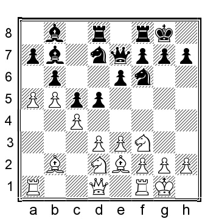

# Глава 7: Основные позиции с 1...Nf6 2.Bb2 e6 и 3...d5

Эти позиции, возможно, не являются основными после 1.b4, но они естественны и часто встречаются, когда черные отвечают 1...Nf6, 1...d5 или 1...e6. Расстановка черных естественна и не требует долгих размышлений в течение первых нескольких ходов, что является привлекательной перспективой. Если белые не будут действовать точно, черные получат хорошую игру. Тем не менее, если белые будут осторожны, позиция черных будет удивительно сложной для игры, особенно в практических шахматах.

**1.b4 e6 2.Bb2 Nf6 3.b5 d5 4.e3 c5 5.Nf3**.

Другой вариант для белых - 5.f4, но черные получают отличную позицию после 5...Nbd7 6.Nf3 Bd6 7.Be2 0-0 8.0-0 Qc7.

**5...Nbd7 6.c4 Bd6**

6...Be7 переходит в позиции, рассмотренные в главе "Индийская ферзевая".

Черные также могут попытаться взять на с4 до того, как белые сыграют d2-d3, но белые легко получают лучшую позицию: 6...dxc4 7.Bxc4 (или 7.a4 b6 8.Na3 c3 9.Bxc3 Be7 10.Nc4; после белые обычно продолжают d2-d3, e3-e4 и Be2) 7...Nb6 8.Be2 a6 9.Ne5 Bd6 10.bxa6 bxa6 11.Na3 и у белых позиционное преимущество.

**7.d3!?**

Этот терпеливый маленький ход кажется лучшим. После альтернативных вариантов у черных нет заметных проблем, например, 7.Nc3 0-0 8.Qb3 d4! или 7.Be2 e5, в обоих случаях у черных преимущество.

**7...0-0**

У черных есть несколько альтернатив:

a) 7...b6 переводит на главную позицию.

b) 7...e5?! - обычная идея для черных, но она ведет к более легкой игре для белых: 8.cxd5 Nxd5 9.Nbd2, с другой развилкой:

b1) 9...0-0 10.Be2 Re8 11.a4 (или 11.Qb3 N7b6 12.Ne4 Bf8 13.Nxe5 Be6 14.Qc2 Nb4 и у черных отличная игра за пешку) 11...Nf8 12.0-0 Bc7 13.g3 и у белых удобная перевернутая позиция сицилианского типа.

b2) 9...Qe7 10.Be2 (10.Nc4 Bc7 11.Be2 (белые также могут фианкеттировать слона, например, 11.g3 0-0 12.Bg2 N5b6 13.Nfd2 Nf6 14.0-0 Rd8 15.Nxb6 axb6 как сыграно в партии Мелих-Баумгартнер, Ческе Будейовице 1992, когда 16.Qc2 h5 17.Nc4 с перевесом у белых) 11...0-0 12.0-0 N7b6 13.Qc2 Nxc4 14.Qxc4 Nb6 15.Qc2 Bf5 16. e4 Bg4 17.h3 Bxf3 18.Bxf3 и белые контролируют игру, Дзинижевски-Пельш, Миколайки 1991) 10...b6 11.0-0 0-0 12.Qb3 Bb7 13.g3 a6 14.a4 Bc7 15.Nc4 Nb4 16.e4 Bc8 17.Bc3 и белые полностью контролируют игру.

c) 7 a6 8.a4 axb5 9.axb5 Rxa1 10.Bxa1 0-0 11.Be2 и у белых больше пространства и небольшой перевес.

**8.Nbd2!?**.

Или 8.Be2 b6 9.0-0 Bb7 10.Nbd2 с переходом на нашу основную позицию.

**8...b6 9.Be2 Bb7 10.0-0**

**10...Qe7**

Black has a couple of alternatives:

a) 10...Qc7 11.Qc2 Rfe8 12.h3 Rad8 13.a4 a5 14.Rac1 Qb8 15.Qb1 h6 16.Qa1 Qc7 17.Rfe1 Rc8 18.Rc2 and the white pieces are near perfectly placed, and he has a small edge, Degterev-Callow, LSS email 2008.

b) 10...Rc8 11.a4 a6 (if 11...Bb8 then 12.g3!?, intending Re1, Bf1, cxd5 and then if Black recaptures with the e-pawn, the white bishop scoots to h3) 12.Re1 Qc7 13.g3 and White has more space and the ability to gradually improve his position, whereas Black is pretty much stuck, waiting for White to do something.

**11. a4 Rad8**

In the game that inspired my use of the variation, Paul Keres went for 11...a5!? 12.bxa6?! (12.Rc1, 12.Qb3, and 12.Qc2 are all better options for White, playing less forcing and leaving him with a nice position with excellent chances to claim to an edge) 12...Rxa6 13.d4 (13.Qb3?! Rfa8 14.Ra2 Bc6 15.Rfa1 e5?! 16.cxd5 Bxd5 17.Nc4 is playable for White but largely unproblematic for Black, Chashchev-Amanov, Elista 2008) 13...Ra7 14.Ne5 Rfa8 15.f4?! cxd4 16.exd4?! Bb4 17.Ndf3 Ne4 18.Qb3 Nxe5 19.fxe5 Rc8, and even though White eventually managed to get a draw, he is much worse at this point, Sokolsky-Keres, Moscow 1950.

**12.a5 Bb8**

**13.axb6**

A reasonable alternative for White is 13.g3 Ne8 14.Qa4 Nd6 15.Rfd1 and White has more space and a good game. Also, 13.Qa4!? can be considered, e.g., 13...e5 14.cxd5 Nxd5 as seen in J.O. Fries Nielsen-J.Kristiansen, Denmark 1989, and now 15.axb6 axb6 16.Rfe1 f5 17.Rad1 would have given White a small but pleasant edge.

**13...axb6 14.Qc2!?**

In another game by Sokolsky, he went for 14.d4 e5 15.dxe5 Nxe5 16.Nxe5 Bxe5 17.Bxe5 Qxe5 18.Ra7?! (it was better to play 18.Qc2 d4 19.Ra3 with a playable position for White) 18...d4 19.exd4 Qb8 20.Qa1? (White should have played 20.Ra3 although 20...Rxd4 21.Qc1 Re8 is better for Black) 20...Rxd4 21.Bf3 Bxf3 22.Nxf3 Rxc4 23.Ng5 Qf4 24.Qa2 Ng4 25.g3 Qd4 26.Re1 Qd5 27.Ra4 Ne5
and White resigned, 0–1, Sokolsky-Efremov, Soviet corr ch 1952.

**14...Ne8**

A couple of alternatives for Black are:

a) 14...e5 15.cxd5 Nxd5 16.Nc4 f6 17.Qb3 Kh8 was played in Schuehler-Kollowa, East Germany 1980, and here 18.Rfe1 f5 19.g3 e4 20.Nh4 Nb4 21.d4 and White has the somewhat better chances.

b) 14...Ng4 15.h3 Nge5 16.Nxe5 Nxe5 17.Nf3 f6 18.Nxe5 fxe5 19.Bg4 Qd6 20.e4 Rf4 21.g3 and White had clear advantage in Zenner-Weinitschke, East Germany 1970.

**15.Qc3 f6 16.d4 Nd6 17.dxc5 bxc5 18.Qc2** and White has marginally better chances, although Black should be able to equalize.

**Other Queen’s Gambit Set-ups**

**1.b4 Nf6**

Black can, of course, also enter Queen’s Gambit set-up without playing ...Nf6 right away: 1...d5 2.Bb2 c6

3. e3 (or 3.a4 Nf6 4.Nf3 Bg4 5.e3 e6 6.b5 a6 7.c4 with chances to both sides), and now:

a) 3...f6 4.c4 e5 5.Qb3 Na6 6.a3 Nc7 7.Nf3 Be6 8.Be2 Nh6 9.Nc3 Bd6 10.0-0 0-0 11.b5 Bf7 12.a4
(or 12.cxd5 cxd5 13.b6 Na6 14.d4 e4 15.Nd2 with chances to both sides) 12...e4 13.Nd4 c5 14.Nc2 dxc4 15.Bxc4 Qe7 16.a5 and White has the initiative.

b) 3...Nd7 4.Nf3 Ngf6 5.c4 e6 6.a3 Bd6 7.c5 Bc7 8.d4, and here:

b1) 8...Ne4 9.Nc3 f5 10.Ne2 0-0 11.Nf4 Qe7 12.Be2 g5 13.Nd3 and White has better chances thanks to his control of the e5–square and the potential on the queenside.

b2) 8...Qe7 9.Be2 e5 10.Nxe5 Nxe5 11.dxe5 Bxe5 12.Bxe5 Qxe5 13.Nd2 and the chances are close to even if Black has to play aggressively to keep the balance.

b3) 8...0-0 9.Nbd2 b6 10.Be2 a5 11.0-0 bxc5 12.bxc5 and White has good opportunities on the queenside, but the chances are about even.

c) 3...e6 4.c4 Nf6 5.a3 dxc4 6.Bxc4 Be7 7.Nf3 0-0 8.0-0 b5 9.Be2 a5 10.bxa5 Bb7 11.d4 Qxa5 12.Nbd2 Nbd7 13.Nb3 Qb6 14.Qc2 Rfc8 15.Ne5?? (15.h3 h6 16.Rfc1 c5 17.dxc5 Nxc5 18.Bd4 Nxb3 19.Qxb3 Rxc1+ 20.Rxc1 Bd5 leads to completely equal chances) 15...c5 (Black could improve with 15...Nxe5 16.dxe5 Nd5 17.Nd4 Nc7 and Black is comfortably better) 16.Nxd7 Nxd7 17.dxc5 Nxc5 18.Bd4 e5 19.Bxc5 Bxc5 20.Nxc5 Rxc5 was played in Stripunsky-Hess, ICC INT 2009, and now 21.Qb1 would have been about equal.

**2.Bb2 e6 3.b5 d5**

Black frequently plays 3...a6 4.a4, and now:

a) 4...d5 5.e3 Be7 (5...Bd6 transposes) 6.Nf3 0-0 7.Be2 c5 8.0-0 axb5 9.axb5 Rxa1 10.Bxa1 Nbd7 11.c4 dxc4 12.Bxc4 Nb6 (or 12...b6 13.d3 Bb7 14.Nbd2 Qc7 15.e4 Ng4 16.Qe2 Bd6 17.g3 Nge5 18.Bb3 Rd8 19.Ne1 Be7 was played in Teichmann-Rujevic, Melbourne 1998, and now 20.Bb2 Ra8 21.h3 h6 22.Kh2 and White has a clear advantage) 13.Be2 Bd7 14.d4 cxd4 15.Qxd4 Nbd5 16.Nc3 Nxc3 17.Bxc3 Bc8 18.Qe5 Qd5 19.Rd1 Qxe5 20.Nxe5 and White has the better chances thanks to her better-placed pieces, Osmak-Vo, Chess.com INT 2021.

b) 4...c6 5.e3 axb5 6.axb5 Rxa1 7.Bxa1 d5 (or 7...cxb5 8.Bxb5 Qa5 9.Nc3 Bb4 10.Qb1 0-0 11.Nf3 with a position we covered in chapter 8) 8.c4, and here Black has tried several moves in this position:

b1) 8...Qa5 9.Bc3 Bb4 10.cxd5 Bxc3 11.Nxc3 Nxd5 12.Nxd5 exd5 13.bxc6 Nxc6 14.Nf3 and White has the better pawn structure but the chances are about even.

b2) 8...Nbd7 9.cxd5 exd5 10.bxc6 bxc6 11.Nf3 Qa5 12.Bc3 Bb4 13.Be2 and White once more has the better pawn structure. 8...Bd6 9.Nf3 transposes to our main line.

b3) 8...dxc4 9.Bxc4 Bd7 10.Nc3 Qa5 11.Qb1 Bb4 12.bxc6 Bxc6 13.Nf3 and White has the better chances.

b4) 8...Be7 9.Nf3 0-0 10.Be2 cxb5 11.cxb5 Nbd7 12.0-0 Nb6 13.Qb3 (if 13.d4 then 13...Bd7
14.Nbd2 Qb8 15.Ne5 Rc8 gave Black a reasonable position in Timmermans-Kanakaris, Chess.com INT 2021) 13...Ne4 14.Rc1 Bd7 15.Bd4 Nd6 16.h3 (also 16.Ne5 Be8 17.Nc3 can be considered) 16...Nf5 17.Bc3 and White has the better placed pieces.

**4.e3 Bd6**

Of course, Black can also choose to develop the bishop to e7: 4...Be7 5.Nf3 0-0 6.c4 c6 7.a4 a6 (or 7...Nbd7 8.Be2 with a likely transposition) 8.Nc3 Nbd7 9.Be2 e5 10.bxc6 (this is better than 10.d4 exd4 11.Nxd4 dxc4 12.Bxc4 Ne5 13.Be2 axb5 14.axb5 Rxa1 15.Bxa1 c5 which gave Black a good game in Miralles-Franic, Groningen 1982 or 10.0-0 Re8 11.cxd5 cxd5 12.a5 Bf8 13.b6 and Black will the struggling with White queenside pressure for a long time) 10...bxc6 11.cxd5 cxd5 12.d4 e4 13.Nd2 Re8 14.Ba3 Bxa3 15.Rxa3 Nf8 16.a5 and White has pressure against Black’s queenside, particularly the a6–pawn will be a long-term target.

**5.Nf3**

**5...a6**

With this move, Black indicates his intentions of exchanging on b5 and then the rooks on a1. There are some additional options for Black:

a) 5...Nbd7 6.c4 0-0, and here we have a few alternatives to look at:

a1) 7.Nc3 c6 8.a4 (8.Qc2 Re8 9.Rc1 a6 10.bxc6 bxc6 11.Be2 e5 12.cxd5 cxd5 was fine for Black in Bosboom-Piket, Rotterdam 2000) 8...a5 9.Qc2 h6 10.Be2 with chances to both sides.

a2) 7.d4 (this leads to a Slav type of position where White has pushed his pawn prematurely to b5) 7...dxc4 (or 7...c5 8.bxc6 bxc6 9.c5 Bc7 10.Be2 Ne4 11.0-0 Rb8 12.Qc2 Qf6 13.Nbd2 with chances to both sides) 8.Bxc4 Nb6 (or 8...Qe7 9.Nbd2 e5 10.Nxe5 (10.Qc2? e4 11.Ng1 Nb6 12.Bb3 Bf5 13.Ne2 c6 and Black had a very nice position in Hort-Kuijpers, Moscow 1963) 10...Nxe5 11.dxe5 Bxe5 12.Bxe5 Qxe5 13.0-0 and White has the easier position to play) 9.Bd3 c5 10.bxc6 bxc6 11.0-0 Bb7 12.e4 (12.Nbd2!? also looks interesting) 12...Be7 13.Nbd2 c5 14.e5 Nfd7 15.a4 cxd4 16.a5 Bxf3 17.Nxf3 Nd5 18.Bxd4 when White has some more space and a little initiative, but Black is close to equalizing, Firouzja-J.Garcia, Xingtai 2019.

a3) 7.cxd5 exd5 8.Qc2 Re8 9.Be2 Ne5 10.Bxe5 Bxe5 11.Nxe5 Rxe5 12.0-0 Bf5 13.Qc5 b6 14.Qd4 Re4 with chances for both sides, Degterev-Del Vecchio, ICCF email 2007; White needs to defend a little precisely on the kingside, but Black has that is under control serious structural issues.

b) 5...c6 6.a4 0-0 7.Be2 will likely transpose to one of the other positions where Black chooses a set- up with ...Bd6.

c) 5...Qe7 6.c4 Nbd7 7.d4 (or 7.cxd5 exd5 8.Be2 0-0 9.Qc2 followed by d2–d3 and Nbd2) 7...b6 8.Nbd2 Bb7 9.Be2 a6 10.a4 with a typical position where White has more space but Black has a solid position.

**6.a4 0-0 7.c4 axb5 8.axb5 Rxa1 9.Bxa1**

**9...Nbd7**

Here Black has several moves to choose between:

a) 9...c6 10.Be2 Qa5 11.Bxf6 gxf6 12.cxd5 cxd5 13.0-0 Bd7 14.Nc3 Bb4 15.Qb3 Bxc3 16.dxc3 Rc8 17.c4 dxc4 18.Bxc4 and White has the better placed pieces and the advantage, Osmak-Purtseladze, Chess.com INT 2021.

b) 9...c5 10.Be2 Nbd7 11.d3 Qc7 12.Nbd2 b6 13.0-0 Bb7 14.Bb2?! (14.h3!? does not sacrifice a pawn and is perfectly playable, as well as a suggestion by Sokolsky himself; the text move is a lot riskier and even more surprising, considering that it was played in the correspondence game!) 14...dxc4 15.Nxc4 Bxf3 16.gxf3 Bxh2+ 17.Kg2 Bd6?! (logical but not the best; Black should have played 17...Be5 when 18.Nxe5 Nxe5 19.Qa1 Ned7 20.f4 gives White some but possibly not entirely adequate compensation) 18.d4 cxd4 19.Qxd4 Bc5 20.Qh4 Be7 21.Bd3 h6 (21...g6 is also possible) 22.Rg1 Nd5?? (total collapse; 22...Ra8 is more solid although White still has an attack for the sacrificed pawn) 23.Kh1! and Black resigned, 1–0, Sokolsky-Shifman, Soviet corr ch 1948.

c) 9...dxc4 10.Bxc4 Nbd7 11.0-0 e5 12.Qc2 Qe7 13.d3 Nb6 14.Nbd2 with a position that seems comfortable for White, but Black cannot be seriously worse.

**10.cxd5 Nxd5 11.Be2 e5**

In my games, Black has several times ended up with positions like those after 11...b6 12.0-0 Bb7 which objectively are more or less even, but I find White’s position easier to play after 13.Nc3 Nxc3 14.Bxc3 or 13.Qc2 Qe7 14.d4 Nb4 15.Qb3 Bd5 16.Qd1 and Black’s pieces are set up a bit artificially.

**12.d3 Qe7 13.Nbd2 f6 14.0-0 N7b6 15.Qc2 Re8 16.Ne4** and White has a slightly more comfortable game in a sort of reversed Sicilian where White has gotten a lot of what he wants to achieve, Kural- B.Gabriel, ICCF email 2011, but nevertheless Black has a solid position.

