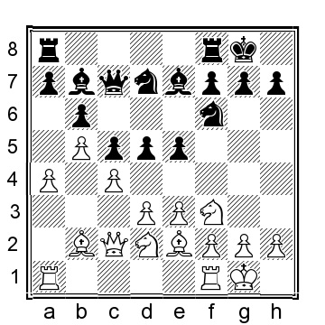
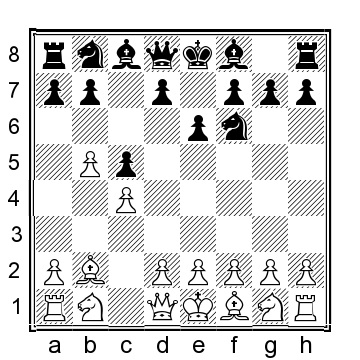
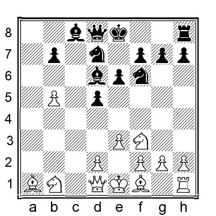
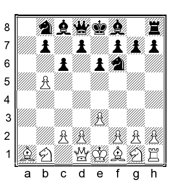
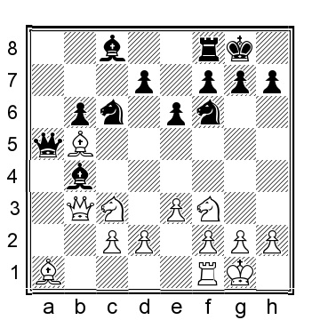

# Глава 8: Прочие расстановки с 1...Nf6 & 2...e6

В этой главе мы рассмотрим позиции, которые не обсуждались в предыдущих главах. Вообще говоря, черные часто могут либо уравнять, либо очень близко подойти к этому.

**1.b4 Nf6 2.Bb2 e6 3.b5 c6**.
Ход ...c7-c6 выглядит немного странным, но он был сыгран несколько раз, причем довольно сильными игроками. Однако есть пара интересных альтернатив:

a) 3...b6 4.e3 Bb7 5.Nf3 Be7 6.Be2 (теперь мы находимся на территории ферзевой индийской) 6...d6 7.0-0 0-0 8.c4 c5 (8...Nbd7 рассматривается в нашей главе о ферзевой индийской) 9.d3 Nbd7 10.a4 Qc7 (или 10...a5 11.bxa6 Rxa6 12.Nc3 Ne8 13.d4 cxd4 14. exd4 Ra8 15.Nd2 Ndf6 было сыграно в партии Ремлинг-Лпутиан, Биль 1997, а теперь 16.d5 (16.Ba3!? тоже интересно) 16...exd5 17.Bf3 Nc7 18.cxd5 Nfxd5 19.Nc4 Nxc3 20.Bxc3 Bxf3 21.Qxf3 Ne6 22.Rfb1 и у белых некоторое давление) 11.Qc2 d5 12.Nbd2 e5?!

(это относительно распространенная ошибка, она выглядит разумной для захвата пространства, но ослабляет светлые поля) 13.cxd5 Nxd5 14.Nc4 (другой вариант - 14.Qb3, например, 14...Bf6 15.g3 a5 16.Nc4 Nb4 17.e4 и у белых явное преимущество) 14...Bf6 15.Rfc1 Rfe8 16.Qb1 e4 17.dxe4 Bxb2 18.Qxb2 Rxe4 19.a5 Nb4? (19...Rd8 было лучше, хотя 20.Rd1 Ree8 21.axb6 axb6 (или 21...N7xb6 22.Na5) 22.Ra7 оставляет белым большой перевес) 20.Ncd2 Ree8 21.Qxb4 и черные сдались, 1-0, Мауерер-Хендке, Cappelle la Grande 2002.
b) 3...c5 4.c4, и теперь:

b1) 4...a6 5.a4 axb5 6.axb5 Rxa1 7.Bxa1 b6 (или 7...d5 8.e3 Bd6 9.Nf3 Nbd7 10.d3 0-0 11.Nbd2 с позицией типа главной, где разменяны пешки и ладьи; шансы близки к равным, но прямо по нашей позиции) 8.Bxf6!? (несколько неожиданное решение выиграть время для проникновения на ферзевый фланг; другая попытка - 8.Nf3 d5 9.cxd5 exd5 10.g3 Be7 11.Bg2 Nbd7 12.d4 0-0 13. 0-0, когда я предпочитаю позицию белых, но у черных не намного хуже) 8...Qxf6 9.Nc3 d6 10.Qa4 Qd8 (или 10...Nd7 11.Qa8 Qd8 12.g3 Ne5 13.d3 g5 14.Bg2 Bg7 15. Na4, у белых некоторое давление, но черные солидны и имеют пару слонов, 15...0-0 16.Nf3 Nxf3+ 17.Bxf3 Qc7 18.0-0 Bd7 19.Qb7 Qxb7 20.Bxb7 Rb8 21.Bg2 с примерно равными шансами) 11.Nf3 Nd7 12.g3 g6 13.Qa8 Bg7 14.Bg2 0-0 15.0-0 и у белых позиционный перевес и хороший контроль на ферзевом фланге.
b2) 4...b6 5.e3 Bb7 6.Nf3 Be7 (при ...d7-d5 нам доступны переходы к позициям в других главах, но ...d7-d6 является независимым 6...d6 7.Be2 a6 8. a4 (8.Nc3 axb5 9.Nxb5 Be7 10.0-0 0-0 11.Qc2 h6 12.a3 Nc6 тоже примерно равны, но дают нам совсем другой тип позиции) 8...axb5 9.axb5 Rxa1 10.Bxa1 Be7 11. d3 Nbd7 12.0-0 Qc7 13.Nbd2 и мы имеем типичную позицию с шансами для обеих сторон, но где у белых больше пространства на ферзевом фланге, что меня радует, но объективно шансы более или менее равны) 7.Be2 0-0 8.0-0 d6 (8...d5 переводит в главу "Ферзевая индийская") 9.d3 и мы переходим к Ремлинг-Лпутяну выше.

**4.a4**

Один из королей-орангутангов в Интернете, Тиммерманс, использовал другой подход, чтобы получить хороший задел: 4.c4 a6 5.a4 axb5 6.axb5 Rxa1 7.Bxa1 cxb5 8.cxb5, и теперь:

a) 8...Qa5?! (этот "выигрывающий время" ход часто встречается в подобных позициях, но ферзь обычно плохо расположен на a5 и других реальных преимуществ от его игры нет) 9.Nc3 b6 10.e3 Bb7 11.Nf3 Be7 12. Be2 0-0 13.0-0 d5 14.Qb1 Nbd7 15.Rc1 Rc8 16.h3 Bd6 было сыграно в партии Тиммерманс - Сарана, Chess.com INT 2020, и теперь 17.Rc2 даст белым небольшое преимущество, так как их фигуры расположены лучше, чем у черных.

b) Думаю, черным лучше сыграть что-нибудь обычное, например, 8...d5 9.e3 Nbd7 10.Nf3 Bd6 Мы достигли позиции, которую играл в паре классических партий сам Сокольский:

b1) 11.d4 Ne4 (или 11...Bb4+ 12.Bc3 Bxc3+ 13.Nxc3 Qa5 14.Qd2 Qa1+ 15.Nd1 Ne4 16.Qb4 Nxf2 17.Kxf2 Qxd1 18.b6 и у белых хорошая компенсация за пожертвованную пешку) 12.Bd3 Qa5+ 13.Nbd2 Bb4 14.Ke2! (король уходит из-под удара и совершенно в безопасности на e2) 14...Ndf6 15.Qc2 Bd7 16.Nb3 Qb6 17.Ne5 Nd6? (17...0-0 было лучше и сохранило бы шансы примерно равными) 18.Nc5 Ke7 19.Rb1 Ra8 20.g4! (в своих примечаниях к партии Сокольский утверждает, что 20.Rxb4 ведет к выигрышу белых, но это спорно; данный ход - это книжный способ использования позиционного преимущества, продемонстрированный Сокольским в партии) 20...h6 21.h4 Be8 22. g5 hxg5 23.hxg5 Nfe4 24.Bxe4 dxe4 25.Rxb4 Bxb5+ 26.Kd2 Rxa1 27.Nb3 Rf1 28.Qc5 Rxf2+ 29.Kc3 Qa6 30.Rxb5 Qxb5 31.Qc7+ Ke8 32. Qxd6 f6 33.Qxe6+ Kd8 34.Nf7+ Kc7 35.Qd6+ и черные сдались, не дождавшись мата, 1-0, Сокольский-Вайнблат Одесса 1949.
b2) 11.Nc3 0-0 12.Be2 Nb6 13.Na4 Bd7 14.Nxb6 Qxb6 15.Bxf6 gxf6 16.Qa4 Rc8 17.0-0 e5 18.Qh4 (шансы объективно близки к равным, но с ослабленной структурой королевского фланга черных у белых приличные шансы доставить черным неприятности) 18. ...Qd8? (18...Bf8! было солиднее и сохранило бы короля в безопасности) 19.Qh5 Be6 20.Nh4 e4 21.Bg4 Qd7 22.Bf5 Bxf5 23. Nxf5 (Теперь белые уже выигрывают) 23...Bf8 24.f3 Rc2 25.fxe4 dxe4 26.Qg4+ Kh8 27.Qh4 Qd8 28.Qxe4 Qxd2 29.Qxb7 (Остается еще немного работы, но белые выигрывают за счет лишней пешки, сильного коня на f5 и небезопасного короля черных) 29. ..Rc1 30.Qf3 Rxf1+ 31.Qxf1 Bc5 32.Kh1 Kg8 33.h4 Bd6 34.g3 Qd5+ 35.Kh2 Bf8 36.Nd4 Kg7 37.Qg2 Qe5 38.Qf3 Bc5 39.Nf5+ Kg8 40.Kh3 Qe6 41.h5 h6 42.g4 Bf8 43.Qc6 Qe5 44.b6 Qa1 45.Ng3 Qe5 46.Qc8 Kg7 47.Nf5+ Kh7 48.Qc7 Qd5 49.e4 Qb3+ 50.Ng3 и черные сдались, 1-0, Сокольский-Масеев, СССР 1965. Прошу простить меня за пространное цитирование этих партий; всегда стоит поиграть в партии самого маэстро.

**4...a6 5.e3 axb5 6.axb5 Rxa1 7.Bxa1**

**7...cxb5**

На этом этапе у черных есть несколько альтернатив:

a) 7...Be7 8.Nf3 0-0 9.c4 d5 переносит в главу 7.

b) 7...Bb4 (не позволяя белым играть d2-d4) 8.Nf3 d5 9.Be2 Qa5 10.Be5 (10.Bxf6 gxf6 11.bxc6 Nxc6 12.c3 Bd6 13.Qb3 Ke7 14.d4 Bd7 15. 0-0 с другой интересной позицией, где шансы примерно равны; король черных в полной безопасности на e7) 10...Nbd7 11.Bb2 Nb6 12.bxc6 bxc6 13.0-0 Bd7 и черные должны были уравнять.

**8.Bxb5 Qa5 9.Nc3 Bb4 10.Qb1**.

Белые ставят ферзя на полуоткрытую вертикаль b и защищают слона на b5.

**10...0-0**

10...b6 11.Nf3 Nc6 12.0-0 0-0 переводит в нашу основную позицию

**11.Nf3 Nc6 12.0-0 b6 13.Qb3**

**13...Ba6**

Черные избавляются от своего неразвитого и несколько плохого слона и убивают сильного слона белых в легком квадрате.

**14.Bxa6 Qxa6 15.Rb1** с захватывающей позицией, где белые смотрят на структурно слабую пешку черных на b6, черные должны быть почти в порядке после **15...Ra8**.
