# Chapter 9: 1...d5 followed by ...Bf5 or ...Bg4

Like in the Reti Opening (1.Nf3 d5 2.g3), Black can reasonably consider developing the light-squared bishop to either f5 or g4. This chapter will look at the lines where Black opts for these options on the 2nd, 3rd, and 4th moves.

**...Bf5 Lines**

**1.b4 d5 2.Bb2 Bf5**

Also frequently is 2...Nf6 3.Nf3 and now 3...Bf5 4.e3 e6 transposes to our main lines below.

**3.e3 e6**

Most of Black’s options on 3rd and 4th moves transpose to other lines covered in this chapter, but there are some lines with an independent vibe, and we will look at hose now:

a) 3...Nd7 4.Nf3 Ngf6 5.c4 dxc4 (5...c6 6.c5 e6 transposes) 6.Bxc4 Nb6 7.Be2 e6 8.a3 a5 (or 8...Bd6 9.d3 Bg6 10.Ne5 a5 11.b5 a4 12.Nxg6 hxg6 13.Bf3 Ra7 14.Bd4 Qe7 15.Qc2 0-0 16.0-0 and White has better chances, the black pieces are oddly placed, J.Dominguez-Baules, Dresden 2008) 9.b5 Bd3 10.Bd4 Bxe2 11.Qxe2 Nbd7 12.0-0 and White has the easier position to play with a space advantage and a lead in development, Zilberman-Kogan, Ramat Aviv 2000.

b) 3...c6 4.Nf3 e6 5.c4!? Bxb4?? (5...Nf6 transposes to 5.c4 below) 6.Bxg7 and White is winning.

**4.Nf3**

There is a good argument for playing 4.c4 immediately as it avoids some of Black’s better options in the ...Bf5 set-ups. 4...Nf6 (most of Black’s moves will transpose to other lines covered below, e.g., 4...c6 5.c5, but like 4...Nf6, it gives good chances of an edge) 5.b5 Be7 6.a4 0-0 7.Nf3 Nbd7 8.Be2 h6 9.0-0 c6 10.Nd4 Bxb1 11.Qxb1 Rc8 12.Rc1 c5 13.Nf3 Bd6 14.h3 Qe7 15.d4 cxd4 16.Nxd4 and White was clearly in command in Timmermans-Maiorov, Chess.com INT 2021; White has the bishop pair and more space.

**4...Nf6**

Or 4...Nd7 5.c4 c6 (5...Ngf6 6.c5 transposes 4...Nf6 5.c4 Nbd7 6.c5 below) 6.b5 Ngf6 7.bxc6 bxc6 8.Nd4!? Qb6 9.Qb3 Nc5 10.Qxb6 axb6 11.Nxf5 (or 11.Nxc6 Nd3+ 12.Bxd3 Bxd3 13.cxd5 Nxd5 14.Nc3 Nxc3 15.Bxc3 and White has a tiny edge, the pawn advantage is likely of a temporary nature because of Black’s activity and bishop pair) 11...exf5 12.Bxf6 gxf6 13.Nc3 dxc4 14.Bxc4 with an interesting position where I prefer White because of Black’s tripled f-pawn.

**5.b5**

This advance is the traditional continuation that I usually have opted for when facing the ...Bf5 lines. However, White also has 5.c4!?.

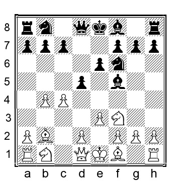

This line is exciting and a bit less explored than 5.b5. There are some pawn sacrifices and other non- traditional ideas. Black has tried several moves in this position:

a) 5...Bxb4 (accepting White’s challenge) 6.cxd5 Qxd5 7.Qa4+ Nc6 8.Bb5 a5 (or 8...Bd6 9.Nc3 Qc5 10.Rc1 a6 11.Nd4 Bg6 12.Bxc6+ bxc6 13.Nce2 Qd5 14.Qxc6+ Qxc6 15.Nxc6 Bd3 16.f3 when White has the better pawn structure) 9.a3 Be7 10.Nc3 Qc5 11.Rc1 and White has excellent compensation for pawn.

b) 5...Nbd7 6.c5 and now Black has some alternatives to choose between:

b1) 6...Be7 7.Nd4 0-0 8.Nxf5 exf5 9.d4 c6 10.Nd2 Ne4 11.Bd3 and White has more space and the bishop pair.

b2) 6...c6 7.Be2 a5 8.a3 Be7 9.Nh4 axb4 10.Nxf5 exf5 11.axb4 with better chances for White.

b3) 6...a5 7.a3 axb4 8.axb4 Rxa1 9.Bxa1 Qa8 10.Nc3 Qa3 11.Nb5 Qxb4 12.Nxc7+ Kd8 13.Bc3 Qxc5 14.Nb5 Ne4 15.Ba1 and White has excellent compensation for the sacrificed pawn; the king being on d8 being the primary reason.

c) 5...Nc6 is played quite frequently but is, in my opinion, one of Black’s worst options. 6.a3 (not 6.b5? because of 6...Nb4! and White is facing early elimination) 6...dxc4 (or 6...Be7 7.d4 0-0 8.c5 with a position where Black’s knight is very poorly placed on c6) 7.Bxc4 Bd3 8.Qb3 Bxc4 9.Qxc4 Qd5 10.Qxd5 Nxd5 11.Ke2 Bd6, and here the players agreed upon a draw, ½–½, in Rodin- Galkovsky, USSR 1979, but White has the better chances after 12.h4 h5 13.Nc3 Nxc3+ 14.Bxc3 f6 15.d4 with an extra central pawn for White and the overall better chances.

d) 5...dxc4 6.Bxc4 Nbd7 7.b5 Nb6 8.Be2 Bd3 9.Bxd3 (9.0-0 is also playable) 9...Qxd3 10.Qb3 Qxb3 11.axb3 Ne4 12.Bd4 Nd5 (12...f6 13.Bxb6 cxb6 14.Ke2 Be7 15.Rc1 Nc5 16.Rc3 e5 17.d4 exd4 18.Nxd4 and White has a small but clear advantage; White’s doubled b-pawns easily controls Black’s three queenside pawn) 13.Nc3 Ndxc3 14.dxc3 and White has a small plus thanks to his space advantage and strong d4–bishop.

e) 5...Be7 6.Nc3 (the «normal» 6.cxd5 exd5 7.b5 0-0 is nothing special for White although I have played it in blitz and won) 6	0-0 7.a3 c6 8.c5 b6 9.d4 and White has more space, but Black is perfectly okay.

f) 5	c6 6.c5 a5 7.a3, and now Black has a few moves to choose between:

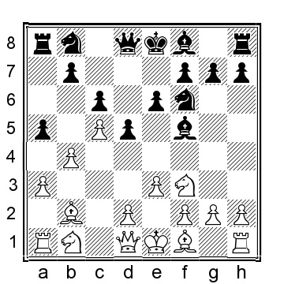

f1) 7...Na6 8.Qb3 Be7 9.d4 0-0 10.Nc3 and White has a big space advantage, but Black has a solid position.

f2) 7...Nbd7 8.Be2 axb4 9.axb4 Rxa1 10.Bxa1 Qa8 (or 10...Be7 11.0-0 Qa8 12.Nc3 0-0 13.Nh4 Bg6 14.Nxg6 hxg6 15.d4 when White has more space and the bishop pair) 11.Bxf6 Nxf6 12.0-0 Be7 13.d4 and White is clearly in command with a large space advantage on the queenside.

f3) 7...axb4 8.axb4 Rxa1 9.Bxa1 Nbd7 (or 9...Be7 10.Nc3 0-0 11.d4 Nbd7 as seen in Partikas- Barczynski, ICCF corr 2002, and now 12.Bd3 Bxd3 13.Qxd3 when White has a little more space, but Black should be able to equalize) 10.Nc3 e5 11.Be2 h6 12.0-0 Be7 13.d4 exd4 14.Nxd4 Bh7 15.b5 gave White an advantage in Morovic Fernandez-Obregon Rivero, Havana 2013; Black is at risk of losing his three queenside pawns for White’s b- and c-pawns.

**5...Bd6**

The natural square for the bishop, but there are some other options for Black that we need to cover:

a) 5...Nbd7 6.Be2 (6.c4 can also be played but I think the text move is slightly more accurate) 6...Bd6 (6...c6 7.a4 a6 8.c4 Bd6 9.0-0 (9.Nh4!?) 9...Be4 10.d3 (10.bxa6 bxa6 11.Bc3!? can also be considered) 10...Bxf3 11.Bxf3 axb5 12.axb5 Rxa1 13.Bxa1 dxc4 14.dxc4 Be5 15.Nd2 0-0 16.h3 and the chances are pretty close to level) 7.c4 dxc4 8.Bxc4

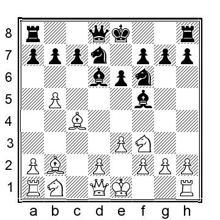

8...Nd5 (or 8...e5 9.d3 (9.Be2 0-0 10.Na3, continuing with the knight to c4 with some pressure) 9...Nb6 10.Bb3 Bb4+ 11.Nc3 e4 12.Nd4 (White can also consider 12.Ne5 0-0 13.0-0 exd3 14.Qf3 Qc8 15.Rfd1 Bd6 16.e4 Bxe5 17.exf5 with an interesting position) 12...Bg6 13.dxe4 Nxe4 14.Qc1 Nd5 15.Bxd5 Qxd5 16.0-0 Nxc3 17.Bxc3 Bd6 18.Qb2 and White has a nice position) 9.a3 0-0 10.Be2 Nc5 11.0-0 Bd3 12.Nc3 Nb6 13.Bxd3 Nxd3 14.Qb3 c5 15.bxc6 bxc6 16.Ne4 Bxh2+ (or 16...Nxb2 17.Qxb2 Be7 18.Rfc1 Qd5 19.Qc2 and White has a pull but obviously it is not a whole lot) 17.Kxh2 Qd5 18.Qxd5 cxd5 19.Nf6+ gxf6 20.Bxf6 and White is marginally better.

b) 5...Be7 6.Be2 0-0 7.0-0 (White can also opt for 7.Nh4 and after 7...Bg6, White will exchange the bishop and claim an edge after 8.Nxg6 hxg6 9.0-0 a6 10.a4 although it is certainly not much) 7...c5 8.c4 h6 9.Qb3 (also 9.d4 Nbd7 10.a4 is a reasonable option for White) 9...a6 (or 9...Nbd7 10.d3 Qc7 11.Nbd2 a6 12.a4 Rfc8 13.Rfc1 and White has the usual queenside pressure) 10.a4 Nbd7 11.d3 with a typical Orangutan position where the chances are objectively even, but because we play the Orangutan and he does not, we will be more familiar with this type of position.

**6.c4**

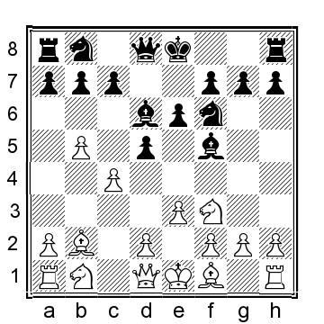

**6...a6**

Another few alternatives are:

a) 6...c6 7.a4 0-0 8.Be2 Nbd7 9.Nh4 (White wants to exchange the bishop; another try is 9.0-0 e5 10.bxc6 bxc6 11.cxd5 cxd5 12.Nc3 a6 13.Ba3 with an interesting position) 9...Bg6 10.Nxg6 hxg6 11.0-0 Rc8 12.cxd5 cxd5 13.a5 Qe7 14.d3 and the chances are very close to even, but as an Orangutan fan, I will want to play White here.

b) 6...c5 7.Be2 a6 (or 7...Nbd7 8.Nh4 Be4 9.d3 Bg6 10.Nd2 Be5 11.Qc2 Bxb2 12.Qxb2 Bh5
13.Nhf3 0-0 14.0-0 is another typical Orangutan where White has more space and the slightly more preferable position) 8.a4 axb5 9.axb5 Rxa1 10.Bxa1 Nbd7 11.0-0 Qa5 12.Bc3 Qa2 13.Bxf6 Nxf6 14.Nc3 and the chances are objectively even.

c) 6...h6 7.cxd5 (or the more traditional 7.Be2 0-0 8.0-0 c6 9.a4 a6 10.Nc3 with a typical Orangutan position) 7...exd5 8.Bxf6!? (8.Be2 is the «normal» move but Black is fine after 8...0-0 9.0-0 a6 10.a4) 8...Qxf6 9.Nc3 c6 10.bxc6 bxc6 11.Nd4 Bc8 12.Rc1 with an interesting position where both sides have chances, but I like White’s chances slightly more.

**7.a4 c6 8.Be2 0-0 9.Nc3 Nbd7 10.0-0 h6 11.bxc6 bxc6**

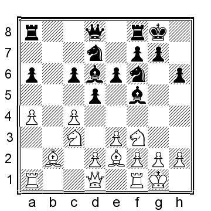

**12.a5**

White should not play the tempting 12.Nd4?! because after 12...Bg6, the c6–pawn is poisoned: 13.Nxc6? Qb6 and Black is much better.

**12...dxc4 13.Bxc4 Ng4 14.Ba3**

An alternative is 14.h3 Nge5 15.Be2 Nxf3+ 16.Bxf3 Rb8 17.Ba3 Bxa3 18.Rxa3 Bd3 19.Be2 Ne5 20.Bxd3 Qxd3 21.Ra2 and the chances are about even

**14...Bxa3 15.Rxa3 Nde5 16.Nxe5 Nxe5 17.Be2 c5**

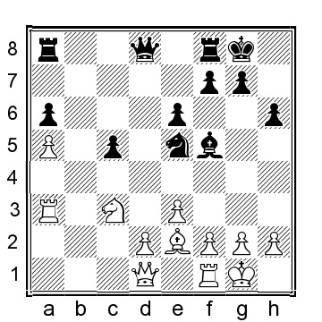

And the chances are pretty even.

**...Bg4 Lines**

**1.b4 d5 2.Bb2 Bg4**

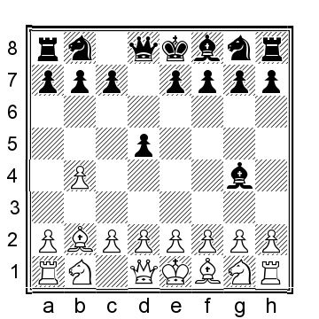

Black can also play 2...Nf6, for instance, 3.e3 (White also has the option of playing 3.Nf3 when 3...Bg4 keeps us in this chapter, but a variety of alternatives takes the game to other chapters	4.e3 (4.c4 e6 transposes to the note after White’s 4th move) 4...Nbd7 5.Be2 c6 6.a4 e6 7.b5 Bd6 8.0-0 0-0 9.h3 Bh5 10.c4 with a normal Orangutan position where the chances are objectively about even) 3...Bg4 (another option is 3...c6 4.c4 Bg4 5.Nf3 Nbd7 6.a3 e6 7.c5 (or 7.d4 Bd6 8.Nbd2 Ne4 9.Nxe4 dxe4 10.h3 Bh5 11.g4 Bg6 with a messy position and chances to both sides) 7...e5 8.Be2 e4 9.Nd4 Bxe2 10.Nxe2 b6 11.cxb6 axb6 12.0-0 Bd6 13.d3 exd3 14.Qxd3 with chances to both sides) 4.Nf3 c6 5.c4 e6, and now White has tried several things:

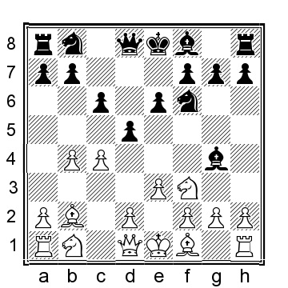

a) 6.c5!?

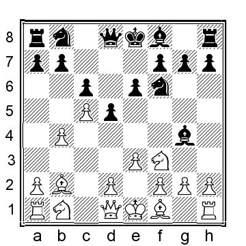

(this pawn advance is likely White’s best option) 6...a5 7.a3 Nbd7 8.Be2 (8.d4 axb4 9.axb4 Rxa1 10.Bxa1 Qa8 11.Bb2 Be7 12.Bd3 0-0 13.0-0 and White has more space and better chances, Avchinikov-D.Evans, ICCF email 2017) 8...b6 9.d4 g6 10.b5 Bxf3 11.gxf3 Qc7 12.bxc6 Qxc6 13.a4 Be7 14.Bb5 Qc7 was played in Volke-Heinig, Germany 1994, and now 15.Nd2 bxc5 16.dxc5 Qxc5 17.0-0 with more than adequate compensation for the sacrificed pawn thanks to White’s bishop pair
b) 6.a3 Nbd7 (or 6...a5 7.b5 Be7 8.bxc6 bxc6 9.cxd5!? (this is an improvement over 9.Nc3 0-0 10.Be2 Nbd7 11.Nd4 Bxe2 12.Qxe2 Ne5 13.cxd5 cxd5 14.d3 Rb8 and Black has comfortable position, Ornstein-G.Johansson, Sweden 2003) 9...exd5 10.Be2 0-0 11.Nc3 with chances to both sides) 7.c5 (White can also consider 7.h3 Bh5 8.cxd5 cxd5 9.Nc3 Bg6 10.Nh4!? Be7 11.Be2 0-0 12.Nxg6 hxg6 13.0-0 Ne8 14.Rc1 Bf6 15.Qb3 and White has a small plus, Kremenietsky-Shabanov, Moscow 2000) 7...e5 8.Be2 e4 9.Nd4 Bxe2 10.Nxe2 and the chances are about even.

**3.Nf3**

An important alternative is 3.c4!?, with a few options for Black:

a) 3...e6 4.Nf3 Nf6 (4...Nd7 transposes to other lines, for instance, 3.Nf3 Nd7 as seen in the next note in the main line, and that line may ultimately end up transposing to the note after Black’s second move - chess can be terribly confusing..) 5.a3, with another fork in the road:

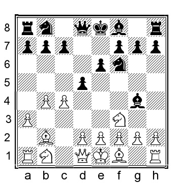

a1) 5...Be7 6.e3 0-0 7.h3 Bxf3 8.Qxf3 Nbd7 9.Be2 a5 10.b5 c6 11.0-0 Rc8 12.Ra2 Nc5 13.bxc6 bxc6 14.Bxf6 (or 14.d4 Nb3 15.Rd1 a4 16.Bd3 g6 17.Bc3 was about equal in Avchinikov-Hengl, ICCF email 2017) 14...Bxf6 15.d4 Nb3 16.Nd2 Nxd2 17.Rxd2 and Black has equalized.

a2) 5...Bxf3 6.gxf3 dxc4 7.e3 (gambitting a pawn; note that White cannot play 7.b5? a6! 8.Qa4?? c6! when Black is already winning) 7...b5 8.d3 cxd3 9.Bxd3 a6 10.Nc3 Nbd7 11.Ne4 Be7 12.Rg1 (even 12.Ke2!? can be considered) 12...g6 13.Qc2 0-0

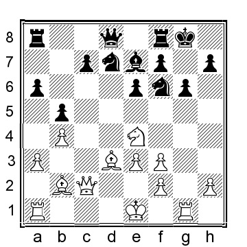

14.Ng5 (or 14.h4 when there is a fun, but hardly forced line, leading to a draw after 14...Rc8 15.Rd1 c5 16.Nxf6+ Bxf6 17.Bxg6 fxg6 18.Rxg6+ hxg6 19.Qxg6+ Kh8 20.Qh6+ Kg8 21.Qg6+ with a perpetual check) 14...Qe8 15.Rd1 with a strong initiative for White.

a3) 5...a5 6.e3 axb4 7.axb4 Rxa1 8.Bxa1 c6 9.c5 Be7 10.h3 (also 10.d4 0-0 11.Bd3 Nbd7 12.0-0 can be played for White, giving White an edge) 10...Bf5 11.Nh4!? (11.g4!? Bg6 12.g5 Nfd7 13.Bxg7 Rg8 14.Bc3 Bxg5 with a complicated position that is difficult to assess accurately, Koval- Schulenberg, ICCF email 2018) 11	0-0 12.Nxf5 exf5 13.Be2 b6 14.d4 with a position where I prefer White but that objectively should be about even.

b) 3...c6 4.Qb3 Nf6 5.e3 e6 6.Nf3 Nbd7 7.cxd5 (7.Be2!?) 7...exd5 8.Be2 (or 8.Nd4 Qb6 9.h3 Be6 10.Bc3 Ne4!? was unproblematic for Black in Wantoch Rekowski-Walczak, ICCF email 2006) 8...Bd6 9.h3 Be6 10.Nd4 Qe7 11.b5 c5 12.Nxe6 fxe6 13.d3 0-0 14.0-0 with an interesting position where both sides have their share of the chances, Lombardy-Quinteros, Malaga 1974.

c) 3...dxc4 4.Na3!? f6 (4	Nf6 5.Nxc4 Nbd7 6.a3 when White intends to follow with g2–g3 and deployment of the bishop to g2) 5.Nxc4 e5 6.a3 c5 7.b5 and the weak light squares in Black’s position is likely to become a long-term weakness.

**3...Bxf3**

An alternative for Black is 3	Nd7 4.c4 e6 5.e3 Ngf6, and now:

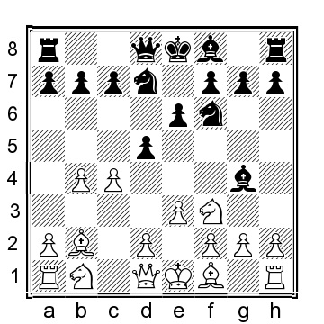

a) 6.c5 a5 7.a3 c6 transposes to the note after Black’s second move.

b) 6.b5 Bd6 7.Be2 c6 8.a4 0-0 9.0-0 Rc8 10.h3 Bh5 11.bxc6 bxc6 12.d4 Rb8 13.Ra2 with equal chances.

c) 6.a3 c6 7.d4 (or 7.c5 e5 8.Be2 e4 9.Nd4 Bxe2 10.Nxe2 b6 11.cxb6 axb6 12.d3 exd3 13.Qxd3 Bd6 14.Nd2 Ne5 15.Qc2 with approximately equal chances) 7...Bd6 8.Nbd2 Ne4

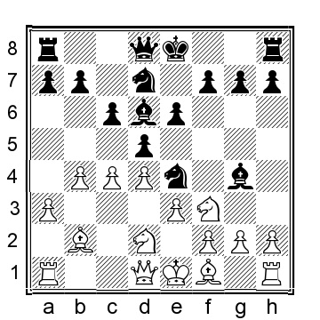

9.Nxe4 (9.Be2 f5 (but not 9...Qb8?, when 10.Nxe4 dxe4 11.Ng5 Bf5 12.Bh5 g6 13.g4 Qd8 14.h4 gxh5 15.gxf5 exf5 was played in Zilberman-Avrukh, Linares 2001, and now 16.c5 would have left White close to winning) 10.c5 Bc7 11.Ne5 Bxe2 12.Qxe2 Nxd2 13.Qxd2 g5 14.a4 with an interesting position where I prefer White but the chances are objectively about even) 9...dxe4 10.h3 Bh5 11.g4 Bg6 12.Ne5

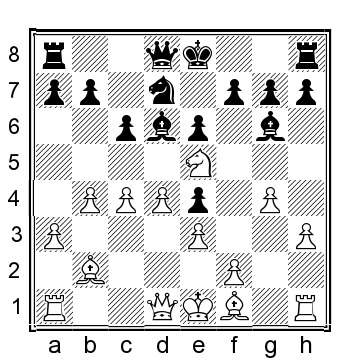

12...Bxe5!? (an improvement over 12...Nxe5 13.dxe5 Bc7 (or 13...Be7 14.Qxd8+ Rxd8 15.h4 h5 16.g5 c5 17.b5 and White has more space but it is doubtful it can be used for much, Avchinikov- Junge, ICCF email 2018) 14.Qxd8+ Rxd8 15.h4 h5 16.g5 and White was in command in Avchinikov- L.Schmidt, ICCF email 2018) 13.dxe5 h5 14.Rg1 hxg4 15.hxg4 and the chances are about equal.

Additionally, 3...e6 4.e3 Nf6 5.a3 Bd6 6.c4 c6 7.d4 0-0 8.Nbd2 Ne4 9.Nxe4 (or 9.h3 Bxf3 10.Nxf3 f5 11.Bd3 and the chances are more or less equal) 9...dxe4 10.h3 Bh5 11.g4 Bg6 12.Ne5 Qh4 was played in Maiztegui Casas-Aguilera, Uruguay 1986, and now 13.Be2 Na6 14.Qc2 would have given White a nice space advantage and better chances.

**4.gxf3!?**

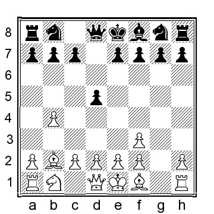

This is almost certainly better than 4.exf3 e6 5.a3 (or 5.a4 Nf6 6.b5 g6 7.Be2 Bg7 8.0-0 0-0 9.d4 Nbd7 10.Nd2 c5 was played in Timmermans-Ozen, Chess.com INT 2021, and now 11.bxc6 bxc6 12.g3 Qc7 13.c4 with chances to both sides) 5...Nf6 (or 5...c6 6.c4 dxc4 7.Bxc4 Nf6 8.0-0 Be7 9.Nc3 Nbd7 10.Ne4 0-0 11.Rc1 Nd5 12.g3 and here the chances are about equal) 6.d4 Bd6 7.Nd2 a5 8.bxa5 0-0 9.Bd3 Nc6 10.a6 bxa6 11.0-0 e5 12.c3 with about equal chances
**4...e6 5.c4 c6 6.e3 Nf6**

Or 6...Nd7 7.a3 Ngf6 when both 8.f4 and 8.c5 lead to interesting play and chances to both sides.

**7.c5!**

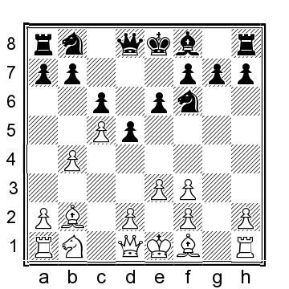

This is much better than 7.Rg1?! Nbd7 8.f4 g6 9.b5?! Bg7 10.bxc6 bxc6 11.cxd5 cxd5 12.Bd4 and here a draw was agreed upon, ½–½, in Damaso-Ribeiro, Caldas da Felgueira 1998, but Black is already comfortably better

**7...a5 8.a3 axb4 9.axb4 Rxa1 10.Bxa1 Be7 11.d4 Qc7 12.Bd3 Nbd7 13.Nd2** and White has a nice advantage thanks to the advantage in space and the bishop pair.
