# Глава 10: Черные атакуют пешку b4 ферзем

Несколько источников рекомендуют позиции, рассмотренные в этой главе, для черных. Конечно, если белые не знают, как реагировать, черные могут получить хорошую игру. С другой стороны, если белые продемонстрируют хорошую подготовку, то они должны получить хорошую игру.

В этой главе рассматриваются следующие варианты:

A) 1...c6 с намерением ...Qb6, атакуя пешку b4.

B) 1...d5 с последующим 2...Qd6

**A)**

**1.b4 c6 2.e3**

Очевидная альтернатива - 2.Bb2, и здесь вступает в действие идея предыдущего хода черных... 2...Qb6 (Другая популярная попытка - 2...a5 3.b5 (белым следует держаться подальше от 3.a3 axb4 4.axb4 Rxa1 5.Bxa1 Qb6 6.c3 d5, который игрался бесчисленное количество раз, но выглядит удручающе для белых и хорошо для черных) 3...cxb5 4.a3 Nc6 5.e4 b4 6.axb4 Nxb4 7.Nf3 Nf6 8.Nc3 d6 9.e5 Nfd5 10.Bb5+ Bd7 11.0-0 Nxc3 12.Bxd7+ Qxd7 13.Bxc3, когда преимущество белых в развитии дает им более чем достаточную компенсацию за пожертвованную пешку, фактически, это похоже на фланговый сицилианский гамбит, несколько неудачный для черных, Дегтерев-Лаурсен, ICCF email 2006) 3.a3 a5, и здесь:

a) Интересным гамбитным вариантом является редкое 4.Nc3

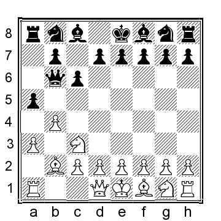

4...axb4 5.axb4 Rxa1 6.Qxa1 Qxb4 Черные выиграли пешку, но у белых отличная компенсация благодаря перевесу в развитии. 7.Na4 f6 8.Bc3 Qd6 9.Nb6 Qc7 10.Na8 Qd6 11.Ba5 (11.e4 Na6 12.Nb6 Qc7 13.Nxc8 Qxc8 14.Bxa6 bxa6 15.Nf3 e6 16.0-0 Be7 17.Rb1 с продолжающейся инициативой, и сомнительно, как долго черные смогут удерживать лишнюю пешку, Лузуриага - Бэкстроем, ICCF email 2008) 11...Na6 12.Nb6 Qc7 13.e4 с полной компенсацией за пожертвованную пешку; белые могут создать множество угроз, с которыми черным будет трудно справиться.

b) Нелепо выглядит альтернатива 4.c3, но тем не менее она была сыграна несколько раз, в том числе не кем иным, как Накамурой; его партия продолжалась 4...Nf6 5.d4 d5 6.Nd2 Bf5 7.e3 e6 8.Ngf3 h6 9.c4 axb4 10.c5 Qc7 11.axb4 Rxa1 12.Qxa1 и здесь белые имеют хороший пространственный перевес и в итоге выиграли партию, Накамура-Мезенцев, Chess.com INT 2021.

c) Ответ главной шахматной линии (?позиции) на установку черных - 4.c4 axb4 5.c5 Qc7 6.axb4 Rxa1 7.Bxa1

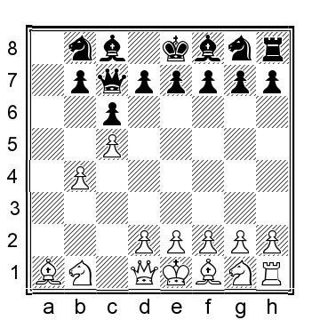

Это ключевая позиция для данного варианта; черные уже попробовали несколько различных ходов:

c1) 7...e5 8.Nf3 d6 9.e3 b6 (9...Nf6 10.Bc4 Be7 11.b5 cxb5 12.Bxb5+ Nc6 13.cxd6 Bxd6 14.Nc3 0-0 было сыграно в партии Дегтерев-Беланофф, email 2010, а теперь 15.Qb1 h6 16.0-0 с небольшим, но явным позиционным перевесом белых) 10.cxd6 Bxd6 11.b5 Ne7 12.bxc6 Nbxc6 13.Nc3 Nb4? 14.Bb5+ и у белых явное преимущество, Тиммерманс - Тайхман, Chess.com INT 2021.

c2) 7...b6 8.e3 d6

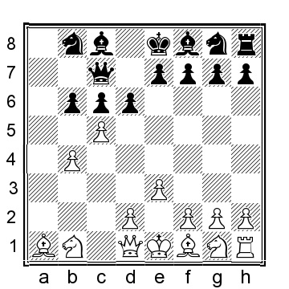

9.Na3 (у белых есть хорошая альтернатива в виде 9.cxd6 Qxd6 10.b5!?, и теперь: 10...Nd7 11.Qa4 Bb7 12.Nf3 e6 13.bxc6 Bxc6 14.Bb5 и у белых комфортный перевес) 9...bxc5 10.bxc5 dxc5 11.Nf3 Nd7 12.Nc4 Ngf6 13.Nfe5 и у белых комфортный перевес и, несмотря на потерянную пешку, компенсации у белых более чем достаточно. В партии белым не удается извлечь из позиции больше: 13...g6 14.Qf3 Bg7 15.Qxc6 Qxc6 16.Nxc6 Bb7 17.N4a5 Bxc6 18.Nxc6 e6 19.Be2 0-0 20.Bf3 Nd5 21.Ke2 (21.Bxd5!?) 21...Ra8 22.Bxg7 Kxg7 23.Rb1 Rc8(?), и черные сразу сдались, 1-0, Босбум-С.Ернст, Дирен 1999.

c3) 7...Na6 8.Qb3!? (менее точно 8.e3 Nxb4 9.Qa4 Nd5 10.Nf3 b5 11.cxb6 Nxb6 12.Qc2 Nf6 13.Nc3 e6 14.Ne4 Nbd5 и у белых не хватает ((?)недостаточная компенсация за) на пожертвованную пешку, Азаладзе-Панцулая, Поти 2010)

c4) 7...d5 8.Nf3 Bf5 9.Be5 Qc8 10.e3 f6

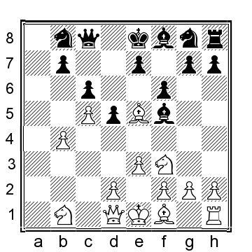

11.Bg3! (это лучше, чем 11.Bb2 e5 12.Be2 Nh6 13.0-0 Nf7 14.d4 (14.Qb3!?) 14...e4 15.Nfd2 Be7 16.Nc3 0-0 17.f3?! (17.b5!?) 17...exf3 18.Bxf3 Ng5 19. e4 и у белых инициатива и лучше расположенные фигуры, Тиммерманс-Будревич, Chess.com INT 2021) 11...h5 12.h3 g5 13.Nc3 Bg7 14.Be2 и у белых превосходная позиция.

c5) 7...Nf6 8.Nf3 Na6 9.Qb3 (интересная альтернатива - 9.Be5 Qd8 10.Qb3 d6 11.Bxf6 exf6 12.d4 Be6 13.Qc3 f5 14.e3 Nc7 15.Bd3 Nd5 16.Qb2 Be7 17.0-0 0-0 18.Nc3 и у белых еще немного пространства, но вряд ли черным стоит беспокоиться, Лоренц-Статный, Чехия 2008) 9...b5

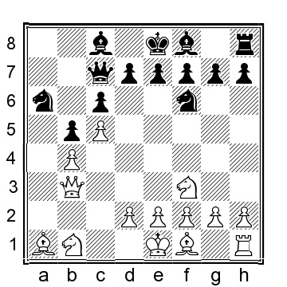

10.Nc3 (10.Ne5 белые могут улучшить путем 10...e6 11.d4 d6 12.Nd3 что дает белым лучшую позицию) 10...d6 11.d4 d5? (у черных была бы вполне приемлемая позиция после 11...dxc5 12.bxc5 e5 13.e3 exd4 14.exd4 с шансами для обеих сторон) 12.e4 dxe4 13.Ng5 e6 14.Ngxe4 Nxe4 15.Nxe4 Qf4 16.Nd2 Nc7 17.g3 Qf6, как сыграно в партии П.Роселл-Нильссон, Хелсингор 1981, и 18.Nf3 Qd8 19.Ne5 Bb7 20.Bg2 и у белых больше пространства и лучшее расположение фигур.

c6) 7...d6 8.Nf3 (или 8.cxd6 Qxd6 9.Qb3 b5 10.e4 (или 10.e3 e6 11.Nf3 Na6 12.Be2 Bb7 13.0-0 с шансами для обеих сторон) 10...Na6 11.Bc3 Nf6 12.d3 e5 13.Nf3 Nd7 (13...Be6!?) 14.d4 Nxb4 15. Be2 Qe6 16.d5 cxd5 17.Bxb4 dxe4 18.Qxe6+ fxe6 19.Bxf8 exf3 20.Bxg7 Rg8 21.gxf3 Rxg7 22.Bxb5 с равными шансами, Б.Якобсон-Хилби, Сент-Луис 2019) 8...Nd7 9.d4 Ngf6 10.Nbd2 d5?! 11.e3 (белые могут улучшить положение путем 11.Qc2! g6 12.e3 Bg7 13.Bc3 и у белых комфортный плюс) 11...g6 12.Bd3 Bg7 13.0-0 0-0 14.b5?! (14.Qb3!?) 14...b6 15.cxb6 Qxb6 16.Qb1 (и хотя шансы почти равны, позицию белых играть немного легче, Москаленко-Кухмазов, Chess.com INT 2016).

**2...d5**

В этой позиции у черных есть несколько альтернатив:

a) 2...a5

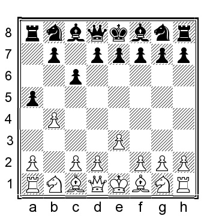

3.b5 d5 4.Bb2 Nf6 5.Nf3 Bf5 (черные могут сыграть и солидное 5...e6 6.c4 cxb5 7.cxd5 b4 8.dxe6 (8.Bb5+ Bd7 9.Bxd7+ Nbxd7 10. dxe6 fxe6 11.a3 b5 12.axb4 Bxb4 13.Qe2 Rb8 14.0-0 0-0 15.Ba3 с трудно оцениваемой позицией, но у черных все должно быть хорошо) 8...Bxe6 9.Bb5+ Bd7 10.Qe2 Be7 11.a3 с позицией, где я предпочитаю шансы белых) 6.Be2 e6 7.Nh4 Bg6 8.0-0 Nbd7 9.c4 dxc4 10.Nxg6 hxg6 11.Bxc4 Ne4 12.bxc6 bxc6 13.g3 и у белых лучшая пешечная структура и пара слонов, Мури-Рингсборг, ICCF email 2009.

b) 2...Qb6

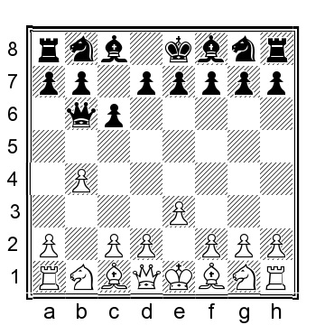

3.a3 a5 4.b5 d5 (черным следует избегать 4...cxb5?! 5.Nc3 b4 6.axb4 Qxb4 (или 6...Nf6 7.Nf3 d5 8.bxa5 Rxa5 9.Rb1 и у белых очень приятная позиция с лучшей структурой пешек) 7.Ba3 Qb6 8.Nd5!

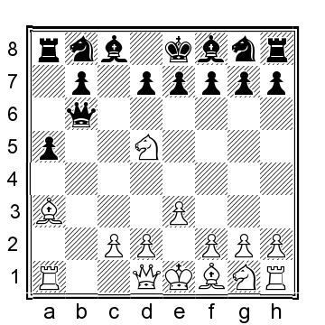

(У белых есть интересная альтернатива 8.Rb1 Qd8 9.Nd5 Nc6?? (черным следовало играть 9...e6 10.Bxf8 Kxf8 11.Nb6 Ra7 12.Qc1 и у белых отличная компенсация за пешку) 10. d4?? (10.Bc5! выигрывает за белых) 10...Nf6 11.Nxf6+ exf6 12.Bxf8 Kxf8 с увлекательной позицией и шансами для обеих сторон, Чандра-Лианес Гарсия, Chess.com INT 2016) 8...Qc6 9.e4 и у белых подавляющее преимущество; непосредственная угроза - Bb5) 5.c4 Nf6 (или 5...dxc4 6.Bxc4 cxb5 7.Qb3 Qg6 8. Qxb5+ Nc6 9.Ne2 Qxg2 10.Bd5 Qg6 11.Nbc3 с острой позицией, где белые имеют адекватную компенсацию за пожертвованную пешку) 6.Nc3 e6 7.Na4 (7.Nf3!?? Nbd7 8.Be2 Be7 9.0-0 0-0 10.Bb2 Ne4 11.cxd5 cxd5 12.Nxe4 dxe4 13.Ne5 Nc5 14.a4 и у белых явный перевес, Кострун-Синанович, Шибеник 2005) 7...Qc7 8.Bb2 Nbd7 9.Rc1 и у белых положение явно лучше.

c) 2...e5 3.Bb2 Bxb4 (3...Qc7 4.a3 b5 5.Nf3 f6 6.c4 bxc4 7.Bxc4 d5 8.Ba2 Bd6 9.Nc3 a6? (черным следовало играть 9...Ne7 10. Rc1, когда у белых небольшой перевес) 10.Rc1 Qb7 11.0-0 Nh6 12.Nxd5 и белые уже выигрывали в партии Ри-Цирик, Вейк-ан-Зее 1969) 4.Bxe5 Nf6 5.c3 Ba5 6.Qa4!?? Bc7 7.Qf4 Bxe5 8.Qxe5+ Qe7 9.Qxe7+ Kxe7 10.a4!? d5 11.Ne2 c5 12.h4 Nc6 13.f3 d4 14.Na3 с небольшим преимуществом у белых.

**3.Bb2 Qb6 4.a3 a5 5.b5**

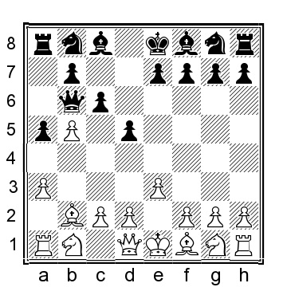

**5...Nd7**

У черных есть несколько альтернатив:

a) 5...Nf6 6.c4 Bf5 (или 6...Bg4 7.f3 Bd7 8.Nc3 dxc4 9.Bxc4 e6 10.Qe2 cxb5 11.Nxb5 и у белых небольшой плюс) 7.Nc3 e6 8.Nf3 Be7 9.Nd4 (также 9.Na4 Qd8 10.c5 лучше для белых) 9...Bg6 10.Na4 Qc7 11.bxc6 bxc6 12.cxd5 exd5 13.Rc1 Qb7 14.Qb3 Qxb3 15.Nxb3 0-0 16.Nbc5 и у белых позиционный перевес, Штеффенс-Норденбаек, Оденсе 2013.

b) 5...e6 6.c4 Qd8 7.Nf3 Nf6 8.Nc3 Be7 9.Be2 и у белых хороший плюс.

**6.c4**

Белые также могут рассмотреть 6.Nf3 Ngf6 (или 6...cxb5 7.Nc3 и у белых гораздо лучше позиция) 7.a4 e6 8.d4 Ne4 9.Bd3 Nd6 10.Qe2 cxb5 11.axb5 Qc7 12.0-0 Nb6 было сыграно в Блойвен-Амигез, Франция 2009, а сейчас 13.Ba3 Nbc4 14.Ne5 Bd7 15.Bxd6 Nxd6 16.b6 Qxb6 17.Nxd7 Kxd7 18.Nd2 g6 19.Rab1 Qc7 20.Rfc1 и у белых явный перевес за счет уязвимого короля черных.

**6...dxc4 7.Bxc4 cxb5 8.Be2 e6 9.Nc3**

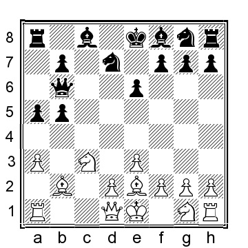

**9...b4**

Черные все равно не могут удержать пешку и пытаются извлечь из ситуации максимум пользы. Если 9...Ngf6, то 10.Nxb5 Be7 11.Nf3 очень удобно для белых.

**10.axb4 Ngf6**.

Заметим, что 10...Bxb4?? проигрывает 11.Na4, угрожая ферзю и на g7.

**11.b5 Bb4 12.Nf3 0-0 13.0-0** с лишней центральной пешкой и лучше скоординированными фигурами у белых небольшой, но комфортный перевес.

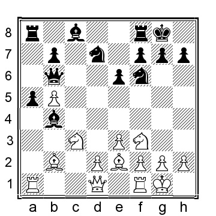

**B)**

**1.b4 d5 2.Bb2 Qd6**

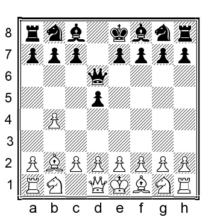

**3.a3**

Это одна из немногих ситуаций, когда белым не следует играть b4-b5: 3.b5?! Qb4 4.Qc1 (еще хуже играть 4.Bc3 Qxb5 5.e4 Qd7, когда у белых не хватает пешки) 4...Qxb5 5.e3 Qa5 6.c4 e6 7.Nf3 c6 8.Be2 Qd8 У белых есть некоторая компенсация за пожертвованную/потерянную пешку, но позиция черных прочна, и в долгосрочной перспективе я сомневаюсь, что у белых будет достаточно ((?)лучше).

**3...e5**

Естественное продолжение, претендующее на пространство в центре, согласуется с размещением ферзя на d6, иначе ход ферзем был бы необычным решением. Некоторые другие попытки:

a) 3...a5 4.b5 e5 5.e3 c5 6.d3 (белые могут сыграть и 6.d4, но 6...exd4 7.exd4 c4 устраивает черных) 6...Be7 7.Nf3 f6 8.g3 (или 8.d4 exd4 9.exd4 c4 10. Nc3 Nd7 11.g3 Nb6 и черные уравняли) 8...Be6 (также 8...Bg4 9.h3 Be6 10.Nbd2 Nh6 11.c4 d4 12.a4 приводит к приятной позиции для белых) 9.Nbd2 Nh6 10.c4!

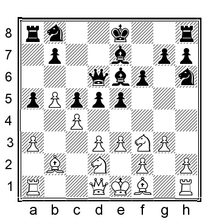

10...d4 11.exd4 cxd4 12.Bg2 Nd7 13.0-0 0-0 14.a4 и у белых хороший вариант дебюта Рети, где ферзь черных плохо расположен на d6.

b) 3...Bf5 4.d3 e5 5.Nd2 a5 6.Ngf3 f6 7.e4 dxe4 8.dxe4 Be6 9.Bb5+ c6 10.Be2 axb4 11.axb4 Rxa1 12.Qxa1 Nh6 (черные не могут взять пешку b4: 12...Qxb4? 13.Nxe5 fxe5 14.Bxe5 Ne7 (или 14...Nd7 15.Bxg7 Bxg7 16.Qxg7 выигрывает за белых) 15.c3 Qc5 16.Bxb8 и белые выигрывают) 13.Nxe5!? (белые также могут играть менее компромиссно как 13.0-0, так и 13.Bc3, в обоих случаях с несколько лучшими шансами для белых) 13...fxe5 14.Bxe5 Qd8 15.Bxg7 Rg8 16.Bxf8 Kxf8 17.Qc3 Qg5 18.g3 с увлекательной позицией, где я предпочитаю шансы белых из-за открытого короля черных.

c) 3...Nf6 4.Nf3 Nbd7 5.e3 a5 (обычно 5...e5 переходит в нашу основную позицию, но белые могут сыграть 6.c4! e4 (если 6...c6, то 7.cxd5 Nxd5 8.Qc2 ведет к перевернутой сицилианке, где черные играют несколько нелепо, а у белых лучшая позиция) 7.c5 Qe7 8.Nd4 c6 9.d3 exd3 10. Bxd3 Ne5 11.Be2 g6 12.h3 с приятной позицией для белых) 6.bxa5!? (или 6.b5 e5 7.d4 e4 8.Nfd2 Nb6 9.c4 dxc4 10.Nxc4 Nxc4 11.Bxc4 Be6 12. Qc2 Bxc4 13.Qxc4 Nd5, когда шансы примерно равны, но я предпочитаю позицию белых) 6...Rxa5 7.c4 e5 8.d4 exd4 9.Nxd4 dxc4 10.Nd2! (белые борются за инициативу) 10...Nb6 11.Nxc4 Nxc4 12.Bxc4 Be7 13.Qb3 0-0 14.0-0 (14.Rd1!? тоже выглядит перспективно) 14...Rh5 (или 14...Bd7 15.Rfe1 Ng4 16.f4 приятно для белых) 15.f4 и у белых несколько лучшие шансы.

**4.e3**

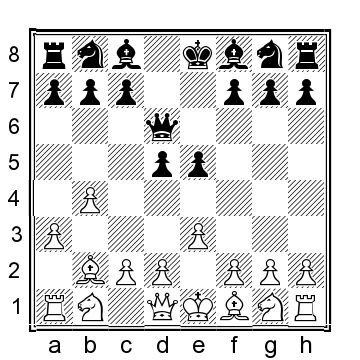

**4...Be6**

The alternatives are:

a) 4...Nf6 5.Nf3 e4 6.Nd4 a5 7.c4 axb4?! (Black can improve with 7...dxc4 8.Bxc4 Be7 9.b5 with a nice position for White) 8.c5 Qd8 9.axb4 Rxa1 10.Bxa1 Bd7 11.Qb3 c6 12.Nc3 b6 13.Na4 bxc5 14.Nxc5 Bxc5 15.bxc5 and White had a clear advantage, G.Gomez-Samraoui, ICCF email 2000.

b) 4...Nd7 5.Nf3 e4 6.Nd4 a5 7.c4 (White can improve with 7.Nb5 Qc6 8.N1c3 Ngf6 9.Be2 Nb6 10.Na7 and White has a small plus) 7...dxc4 8.Bxc4 Ne5 9.Qc2 Nxc4?! (9...c6!?) 10.Qxc4 c6 11.b5 c5? (this is a mistake, but White already has a small plus after 11...Bd7 12.0-0 c5 13.Nb3) 12.Ne2 f5 13.Nf4 Nf6 14.d3 exd3 15.0-0 Qe7 16.Nc3 Qf7 17.Ncd5 Nxd5 18.Nxd5 and White is much better, Teichmann-A.Smirnov, Ballarat 2016.

**5.Nf3 Nd7**

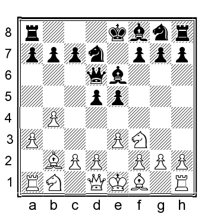

**6.d4**

У белых есть несколько интересных альтернатив:

a) 6.Ng5 Bf5 7.c4 f6 8.Nf3 c6 9.d4 e4 10.Nfd2 Qe6 11.Nc3 Bd6 12.Qb3 (белые также могут рассмотреть 12.Nb3!? Ne7 13.Nc5 Nxc5 14.bxc5 Bc7 15.Qb3 Rb8 16.cxd5 Nxd5 17.Bc4 Ba5 18.0-0 Bxc3 19.Bxc3 и у белых перевес) 12...Ne7 13.a4 Qf7 14.cxd5 (возможное улучшение - 14.b5! Be6 15.bxc6 bxc6 16.cxd5 Nxd5 (или 16...cxd5 17.Nb5 Bb8 18.Ba3 и у черных на руках позиционная катастрофа) 17.Ncxe4 и черные разбиты) 14...cxd5 15.b5 Be6 16. Ba3 Bxa3 17.Qxa3 f5 18.g3 g5 19.Ne2 Ng6 20.f4 h6 21.Nb1 и здесь была согласована ничья, даже при наличии у черных удобной позиции, С.Каспаров-Мор, Грац 2010.

b) 6.Be2 Ngf6 (6...Be7 7.d3 Ngf6 8.Nbd2 приведет к аналогичной позиции, как после 6...Ngf6) 7.d3 a5 8.Nbd2 Be7 9.c4! dxc4 10.dxc4 axb4 11. axb4 Rxa1 12.Qxa1 Qxb4 13.0-0 0-0 14.Bc3 Qa3 15.Qxa3 Bxa3 16.Nxe5 у белых небольшой перевес, но черные должны удержать равновесие.

c) 6.c4 dxc4 7.Qc2 a5 8.b5 Ngf6 9.Bxc4 Qc5 10.d3 e4 11.Bd4 exd3 12.Bxd3 Qxc2 13.Bxc2 Bc4 14.Nc3 и у белых небольшой плюс.

**6...e4 7.Nfd2 c6**.

Важной альтернативой является 7...f5 8.c4 c6

9.Nc3 (белые также могут рассмотреть 9.cxd5 cxd5 10.Nc3 a6 11.Rc1 Ngf6 12.Be2 Nb6 13.Nb3 Be7 14.Nc5 Rb8 было сыграно в К.Шмидт-Скорна, ICCF email 2015, а сейчас лучше всего было бы 15.a4, что привело бы к комфортной игре для белых, но объективно черные должны быть в порядке) 9...Ngf6 10.cxd5 Nxd5 11.Na4 (или 11.Nc4 Qc7 12.Be2 Be7 13.0-0 0-0 14.Rc1 N7b6 и у черных комфортная позиция) 11...Bf7 12.Nc5 Qc7 13.g3 с более-менее равными шансами.

**8.c4**

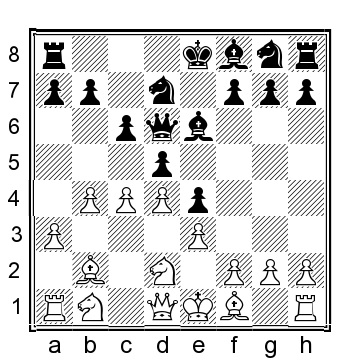

**8...Ngf6**.

Обратите внимание, что 8...f5 9.Nc3 Ngf6 10.cxd5 Nxd5 переходит в 7...f5, описанное выше.

**9.Nc3 Be7 10.b5 a6 11.bxc6 bxc6 12.a4 dxc4 13.Ba3!**.

Захват инициативы.

**13...c5 14.Bxc4 Qc6 15.Bxe6 Qxe6 16.Ne2!** и у белых лучшие шансы, прежде всего потому, что ферзь черных несколько неудобно расположен на е6.
