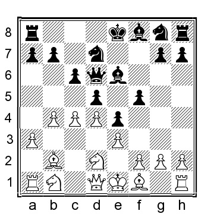

# Chapter 10: Black attacks the b4-pawn with the Queen

Several sources recommend the lines covered in this chapter for Black. Admittedly, if White does not know how to react, Black can get a good game. On the other hand, if White shows up prepared, then White should get a good game.

The lines covered in this chapter are:

A) 1...c6 intending ...Qb6, attacking the b4-pawn

B) 1...d5 followed by 2...Qd6

**A)**

**1.b4 c6 2.e3**

The obvious alternative is 2.Bb2, and here the idea behind Black’s previous move comes into action... 2...Qb6 (Another popular try is 2...a5 3.b5 (White should stay away from 3.a3 axb4 4.axb4 Rxa1 5.Bxa1 Qb6 6.c3 d5 which has been played countless times but looks depressing for White and scores well for Black) 3...cxb5 4.a3 Nc6 5.e4 b4 6.axb4 Nxb4 7.Nf3 Nf6 8.Nc3 d6 9.e5 Nfd5 10.Bb5+ Bd7 11.0-0 Nxc3 12.Bxd7+ Qxd7 13.Bxc3 when White’s lead in development gives him more than enough compensation for the sacrificed pawn, in fact, this looks like a Sicilian Wing Gambit gone somewhat wrong for Black, Degterev-Laursen, ICCF email 2006) 3.a3 a5, and here:

a) An interesting gambit option is the rare 4.Nc3

4...axb4 5.axb4 Rxa1 6.Qxa1 Qxb4 Black has won a pawn, but White has excellent compensation thanks to his lead in development. 7.Na4 f6 8.Bc3 Qd6 9.Nb6 Qc7 10.Na8 Qd6 11.Ba5 (11.e4 Na6 12.Nb6 Qc7 13.Nxc8 Qxc8 14.Bxa6 bxa6 15.Nf3 e6 16.0-0 Be7 17.Rb1 with an ongoing initiative, and it is questionable how long Black will be able to hang on to his extra pawn, Luzuriaga- Baeckstroem, ICCF email 2008) 11...Na6 12.Nb6 Qc7 13.e4 with full compensation for the sacrificed pawn; White can create a variety of threats which Black will have a hard time handling.

b) A ridiculous-looking alternative is 4.c3, but it has nevertheless been played several times, including by none other than Nakamura; his game continued 4...Nf6 5.d4 d5 6.Nd2 Bf5 7.e3 e6 8.Ngf3 h6 9.c4 axb4 10.c5 Qc7 11.axb4 Rxa1 12.Qxa1 and here White has a nice space advantage and eventually won the game, Nakamura-Mezentsev, Chess.com INT 2021.

c) The main line response to Black’s set-up is 4.c4 axb4 5.c5 Qc7 6.axb4 Rxa1 7.Bxa1

This is the key position of for this side variation; Black has now tried a number of different moves:

c1) 7...e5 8.Nf3 d6 9.e3 b6 (9...Nf6 10.Bc4 Be7 11.b5 cxb5 12.Bxb5+ Nc6 13.cxd6 Bxd6 14.Nc3 0-0 was played in Degterev-Belanoff, email 2010, and now 15.Qb1 h6 16.0-0 with a small but clear positional advantage for White) 10.cxd6 Bxd6 11.b5 Ne7 12.bxc6 Nbxc6 13.Nc3 Nb4? 14.Bb5+ and White has a clear advantage, Timmermans-Taichman, Chess.com INT 2021.

c2) 7...b6 8.e3 d6

9.Na3 (White has a good alternative in 9.cxd6 Qxd6 10.b5!?, and now: 10...Nd7 11.Qa4 Bb7 12.Nf3 e6 13.bxc6 Bxc6 14.Bb5 and White has a comfortable advantage) 9...bxc5 10.bxc5 dxc5 11.Nf3 Nd7 12.Nc4 Ngf6 13.Nfe5 and White has a comfortable edge and despite the missing pawn, White has more than enough compensation. In the game, White does not manage to get more out of the position: 13...g6 14.Qf3 Bg7 15.Qxc6 Qxc6 16.Nxc6 Bb7 17.N4a5 Bxc6 18.Nxc6 e6 19.Be2 0-0 20.Bf3 Nd5 21.Ke2 (21.Bxd5!?) 21...Ra8 22.Bxg7 Kxg7 23.Rb1 Rc8??, and Black resigned at the same time, 1– 0, Bosboom-S.Ernst, Dieren 1999.

c3) 7...Na6 8.Qb3!? (less accurate is 8.e3 Nxb4 9.Qa4 Nd5 10.Nf3 b5 11.cxb6 Nxb6 12.Qc2 Nf6 13.Nc3 e6 14.Ne4 Nbd5 and White does not have enough for the sacrificed pawn, Azaladze- Pantsulaia, Poti 2010)

c4) 7...d5 8.Nf3 Bf5 9.Be5 Qc8 10.e3 f6

11.Bg3! (this is better than 11.Bb2 e5 12.Be2 Nh6 13.0-0 Nf7 14.d4 (14.Qb3!?) 14...e4 15.Nfd2 Be7 16.Nc3 0-0 17.f3?! (17.b5!?) 17...exf3 18.Bxf3 Ng5 19.e4 and White has the initiative and better- placed pieces, Timmermans-Budrewicz, Chess.com INT 2021) 11...h5 12.h3 g5 13.Nc3 Bg7 14.Be2 and White has a superior position.

c5) 7...Nf6 8.Nf3 Na6 9.Qb3 (an interesting alternative is 9.Be5 Qd8 10.Qb3 d6 11.Bxf6 exf6 12.d4 Be6 13.Qc3 f5 14.e3 Nc7 15.Bd3 Nd5 16.Qb2 Be7 17.0-0 0-0 18.Nc3 and White has some more space but it is hardly something that Black should be concerned about, Lorenc-Stastny, Czech Republic 2008) 9...b5

10.Nc3 (10.Ne5 White can improve with 10...e6 11.d4 d6 12.Nd3 gives White a better position) 10...d6 11.d4 d5? (Black would have had an entirely acceptable position after 11...dxc5 12.bxc5 e5 13.e3 exd4 14.exd4 with chances to both sides) 12.e4 dxe4 13.Ng5 e6 14.Ngxe4 Nxe4 15.Nxe4 Qf4 16.Nd2 Nc7 17.g3 Qf6 as played in P.Rosell-Nilsson, Helsingor 1981, and 18.Nf3 Qd8 19.Ne5 Bb7 20.Bg2 and White has more space and better placed pieces.

c6) 7...d6 8.Nf3 (or 8.cxd6 Qxd6 9.Qb3 b5 10.e4 (or 10.e3 e6 11.Nf3 Na6 12.Be2 Bb7 13.0-0 with chances to both sides) 10...Na6 11.Bc3 Nf6 12.d3 e5 13.Nf3 Nd7 (13...Be6!?) 14.d4 Nxb4 15.Be2 Qe6 16.d5 cxd5 17.Bxb4 dxe4 18.Qxe6+ fxe6 19.Bxf8 exf3 20.Bxg7 Rg8 21.gxf3 Rxg7 22.Bxb5 with equal chances, B.Jacobson-Hilby, Saint Louis 2019) 8...Nd7 9.d4 Ngf6 10.Nbd2 d5?! 11.e3 (White can improve with 11.Qc2! g6 12.e3 Bg7 13.Bc3 and White has a comfortable plus) 11...g6 12.Bd3 Bg7 13.0-0 0-0 14.b5?! (14.Qb3!?) 14...b6 15.cxb6 Qxb6 16.Qb1 (and while the chances are close equal, White’s position is a little easier to play, Moskalenko-Kukhmazov, Chess.com INT 2016.)

**2...d5**

Black has some alternatives in this position:

a) 2...a5

3.b5 d5 4.Bb2 Nf6 5.Nf3 Bf5 (Black can also play the solid 5...e6 6.c4 cxb5 7.cxd5 b4 8.dxe6 (8.Bb5+ Bd7 9.Bxd7+ Nbxd7 10.dxe6 fxe6 11.a3 b5 12.axb4 Bxb4 13.Qe2 Rb8 14.0-0 0-0 15.Ba3 with a difficult to assess position, but Black should be doing fine) 8...Bxe6 9.Bb5+ Bd7 10.Qe2 Be7 11.a3 with a position where I prefer White’s chances) 6.Be2 e6 7.Nh4 Bg6 8.0-0 Nbd7 9.c4 dxc4 10.Nxg6 hxg6 11.Bxc4 Ne4 12.bxc6 bxc6 13.g3 and White has the better pawn structure and the bishop pair, Muri-Ringsborg, ICCF email 2009.

b) 2...Qb6

3.a3 a5 4.b5 d5 (Black should avoid 4...cxb5?! 5.Nc3 b4 6.axb4 Qxb4 (or 6...Nf6 7.Nf3 d5 8.bxa5 Rxa5 9.Rb1 and White has a very pleasant position with the better pawn structure) 7.Ba3 Qb6 8.Nd5!

(White has an interesting alternative in 8.Rb1 Qd8 9.Nd5 Nc6?? (Black should have played 9...e6 10.Bxf8 Kxf8 11.Nb6 Ra7 12.Qc1 and White has excellent compensation for pawn) 10.d4?? (10.Bc5! wins for White) 10...Nf6 11.Nxf6+ exf6 12.Bxf8 Kxf8 with a fascinating position and chances to both sides, Chandra-Lianes Garcia, Chess.com INT 2016) 8...Qc6 9.e4 and White has an overwhelming advantage; the immediate threat is Bb5) 5.c4 Nf6 (or 5...dxc4 6.Bxc4 cxb5 7.Qb3 Qg6 8.Qxb5+ Nc6 9.Ne2 Qxg2 10.Bd5 Qg6 11.Nbc3 with a sharp position where White has adequate compensation for the sacrificed pawn) 6.Nc3 e6 7.Na4 (7.Nf3!? Nbd7 8.Be2 Be7 9.0-0 0-0 10.Bb2 Ne4 11.cxd5 cxd5 12.Nxe4 dxe4 13.Ne5 Nc5 14.a4 and White has a clear advantage, Kostrun-Sinanovic, Sibenik 2005) 7...Qc7 8.Bb2 Nbd7 9.Rc1 and White is clearly better.

c) 2...e5 3.Bb2 Bxb4 (3...Qc7 4.a3 b5 5.Nf3 f6 6.c4 bxc4 7.Bxc4 d5 8.Ba2 Bd6 9.Nc3 a6? (Black should have played 9...Ne7 10.Rc1 when White has a small advantage) 10.Rc1 Qb7 11.0-0 Nh6 12.Nxd5 and White was already wining in Ree-Ciric, Wijk aan Zee 1969) 4.Bxe5 Nf6 5.c3 Ba5 6.Qa4!? Bc7 7.Qf4 Bxe5 8.Qxe5+ Qe7 9.Qxe7+ Kxe7 10.a4!? d5 11.Ne2 c5 12.h4 Nc6 13.f3 d4 14.Na3 with a small advantage for White.

**3.Bb2 Qb6 4.a3 a5 5.b5**

**5...Nd7**

Black has a couple of alternatives:

a) 5...Nf6 6.c4 Bf5 (or 6...Bg4 7.f3 Bd7 8.Nc3 dxc4 9.Bxc4 e6 10.Qe2 cxb5 11.Nxb5 and White has a small plus) 7.Nc3 e6 8.Nf3 Be7 9.Nd4 (also 9.Na4 Qd8 10.c5 is better for White) 9...Bg6 10.Na4 Qc7 11.bxc6 bxc6 12.cxd5 exd5 13.Rc1 Qb7 14.Qb3 Qxb3 15.Nxb3 0-0 16.Nbc5 and White has a positional advantage, Steffens-Nordenbaek, Odense 2013.

b) 5...e6 6.c4 Qd8 7.Nf3 Nf6 8.Nc3 Be7 9.Be2 and White has a nice plus.

**6.c4**

White can also consider 6.Nf3 Ngf6 (or 6...cxb5 7.Nc3 and White is much better) 7.a4 e6 8.d4 Ne4 9.Bd3 Nd6 10.Qe2 cxb5 11.axb5 Qc7 12.0-0 Nb6 was played in Bleunven-Amigues, France 2009, and now 13.Ba3 Nbc4 14.Ne5 Bd7 15.Bxd6 Nxd6 16.b6 Qxb6 17.Nxd7 Kxd7 18.Nd2 g6 19.Rab1 Qc7 20.Rfc1 and White has a clear advantage on account of Black’s vulnerable king.

**6...dxc4 7.Bxc4 cxb5 8.Be2 e6 9.Nc3**

**9...b4**

Black cannot hang on to the pawn anyway and tries to make the best of the situation. If 9...Ngf6 then 10.Nxb5 Be7 11.Nf3 is very pleasant for White.

**10.axb4 Ngf6**

Note that 10...Bxb4?? loses to 11.Na4, threatening the queen and on g7.

**11.b5 Bb4 12.Nf3 0-0 13.0-0** with an extra central pawn and better-coordinated pieces, White has a small but comfortable advantage.

**B)**

**1.b4 d5 2.Bb2 Qd6**

**3.a3**

This is one of the few situations where White should not play b4–b5: 3.b5?! Qb4 4.Qc1 (it is even worse to play 4.Bc3 Qxb5 5.e4 Qd7 when White does not have enough for the pawn) 4...Qxb5 5.e3 Qa5 6.c4 e6 7.Nf3 c6 8.Be2 Qd8 White has some compensation for the sacrificed/lost pawn, but Black’s position is solid, and in the long run, I doubt White will have enough in the long run.

**3...e5**

The natural continuation, claiming space in the center is consistent with having placed the queen on d6, otherwise the queen move would be a peculiar decision. Some other tries are:

a) 3...a5 4.b5 e5 5.e3 c5 6.d3 (White can also play 6.d4 but 6...exd4 7.exd4 c4 is okay for Black) 6...Be7 7.Nf3 f6 8.g3 (or 8.d4 exd4 9.exd4 c4 10.Nc3 Nd7 11.g3 Nb6 and Black has equalized) 8...Be6 (also 8...Bg4 9.h3 Be6 10.Nbd2 Nh6 11.c4 d4 12.a4 leads to a pleasant position for White) 9.Nbd2 Nh6 10.c4!

10...d4 11.exd4 cxd4 12.Bg2 Nd7 13.0-0 0-0 14.a4 and White has a good version of a Reti Opening where Black’s queen is poorly placed on d6.
b) 3...Bf5 4.d3 e5 5.Nd2 a5 6.Ngf3 f6 7.e4 dxe4 8.dxe4 Be6 9.Bb5+ c6 10.Be2 axb4 11.axb4 Rxa1 12.Qxa1 Nh6 (Black cannot capture the b4–pawn: 12...Qxb4? 13.Nxe5 fxe5 14.Bxe5 Ne7 (or 14...Nd7 15.Bxg7 Bxg7 16.Qxg7 wins for White) 15.c3 Qc5 16.Bxb8 and White is winning) 13.Nxe5!? (White can also play less committal with both 13.0-0 and 13.Bc3, in both cases with somewhat better chances for White) 13...fxe5 14.Bxe5 Qd8 15.Bxg7 Rg8 16.Bxf8 Kxf8 17.Qc3 Qg5 18.g3 with a fascinating position where I prefer White’s chances on account of Black’s open king.

c) 3...Nf6 4.Nf3 Nbd7 5.e3 a5 (usually 5...e5 transposes to our main line, but White can play 6.c4! e4 (if 6...c6 then 7.cxd5 Nxd5 8.Qc2 leads to a reversed Sicilian where Black has played somewhat ridiculously and White has better position) 7.c5 Qe7 8.Nd4 c6 9.d3 exd3 10.Bxd3 Ne5 11.Be2 g6 12.h3 with a pleasant position for White) 6.bxa5!? (or 6.b5 e5 7.d4 e4 8.Nfd2 Nb6 9.c4 dxc4 10.Nxc4 Nxc4 11.Bxc4 Be6 12.Qc2 Bxc4 13.Qxc4 Nd5 when the chances are about even but I prefer White’s position) 6...Rxa5 7.c4 e5 8.d4 exd4 9.Nxd4 dxc4 10.Nd2! (White is fighting for the initiative) 10...Nb6 11.Nxc4 Nxc4 12.Bxc4 Be7 13.Qb3 0-0 14.0-0 (14.Rd1!? also looks promising) 14...Rh5 (or 14...Bd7 15.Rfe1 Ng4 16.f4 is pleasant for White) 15.f4 and White has the somewhat better chances.

**4.e3**

**4...Be6**

The alternatives are:

a) 4...Nf6 5.Nf3 e4 6.Nd4 a5 7.c4 axb4?! (Black can improve with 7...dxc4 8.Bxc4 Be7 9.b5 with a nice position for White) 8.c5 Qd8 9.axb4 Rxa1 10.Bxa1 Bd7 11.Qb3 c6 12.Nc3 b6 13.Na4 bxc5 14.Nxc5 Bxc5 15.bxc5 and White had a clear advantage, G.Gomez-Samraoui, ICCF email 2000.

b) 4...Nd7 5.Nf3 e4 6.Nd4 a5 7.c4 (White can improve with 7.Nb5 Qc6 8.N1c3 Ngf6 9.Be2 Nb6 10.Na7 and White has a small plus) 7...dxc4 8.Bxc4 Ne5 9.Qc2 Nxc4?! (9...c6!?) 10.Qxc4 c6 11.b5 c5? (this is a mistake, but White already has a small plus after 11...Bd7 12.0-0 c5 13.Nb3) 12.Ne2 f5 13.Nf4 Nf6 14.d3 exd3 15.0-0 Qe7 16.Nc3 Qf7 17.Ncd5 Nxd5 18.Nxd5 and White is much better, Teichmann-A.Smirnov, Ballarat 2016.

**5.Nf3 Nd7**

**6.d4**

White has a few interesting alternatives:

a) 6.Ng5 Bf5 7.c4 f6 8.Nf3 c6 9.d4 e4 10.Nfd2 Qe6 11.Nc3 Bd6 12.Qb3 (White can also consider 12.Nb3!? Ne7 13.Nc5 Nxc5 14.bxc5 Bc7 15.Qb3 Rb8 16.cxd5 Nxd5 17.Bc4 Ba5 18.0-0 Bxc3 19.Bxc3 and White has the upper hand) 12...Ne7 13.a4 Qf7 14.cxd5 (a possible improvement is 14.b5! Be6 15.bxc6 bxc6 16.cxd5 Nxd5 (or 16...cxd5 17.Nb5 Bb8 18.Ba3 and Black has a positional disaster on his hands) 17.Ncxe4 and Black is busted) 14...cxd5 15.b5 Be6 16.Ba3 Bxa3 17.Qxa3 f5 18.g3 g5 19.Ne2 Ng6 20.f4 h6 21.Nb1 and here a draw was agreed upon, even if Black has a comfortable position, S.Kasparov-Mohr, Graz 2010.

b) 6.Be2 Ngf6 (6...Be7 7.d3 Ngf6 8.Nbd2 will lead to a similar position as after 6...Ngf6) 7.d3 a5 8.Nbd2 Be7 9.c4! dxc4 10.dxc4 axb4 11.axb4 Rxa1 12.Qxa1 Qxb4 13.0-0 0-0 14.Bc3 Qa3 15.Qxa3 Bxa3 16.Nxe5 when White has a slight pull but Black should hold the balance.

c) 6.c4 dxc4 7.Qc2 a5 8.b5 Ngf6 9.Bxc4 Qc5 10.d3 e4 11.Bd4 exd3 12.Bxd3 Qxc2 13.Bxc2 Bc4 14.Nc3 and White has a small plus.

**6...e4 7.Nfd2 c6**

An important alternative is 7...f5 8.c4 c6

9.Nc3 (White can also consider 9.cxd5 cxd5 10.Nc3 a6 11.Rc1 Ngf6 12.Be2 Nb6 13.Nb3 Be7 14.Nc5 Rb8 was played in K.Schmidt-Skorna, ICCF email 2015, and now 15.a4 would have been best, leading to a comfortable game for White but objectively Black should be okay) 9...Ngf6 10.cxd5 Nxd5 11.Na4 (or 11.Nc4 Qc7 12.Be2 Be7 13.0-0 0-0 14.Rc1 N7b6 and Black has a comfortable position) 11...Bf7 12.Nc5 Qc7 13.g3 with more or less equal chances.

**8.c4**

**8...Ngf6**

Note that 8...f5 9.Nc3 Ngf6 10.cxd5 Nxd5 transposes to 7...f5 above.

**9.Nc3 Be7 10.b5 a6 11.bxc6 bxc6 12.a4 dxc4 13.Ba3!**

Grabbing the initiative.

**13...c5 14.Bxc4 Qc6 15.Bxe6 Qxe6 16.Ne2!** and White has the better chances, primarily because Black’s queen is somewhat awkwardly placed on e6.
