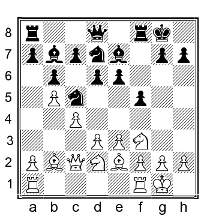
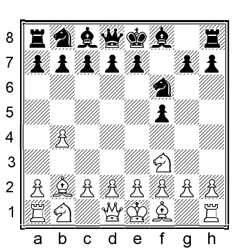
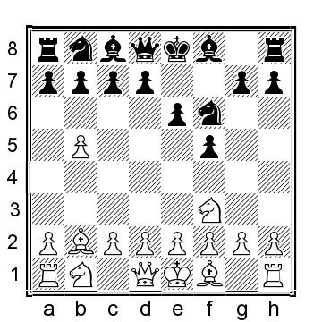
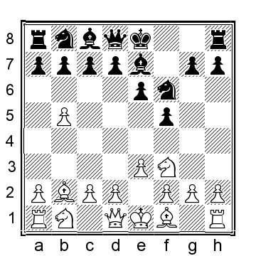
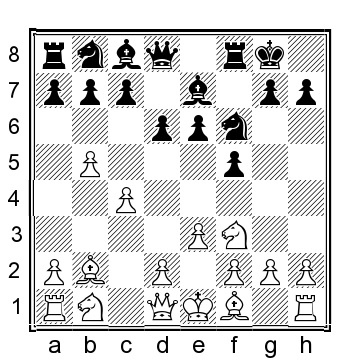
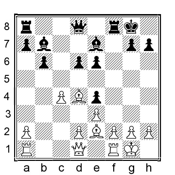
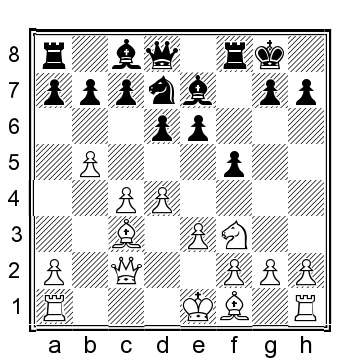
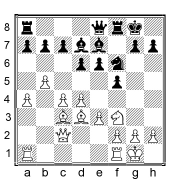
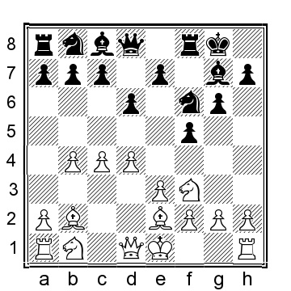

# Глава 11: Голландские расстановки

Петросян однажды сказал, "что если люди хотят играть голландку, то нет причин препятствовать им в этом". Учитывая это, остановить кого-либо от голландской расстановки после 1.b4 практически невозможно. Тем не менее, белым не нужно чрезмерно беспокоиться о голландцах.

**1.b4 f5 2.Bb2 Nf6**

В одной из моих блиц-партий гроссмейстерский соперник предпочел другой порядок ходов: 2...e6 3.e3 (Острое 3.e4 менее эффективно, но может привести к интересной игре, например, 3...Qh4 4.Nc3 fxe4 5.g3 Qh6 6.Nxe4 d5 (или 6...Bxb4, превращая его в полноценный гамбит, но белые получают удовлетворительную компенсацию после 7.Qg4 Bf8 8.Bg2 Nc6 9.f4 d6?! 10.Qe2 Be7 11.Nf3 как в партии Теллйоханн-Хеймрат, Апольда 2017, когда белые были явно лучше, но улучшить игру черных не должно быть сложно) 7.Nc5 Nc6 8.Bb5!?? Bd6 9.Bxc6+ bxc6 10.Nf3 Ne7 11.0-0 0-0 12.Ne5 a5 13.a3 Ng6 14.f4 с
увлекательной позицией и шансами для обеих сторон) 3...Nf6 4.b5 Be7 5.Nf3 b6 (5...0-0 соответствует 2...Nf6 3.e3 e6 4.b5 Be7 5. Nf3 0-0 ниже) 6.Be2 Bb7 7.c4 0-0 8.0-0 Ne4?! (8...Qe8 9.d4 d5 10.a4 также очень неприятно для черных) 9.d3 Nc5 10.Nbd2 d6 11.Qc2 Nbd7

12.Nd4!? (Белые играют за контроль над полем c6, но, возможно, лучше было продолжить 12.d4! Ne4 13.a4 и у белых солидный перевес) 12...Bf6 13.Bf3 Qc8 14.Nc6 e5? (меньшим злом было бы 14...Bxc6, когда 15.Bxc6 Bxb2 16.Qxb2 Nxd3 17.Qc3 N7c5 18.Bxa8 Qxa8 19.Nb3 дало бы белым небольшой материальный перевес, но размен далеко не прост) 15.Bd5+ Kh8 16.d4! Ne4 17.Nxe4 fxe4 18.Bxe4 и позиция черных рушилась Кa.Хансен - Амир Багери, Chess.com 2021.

**3.Nf3**

**A)**

**3...e6 4.b5**

4...Be7

There are several minor alternatives for Black:

a) 4...a6?! (in my opinion, this early challenge only helps White, as White is much more likely to benefit from the opening of the a-file) 5.a4 Be7 6.e3 0-0 7.Be2 axb5 8.axb5 Rxa1 9.Bxa1 b6 10.0-0 Re8 11.d3 Bb7 12.Nbd2 Bf8 13.c4 d6 14.Nd4 g6 15.Bf3 Bxf3 16.Qxf3 (White can improve with 16.N4xf3!? e5 17.Qb3 Kg7 18.Bc3 Nbd7 19.Ra1 and White has a superior position with more space and control over the a-file) 16...Bg7 17.Bb2 e5 18.Nc2 Nbd7?! 19.Nb4 (19.Qc6!? can also be considered) 19...e4 20.Qe2 exd3 21.Qxd3 Nc5 22.Qc2 Qd7 23.h3 (cautious and reasonable, but 23.Ra1! may well be even better) 23...Ra8 24.Bxf6 Bxf6 25.e4 fxe4 26.Nxe4 Nxe4 27.Qxe4 gave White a clear advantage in Sulskis-Stremavicius, Lithuania 2021; the locked queenside pawns, the d5–square, and Black’s open king gives White amble opportunity to squeeze for a long time. In the game, Black held on, and a draw was agreed upon after 74 moves.

b) 4...b6 5.c4 Bb7 6.e3 (6.g3 is also perfectly acceptable 6.e3 is our preferred option because it stylistically leads to positions that are consistent with the standard Orangutan game plan) 6...d5 (6...Be7 transposes to my game in the initial comment at the beginning of this chapter) 7.cxd5 Nxd5 8.Bc4 and White has a positional advantage.

c) 4...d5 5.e3 Bd6 6.c4 (White can also play 6.Be2 0-0 7.c4 a6 8.a4 axb5 9.axb5 Rxa1 10.Bxa1 Nbd7 11.0-0 dxc4 12.Bxc4 Nb6 13.Qb3 Qe7 as seen in Thau-Leisebein, corr 2002, and now 14.Be2!?, preserving the bishop seems best, guaranteeing White a long-term edge) 6	0-0 7.Be2 (stopping Black’s	f5–f4 ambitions with 7.g3 can also seem reasonable, but I don’t think this is White’s best choice, e.g., 7	c6 8.cxd5 cxd5 9.Nc3 Kh8 10.Bg2 Nbd7 11.0-0 e5 which gives Black something that he/she will enjoy while objectively pleasant for White) 7	a6 (again this move which will likely help White more than Black, but many players, even strong ones, cannot resist the temptation to open the a-file and exchange rooks) 8.a4 axb5 9.axb5 Rxa1 10.Bxa1 Nbd7 11.0-0 Qe7 12.cxd5 Nxd5 13.d3 N7f6 14.Nbd2 and White the slightly more pleasant position: the queen will move to b3, the rook to c1 (or b1, if necessary), and the knight can jump to d4 and c4, respectively.

**5.e3**

White has a perfectly reasonable alternative in 5.g3, for instance, 5	0-0 6.Bg2 d6 7.d4?! (I think, White would be better served by playing 7.c4 e5 8.Nc3 Qe8 9.a4 Qh5 10.d3 a6 11.e3 with a pleasant position for White) 7...a6 8.a4 axb5 9.axb5 Rxa1 10.Bxa1 c6 11.bxc6 bxc6?! (11	Nxc6! is fine for
Black) 12.0-0 Nbd7 13.c4 d5 14.Nbd2 Ne4 15.Qa4 Qc7 16.Rc1 Qb7 17.Rb1 Qa6 was played in Kutynec-Wozniak, Katowice 2017, and now 18.Qc2 would have provided White with a nice edge.

**5...0-0**

The Classical Dutch approach with 5...b6 is nice for White: 6.c4 a6 7.a4 Bb7 (or 7...Bb4 8.Be2 0-0 9.0-0 and White is better) 8.Be2 Ne4 9.0-0 0-0 10.Nc3 a5 11.d4 (or 11.d3 Nxc3 12.Bxc3 Qe8 13.Ne1 and White has a nice plus) 11...Nxc3 12.Bxc3 d6 13.Ne1 Nd7 14.Nd3 Qe8 15.Bh5 g6 16.Bf3 with a clear positional advantage for White.

**6.c4**

White can also play 6.Be2, when 6...c5 takes the game in a unique direction: 7.0-0 d5 8.c4 Nbd7 9.a4 Ne4 10.d3 Nd6 11.cxd5 exd5 12.Qb3 Nf6 and here a draw was agreed upon, ½–½, in Baginskaite- Hoang Trang, Istanbul ol 2000, but White has an advantage after 13.Nbd2 Kh8 14.Rfc1 b6 15.Ne5.

**6...d6**

Of course, somebody has tried 6...a6?! in this position, and this case, it is the legend Pal Benkö, but that does not make a move a lot better: 7.a4 axb5 8.axb5 (it makes less sense to capture in the other direction when Black’s has not played ...b7–b6 yet: 8.cxb5?! d5 and Black should be okay) 8...Rxa1 9.Bxa1 b6 10.Be2 d6 11.0-0 Bb7 12.Nd4 Qc8 13.f4 (or 13.Qc2 c5 14.bxc6 Nxc6 15.Qb3 Nxd4 16.Bxd4 Qc6 17.Bf3 Qd7 18.Bxb7 Qxb7 19.Nc3 and White has a nice positional plus) 13...Ne4 14.Nc3 Bf6 15.Nxe4 Bxe4 16.d3 Bb7 was played in Poley-Benko, Budapest 1991, and now 17.Bh5!? to provoke Black to play ...g7–g6, to weaken the dark squares; in any case, White has a small but comfortable advantage.

**7.d4**

White chooses to enter the Dutch proper, but a couple of other moves can be considered as well: a) 7.Nc3 c5 (or 7...e5 8.Qb3 Kh8 9.d4 e4 10.Ng5 h6 11.h4 Qe8 12.Nh3 c5 13.Nf4 Bd8 14.h5 Rf7 15.0-0-0 Nbd7 as played in De Visser-Hendriks, Netherlands 1982, and now 16.Be2 would have left White with a clear advantage; Black’s pieces look like a mess) 8.bxc6 Nxc6 9.Be2 b6 10.0-0 Ne4 11.Nxe4 fxe4 12.Nd4 Nxd4 13.Bxd4 Bb7,

and here we need to look at a few different moves:

a1) 14.a4 Bf6 15.Bg4!? Qc8 16.d3!? Bxd4 17.exd4 Qe8 18.dxe4 Bxe4 19.Re1 Qg6 20.Qe2 d5 21.f3 and White has the better chances.

a2) 14.f4?! exf3 15.Bxf3 Bxf3 16.Rxf3 Bf6 17.Bxf6 Rxf6 18.Qe2 Qe7 19.Rxf6 Qxf6 was played in the grandmaster encounter, Lombardy-Evans, New York 1962; the chances were about even, and a draw was eventually agreed upon.

a3) 14.Bg4 Qd7 15.a4 d5 16.cxd5 Qxd5 17.Qe2 and White has a small plus thanks to his superior pawn structure.

b) 7.Be2 e5 (if 7...a6, then 8.a4 axb5 9.axb5 Rxa1 10.Bxa1 Nbd7 11.0-0 e5 12.d3 and White has an excellent English-style position) 8.d4 e4 9.Nfd2 Qe8 10.Nc3 Qg6 11.0-0! (this is stronger than 11.g3 Nbd7 12.Qb3 c5 13.a4 Kh8 14.f4?! (this is unnecessary; 14.a5!? is more interesting) 14...exf3 15.Bxf3 Qh6? (Black should have opted for 15...cxd4 16.exd4 Ng4 and Black would have had the better chances) 16.Ne2 Bd8 17.Nf4 and White had the upper hand, Teichmann-Bhend, Bern 1991) 11...Be6 12.a4 a5 13.f4 Nbd7 14.d5 Bf7 15.Nb3 and White has more space and the much easier position to play.

**7...Ne4**

The ‘normal’ Dutch continuation, 7...Qe8, has also been tested: 8.Be2 Nbd7 9.Nbd2 Ne4 10.Nxe4 fxe4 11.Nd2 d5 12.0-0 c6 13.a4 Nf6 14.Qb3 Bd7 15.Ba3 Kh8 16.Bxe7! (16.f4 exf3 17.Rxf3 Bxa3 18.Qxa3 e5 19.Bf1 e4 20.Rf4 was played in A.Rodriguez-Belmonte, Salta 1993, and now 20...Qh5 21.Re1 and while I prefer White’s position, Black should be okay) 16...Qxe7 17.Qa3! Qe8 (or 17...Qxa3 18.Rxa3 dxc4 19.Bxc4 Rac8 20.bxc6 Rxc6 21.Bb5 Rc7 22.Bxd7 Rxd7 23.Rc3 and White has a clear advantage in the endgame) 18.Qd6 with a dominating position for White

**8.Nc3**

Which knight move is better? I’m not sure. For instance, 8.Nbd2 b6 9.Nxe4 fxe4 10.Nd2 d5 11.a4 Nd7 12.Be2 (White can also consider both 12.Qc2 and 12.Qb3) 12...Bd6 13.0-0 and has a pleasant position.

**8...Nxc3 9.Bxc3 Nd7 10.Qc2**

**10...Nf6?!**

Normal but not best. Black should opt for 10...e5 when 11.Be2 (Black gets more or less full compensation for the pawn after 11.dxe5 dxe5 12.Nxe5 Nxe5 13.Bxe5 f4 and White needs to start thinking about getting the pieces developed and the king to safety) 11...e4 12.Nd2 Nf6 13.a4 c6 14.0- 0 d5 15.Rfb1 and White has better chances, but as an alternative to the game continuation, this is a better option for Black.

**11.Bd3 Bd7?!**

A developing move that looks perfectly normal, but that probably is just wrong. The engine instead suggests the pawn sacrifice 11...Ne4 although White after 12.Bxe4 fxe4 13.Qxe4 d5 14.Qd3 has the better chances. The point behind the sacrifice is that Black’s position is less cramped after 14...a6 15.0-0 dxc4 16.Qxc4 axb5 17.Qxb5 b6 18.Rfe1, but it is not 100% satisfactory either.

**12.0-0 Qe8 13.a4**

White has a clear advantage as he is much further along on the queenside than Black is on the kingside. In the game, one by the Orangutan maestro himself, things soon get much, much worse for Black.

**13...Qh5 14.a5 Ng4 15.h3 Rf6 16.Rfb1 Rh6 17.b6!** White is already crashing through on the queenside, whereas Black isn’t making much progress on the kingside.

**17...cxb6 18.axb6 a6 19.Ra5!** White stops any hopes of counterplay Black may have fostered.

**19...Nf6 20.e4! Bc6 21.d5!** Black’s position now just falls apart. **21...exd5 22.cxd5 Bd7 23.exf5 g5 24.Bxf6 Bxf6 25.Rb4 Rc8 26.Rc4 Rf8 27.Rg4 Rc8 28.Qd2 Kh8 29.Nxg5 Bc3 30.Qe3 Rf6 31.Ra3 Bb2 32.Qe7 Bxf5 33.Bxf5 Rxf5 34.Rf3 Be5 35.Qc7** and after this neat move to crush Black’s spirit, Black threw the towel in the ring, 1–0, Sokolsky-Lukin, Soviet correspondence ch 1960.

**B)**

**3...g6 4.c4 Bg7 5.e3 0-0**

5...d6 6.d4 0-0 will transpose to other lines.

**6.Be2 d6**

An odd-looking alternative is 6...e6 7.Qc2 (7.d4!? is also pleasant for White) 7...Qe7 8.0-0 b6 9.a4 Bb7 10.b5 a5 11.d4 Ne4 12.Nc3 d6 13.Nxe4 Bxe4 was played in Martinez Duany-Soto Hernandez, Santa Maria del Mar 2017, and now 14.Qb3 Bb7 15.Nd2 Nd7 when both 16.f4 and 16.Rac1 give White the better chances.

**7.d4**

We have now arrived in a Leningrad Dutch. Black has tried several things, but White appears to be doing rather well against most of them:

a) 7...Qe8 (a standard Leningrad move, but this should not worry White) 8.Qb3 h6 (or 8...Kh8 9.0-0 c6 10.b5 Nbd7 11.Nc3 e5 12.bxc6 bxc6 13.Qa4 c5 14.dxe5 dxe5 15.Nd5 Nxd5 16.cxd5 Nb6 was Sakaev-Ehlvest, Jurmala 2015, and here 17.Qa3 e4 18.Nd2 would have given White a clear positional advantage) 9.0-0 c6 10.a4 Be6 11.Nc3 Nbd7 12.d5 Bf7 13.a5 c5 was played in J.Lee- Harsha, Manavgat 2018, and here 14.Nb5 Qd8 15.bxc5 Nxc5 16.Qa3 a6 17.Nbd4 would have led to dominating position for White.

b) 7...e6 and here we reach another fork in the road:

b1) 8.0-0 Qe7 9.Qb3 (another try is 9.Nbd2 Nbd7?! 10.Qb3 (10.c5!) 10...a5 11.a3?! (11.c5!) 11...Kh8? (11...b6 was necessary) 12.c5! Nd5 13.cxd6 cxd6 14.bxa5 Rxa5 15.Nc4 Ra6 16.a4 and White was positionally winning in Ehlvest-Pruijssers, Chess.com INT 2018) 9...Kh8 10.Nc3 e5? (or 10...b6?! 11.a4 (11.c5! is possibly even stronger) 11...a5 12.bxa5 bxa5 13.Ba3 c5 14.dxc5 dxc5 15.Ne5 Nfd7 16.Nxd7 Nxd7 17.Rad1 (White is clearly better, the conclusion of the game can surprisingly soon..) 17...Rb8 18.Nb5 Bb7 19.Rd6 Rfc8 20.Rfd1 Qg5 21.g3 Nf8 22.Rb6 Ba8 23.Nd6 and Black resigned, 1–0, Kempinski-Piorun, Katowice 2019) 11.dxe5 dxe5 12.Nd5 Nxd5 13.cxd5 Rd8 14.Rfd1 a5 15.b5 and somehow this position is scored as a win for White, 1–0 in Bluebaum- Sochacki, Chalons en Champagne 2021; that being said, Black’s position is utter rubbish and he has been thoroughly outplayed.

b2) 8.Nbd2 Qe7 9.Qb3 Nc6 10.0-0 Nd8 11.Rac1 Nf7 12.c5 g5 13.b5 g4 14.Ne1 h5 15.Nd3 (White
is already clearly better, but since Black’s kingside attack may look intimidating to some, I will include the entire game to illustrate how White should handle a position like this) 15...Nd5 16.cxd6 (White can do even better with 16.Nf4! Nxf4 17.exf4 d5 18.Rfe1 and White has a clear advantage) 16...cxd6 17.Nf4 (or 17.Ba3 a6 18.b6 Bd7 19.Nf4 and White is in command) 17...Nxf4 18.exf4 d5 19.Bd3 Nd6 20.Rfe1 Qd8 21.Nf1 Bd7 22.Ba3 Qb8 23.Ne3 Re8 24.Nxd5 Nf7 25.Nc7 Bxd4 26.Qc4 Bf6 27.Nxe8 and Black resigned, 1–0, Kempinski-Heberla, Wroclaw 2014.

b3) 8.Nc3 Qe7 9.Qb3 a5 10.b5 b6 11.0-0 (11.c5!? can also be considered, e.g., 11...dxc5 12.dxc5 bxc5 13.Na4 Bb7 14.Rc1 Nbd7 15.0-0 and White is better) 11...Nbd7 12.Nd2 Bb7 13.Bf3 Bxf3 14.Nxf3 Kh8 15.Rad1 Nh5 16.Na4 (16.Ba3!? is also worth a try) 16...Nhf6 17.Ba3 Ne4 was played in Yankelevich-Sethuraman, Tegernsee 2019, and now 18.Nd2 Qh4 19.c5 is comfortably better for White.

c) 7...Ne4?! 8.Nbd2 Nd7 9.0-0 Nxd2 (also 9...a5 10.b5 Ndf6 11.a4 is comfortably better for White) 10.Qxd2 e5 11.dxe5 Nxe5 12.Qd5+ Nf7 13.Bxg7 Kxg7 14.c5 Qf6 was seen in Kempinski- Chojnacki, Trzcianka 2016, and now 15.b5 c6 16.bxc6 Be6 17.Qd3 bxc6 18.cxd6 would have been clearly better for White.

d) 7...c6 8.0-0 Ne4 9.Nc3 Nd7 10.Qc2 (White can possibly improve with 10.Nxe4!? fxe4 11.Nd2 Nf6 12.d5 and White has a clear advantage) 10...Ndf6 11.a4 and White was better in Frosch- Mayerhofer, Austria 2019.

e) 7...Kh8 has been played several times by Ukrainian super grandmaster Volokitin, but White has no problems obtaining a nice advantage against it: 8.0-0 Be6 9.Nc3 Bg8 10.Qc2 c6 11.a4 Nbd7 12.a5 (or 12.Rfd1 Qc7 13.b5 e5 14.a5 e4 15.Nd2 c5 16.Nb3 b6 as in Kempinski-Volokitin, Germany 2010, and here 17.Qc1 Rfc8 18.dxc5 dxc5 19.axb6 axb6 20.Ra6 and White would have had a large advantage) 12...a6 13.Na4 Qc7 14.Nd2 e5 15.dxe5 Nxe5 16.Nb6 Rae8 was seen in Miljkovic- Volokitin, Kragujevac 2010, and now 17.Rad1 would have left White with a clear advantage.

f) 7...a5 8.b5 e6 9.a4?! (I think this pawn advance is unnecessary, I mean, is Black really threatening to play ...a5–a4? Good alternatives are 9.Nfd2!?; and 9.Nc3) 9...Qe7 10.0-0 b6 11.Nc3 Bb7 12.Rc1 (an interesting alternative is 12.c5 bxc5 13.dxc5 dxc5 14.Qb3 Nbd7 15.Bc4 Rfe8 16.Ng5 Nf8 17.Ne2 h6 18.Nf3 Bxf3 19.gxf3 with a position where I clearly prefer White, but objectively speaking, Black should be okay, at least the computer says so; this was tested in Kazhgaleyev- Potapov, Moscow 2019) 12...Nbd7 13.Qb3 Kh8 14.Nd2 Ne4? (Black can improve with 14...e5!, for instance, 15.Qc2 Qf7 is completely okay for Black) 15.Ncxe4 fxe4 16.Qc2 Nf6 17.c5 and White has a near decisive advantage, Piorun-Potapov, Moscow 2019.

**C)**

**3...d6**

Black signals that he is considering ...e7–e5 on the next move. White can reasonably prevent this idea with the straightforward d2–d4, which is better for White. But we will explore another option...

**4.Bxf6!? exf6**

This is the normal recapture, but surprisingly, Black can even consider 4...gxf6!? 5.e3 Bg7 This position looks somewhat ridiculous but is interesting, though mostly for White	6.g3 0-0 7.Nh4 (7.c4 is perfectly normal and good) 7...e6 8.a4 Nc6 9.b5 (the computer also likes 9.c3!?) 9...Ne7 10.c4 e5 11.Nc3 f4 12.exf4 f5 13.Rc1 a6 14.Ng2 with a fascinating position where White probably has somewhat better chances.

**5.e3**

The untried 5.c4 is possibly better, for instance, 5...c5 6.b5 Nd7 7.e3 Ne5 8.Nc3 Be6 9.Nd5 and White has a nice advantage.

**5...d5 6.a3 a5 7.b5 Bd6 8.c4 0-0 9.cxd5 Nd7 10.Nc3 Qe7 11.Nd4!**

This is much better than 11.Bc4 Ne5 12.Nxe5 fxe5 13.Qb3 Kh8 14.b6 cxb6 and here a draw was agreed upon, ½–½, in Chytilek-Sluka, Czech Republic 1997, even though I think White still has the slightly better chances.

**11...Nb6 12.Bd3**

Or 12.g3 f4 13.Bg2 fxe3 14.dxe3 Bxa3 15.Qb3 Bd6 16.0-0 and White has a nice advantage.

**12...g6 13.Qb3** and White has the better chances.
