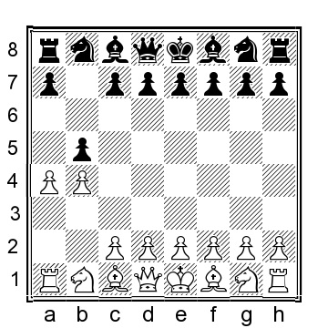

# Глава 12: Различные другие 1-ые ходы за черных

Линии, рассматриваемые в этой главе, в основном представляют собой странные варианты, пытающиеся спровоцировать реакцию белых.
После **1.b4** мы рассмотрим следующие ходы:

A: 1...c5
B: 1...a5
C: 1...Na6
D: 1...b5
E: 1...Nh6
F: 1...f6
G: 1...g5

**A)**
**1...c5**

Эта линия называется Бирмингемским гамбитом. Если белые не подготовлены должным образом, черные могут легко получить приличную позицию. Я экспериментировал с парой идей в своих собственных партиях и считаю, что белые могут получить преимущество, но это требует некоторой оригинальной игры.

**2.bxc5 e5 3.e3**

Продвижение пешки считается главной линией. У белых есть несколько альтернатив:

3.Bb2 играется чаще, но, на мой взгляд, более или менее безвредно для черных, например, 3...Nc6 4.Nf3 Bxc5 5.e3 d6 6.d4 (6.Be2!?) 6...Qb6 7.Bc3 Bb4 и черные очень близки к уравниванию.

3.Ba3!? - мое любимое продолжение. В двух партиях, в которых я его использовал, мои соперники реагировали довольно растерянно и вскоре попали в беду.

3...Qa5 (черные должны сделать этот ход в какой-то момент, если пешка c5 должна быть восстановлена; альтернатива - 3...Nc6 4.e3 Qa5 и теперь 5.Nf3 переходит на нашу главную линию) 4.Nf3 Nc6 5.Bb2 (или 5.c3 Bxc5 6.Bxc5 Qxc5 7.d4 Qe7 8. d5 Na5 9.d6 Qe6 10.Na3 a6 11.e4 с увлекательной позицией, где у белых незначительно лучше, тогда как; 5.e3 переставляется) 5...Bxc5 6.e3 d6 7.Be2 Nf6 8.0-0 0-0 9.c4 Bf5 10.Nc3 и у белых несколько лучшие шансы.

**3...Bxc5 4.Nf3**

Если на третьем ходу слон не будет развит, белым пока лучше воздержаться от его развития, так как на b2 он может и не понадобиться. Есть несколько альтернатив:

a) 4.c4 Nc6 5.Nc3 Nf6 6.Nge2 0-0 7.Nd5 d6 8.Nec3 Be6 9.Be2 Bxd5 10.cxd5 было удобно для белых в партии Ситников-Авескулов, Харьков 2005.

b) 4.d4 exd4 5.exd4 Be7 6.Nf3 (или 6.g3 Nf6 7.Bg2 d5 8.Ne2 Nc6 9.0-0 0-0 с примерно равными шансами, М.Бах-Дж.О. Фрис Нильсенn, Гамбург 2016) 6...Nf6 7.Bd3 0-0 8.0-0 d5 9.h3 Nc6 10.Re1 Re8 и черные уравняли в партии Васюков-Хехт, Дрезден 2010.

**4...Nc6**

Разумной и неопробованной альтернативой является 4...d6 5.c3!? (или 5.d4 exd4 6.exd4 Bb6 7.Bb5+ Bd7 8.Bxd7+ Qxd7 9.0-0 и у белых немного лучшая позиция) 5...Nc6 6.d4 Bb6 7.Ba3 (белые могут улучшить с помощью 7.Bb5! exd4 8.cxd4 a6 9.Bd3, когда у белых лучшая пешечная структура) 7... e4 8.Nfd2 (или 8.d5 Nce7 9.Ng5 Nf6 10.Qa4+ Bd7 11.Bb5 Nexd5 12.Nxe4 Nxe4 13.Bxd7+ Qxd7 14.Qxe4+ Ne7 15.0-0 с примерно равными шансами) 8...Nf6 (8...d5 9.c4 более или менее выигрывает для белых) 9.Be2 0- 0 10.0-0 Re8 - все в порядке для черных.

**5.d4 exd4 6.exd4**

**6...Bb6**

Это лучшая клетка. Напротив, 6...Be7 слишком пассивно: 7.d5 Bf6 8.c3 Ne5 9.Nbd2 Nh6 10.Nxe5 Bxe5 11.Bd3 Bxc3 (или 11...d6 12.0-0 0-0 13.Rb1 Bxc3 14.Qc2 и у белых явный перевес) 12.Ba3 и у белых огромный перевес в развитии, и черным повезет остаться в партии.

**7.d5 Qf6!**

Необходимо, так как альтернативы, ходы конем, ужасны, например, 7...Nce7 8.d6 Nc6 9.Bc4 и у белых подавляющее преимущество; или 7...Na5 8.Ba3 (8.Bd3!?) 8...d6 9.Nc3 и у белых явное преимущество.

**8.c3 Ne5 9.Qe2 d6 10.Nbd2 Ne7 11.Nxe5 Qxe5 12.Qxe5 dxe5 13.c4** и у белых лучшие шансы.

**B)**
**1...a5**

Всякий раз, когда черные делают этот ход, я сразу же начинаю радоваться, потому что в данный момент у черных нет ни одной хорошей причины играть этот ход. Конечно, он может переходить к ходам, описанным в других разделах этой книги.

**2.b5 Nf6**

Черные перепробовали кучу других ходов:

a) 2...c6 3.e3 переходит в 1...c6 2.e3 a5, что рассматривается в [Главе 10](capter-10.md).

b) 2...d5 3.Nf3 c5 4.c4 d4 5.e3 g6 6.exd4 Bg7 7.Ba3 (или 7.d3 cxd4 8.g3 с отличной позицией для белых) 7...cxd4 8.d3 Nf6 9.g3 0-0 10.Bg2 Re8 11.0-0 e5 12.Re1 e4 13.dxe4 Nxe4 14.Bb2 и у белых явное преимущество.

c) 2...e5 3.Bb2 d6 4.e3 Bf5 5.c4 (5.d4!?) 5...Nf6 6.Nf3 c6 7.a4 Be7 8.Be2 0-0 9.Nc3 Nbd7 10.0-0 и позиция белых более привлекательна.

d) 2...b6 3.c4 Bb7 4.Bb2 Nf6 5.Nf3 e6 6.Nc3 Be7 7.e3 (7.g3!?) 7...c5 8.bxc6 Nxc6 9.Be2 0-0 10.0-0 d5 11.cxd5 Nxd5 12.a3 и у белых небольшой плюс.

e) 2...c5 3.c4 e6 4.Nf3 Nf6 5.g3 d5 6.Bg2 d4 (или 6...Bd6 7.0-0) 7.0-0 Bd6 8.d3 e5 9.e3 0-0 10.Nbd2 h6 11.a4 Re8 12.e4 и у белых своего рода упавший гамбит Беко с перевернутыми цветами. Эту позицию гораздо легче играть белым.

f) 2...a4 (я сталкивался с этим несколько раз; обычно черные в итоге теряют пешку, потому что она отделена от других пешек и ее трудно защищать) 3.c4 Nf6 4.Nf3 c6 5.Nc3 d5 6.e3 a3 7.d4 e6 8.Bd3 dxc4 9.Bxc4 Nbd7 10.0-0 и у белых позиция лучше.

g) 2...d6 3.c4 Nf6 4.Nc3 g6 5.Nf3 Bg7 6.Ba3!? (6.d4!?) 6...c5 7.e3 b6 8.Be2 Bb7 9.d4 0-0 10.0-0 Ne4 (или 10...Nbd7 11.d5) 11.Nxe4 Bxe4 12.Ng5 Bb7 13.Bf3 Bxf3 14.Nxf3 и у белых небольшой перевес.

h) 2...e6 3.c4 d5 4.e3 Nf6 5.Nf3 Nbd7 6.cxd5 exd5 7.Be2 c5 8.bxc6 bxc6 9.0-0 Bd6 10.Qa4 и у белых позиция несколько лучше.

i) 2...h5 (уморительная попытка высмеять дебютную игру белых) 3.Nf3 e6 4.e3 d5 5.c4 Nf6 6.Be2 c5 7.Bb2 Bd6 8.0-0 Nbd7 9.Nc3 b6 10.d4 и здесь раннее ...h7-h5 только ослабляет позицию черных и у белых положение лучше.

**3.e3 g6**

3...c6 4.Nf3 переносимся в [Главу 10](chapter-10.md).

**4.c4 Bg7 5.Bb2 d6 6.Nf3 e5**

Теперь мы вошли в позицию, которая часто достигается из английского дебюта.

**7.Nc3 0-0 8.Be2 Re8**

Или 8...Bf5 9.0-0 Re8 10.Rc1 Nbd7 11.d4 и у белых отличная королевско-индийская позиция.

**9.0-0 Nbd7 10.d4 exd4 11.Nxd4**

**11...Nc5 12.Bf3**

Альтернатива - 12.Qc2 Bg4 13.Rad1 Bxe2 14.Qxe2 Qe7, как сыграно в партии Ломбардия - Р.Бирн, Нью-Йорк 1969, и теперь 15.Nb3 дает белым небольшой плюс.

**12...Nfd7**

Также 12...Bd7 13.Nb3 Nxb3 14.axb3 Qc8 15.b6 было лучше для белых, Жуков-Макаревич, попр 1972.

13.Nd5 Ne5 14.Be2 c6 15.Nf4 и у белых чуть более легкая позиция для игры, Кенель-Квейнис, Невшатель 1995.

**C)**

**1...Na6?!**

На фланговый ход белых черные отвечают собственной провокацией. Этот ход, согласно Википедии, называется габмит Бюкера, я полагаю, в честь немецкого мастера ФИДЕ Стефана Бюкера. Белые без проблем получают преимущество.

**2.b5!**

Идея черных - ответить на 2.a3 ходом 2...c5 3.b5 (3.bxc5 Qa5 (или 3...Nxc5 4.d4 Ne4 5.f3 Qa5+ 6.c3 Nef6 7.e4 и у белых комфортный перевес) 4.e3 Nxc5 5.Be2 e6 6.Nf3 Be7 7. 0-0 d5 8.a4 Nf6 9.d4 Nce4 10.c4 и у белых позиция лучше, черному ферзю нечего делать на a5, а у белых уже есть инициатива) 3...Nc7, но белые могут улучшить ситуацию 2...Nc5

Или 2...Nb8 3.Bb2 и у белых преимущество.

**3.d4 Ne6 4.e4 c5 5.d5 Nc7 6.c4*

Белые получили значительный перевес в пространстве, а черные, в свою очередь, перевели коня на с7, где он абсолютно ничего не делает.

**6...d6 7.Bd3 e5**

Или 7...Nf6 8.Nc3 g6 9.Nf3 Bg7 10.Bd2 с отличной позицией типа Бенони у белых.

**8.dxe6 Nxe6 9.Bb2 Be7 10.Nc3 Bf6 11.Nge2 Ne7 12.0-0** и белые имели явный перевес в партии Г.Вест - Х.Мортенсен, Канберра 2001.

**D)**

**1...b5**

Этот симметричный подход (или мы можем назвать его "Противоположный орангутанг" или даже "Полярная полька") не так глуп, как кажется. Я по-прежнему считаю, что у белых лучше, но не намного.

**2.a4!**

В данной конкретной позиции белым необходимо сразу же бросить вызов пешке на b5, а не развиваться обычным способом 2.Bb2 Bb7 (черные могут и сами рассмотреть вариант 2...a5!?, например, 3.c3 c6 с довольно причудливо выглядящей позицией, где шансы примерно равны) 3.a4 c6 (если черные пытаются сохранить симметричность позиции, то откровенной ошибкой будет 3...a6? 4.axb5 axb5 5.Rxa8 Bxa8 6.Na3 c6 7.Qa1 и, угрожая и Bxg7, и Nxb5 (слон на a8 незащищен), у белых позиция заметно лучше) 4.Nc3! (4.e3 e6 близко к равенству) 4...a6 (или 4...Na6 5.axb5 Nxb4 6.bxc6 Bxc6 7.e3 с лучшей игрой у белых) 5.Ne4!? d6 6.e3 Nd7 7.Nf3 e5 8.Ng3 с увлекательной позицией, где я предпочитаю белых, но объективно говоря, шансы близки к равенству

**2...bxa4 3.e3**

Я думаю, что продвижение пешки лучше, чем немедленное возвращение ладьи, хотя и это тоже вполне играбельно, например, 3.Rxa4 e6 (или 3...a5 4.e3 e6 5.b5 d5 6.Bb2 Nf6 7.Nf3 с приятной для белых игрой) 4.e3 Nf6 5.Nf3 d5 6.Bb2 c5 (если 6...Bd7, то 7.b5 c6 8. Nc3, расчищая ферзю путь на a1) 7.bxc5 Bxc5 8.Bb5+ Bd7 9.Bxf6 Qxf6 10.c4 Bxb5 11.cxb5 0-0 12.Nc3 Bb6 13.0-0 и у белых несколько лучшие шансы.

**3...e6 4.c3 d5**

Также 4...Bb7 5.Rxa4!? (или 5.Nf3 a5 6.b5 Nf6 7.Qxa4 d5 8.Ba3 Bd6 9.Be2, когда я предпочитаю белых, но черные должны быть в порядке) 5...c5 6.bxc5 Bxc5 7.d4 Be7 8.Nf3 и у белых лучшая пешечная структура.

**5.Qxa4+ Bd7 6.Qc2**

Игра белых пешками выглядит несколько нелепо, особенно с чернопольным слоном, спрятавшимся на с1, но это можно исправить ходом b4-b5 с последующим Ba3 в определенный момент.

**6...c5 7.bxc5 Bxc5 8.d4 Bd6 9.Nf3 Nf6 10.Ba3! Qc7**

Если 10...Bxa3, то 11.Rxa3 0-0 12.Bd3 Qc7 13.Nbd2 Rc8 14.0-0 дает белым небольшой, но явный перевес.

**11.Be2 0-0 12.0-0 Rc8 13.Nbd2!** и у белых комфортное преимущество.

**E)**

**1...Nh6 2.Bb2 Rg8**

Этот ход ладьей, конечно, выглядит и является нелепым. Как вариант, 2...f6 3.a3 d5 4.d4 c6 5.Nd2 Bf5 6.e4 dxe4 7.Ne2 a5 8.Ng3 axb4 9.axb4 Rxa1 10.Qxa1 и у белых комфортный перевес.

**3.c4 e6 4.b5 g5 5.g3 a6 6.a4** и у белых позиция явно лучше.

**F)**
**1...f6**

Этот ход явно нелеп, если только за ним не последует ...e7-e5, что мы уже рассматривали в [Главе 2](chapter-02.md).

**2.Bb2 Nh6?!**

2...e5 это то, что нужно.

**3.c4 e6 4.b5 c6 5.Nc3 d5 6.e3 Nf7 7.Nf3** и у белых положение гораздо лучше.

**G)**

**1...g5 2.Bb2 Nf6 3.e3**

Или 3.c4 c5 4.b5 a6 5.a4 axb5 6.axb5 Rxa1 7.Bxa1 Bg7 8.Nc3 0-0 9.e3 e6 10.Nge2 и у белых комфортный плюс, Веллинг-Хаукенфрерс, Ричмонд 2004.

**3...Bg7 4.c4 d6 5.Qc2 e5 6.Nc3 Nc6 7.a3 a5 8.b5 Ne7 9.Bd3**

Также 9.h3 Bf5 10.d3 Bg6 11.Nf3 h6 12.Be2 Qd7 13.0-0 лучше у белых, Скерлик-Игнатов, ICCF email 2008.

**9...b6 10.Nge2 Bb7 11.0-0** и у белых явный структурный перевес.
