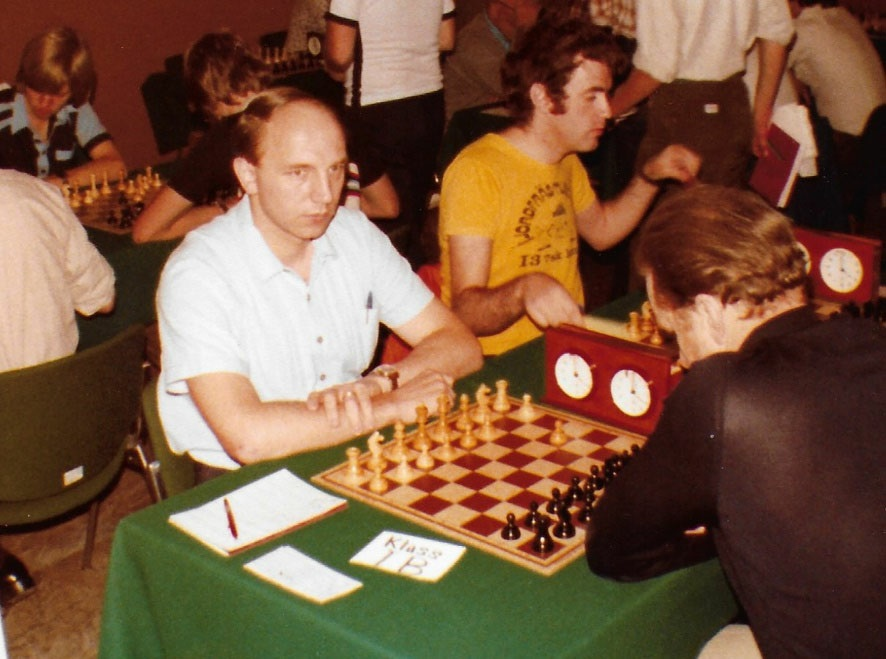

# Благодарности

Я хочу выразить особую благодарность трем людям:
Моему отцу, Йорну Эрику Хансену, который вдохновил меня на написание этой книги;
Михаилу Басману за согласие написать предисловие;
и Джерарду Веллингу, который с энтузиазмом снабжал меня играми и анализом.

# Посвящение моему отцу

Эта книга посвящается моему отцу, который не только научил меня многому в шахматах, но и в жизни, и который играл 1.b4 более двух десятилетий.

Мой отец, Йорн Эрик Хансен, много сделал для шахмат, прежде всего как организатор: он был членом правления нескольких шахматных клубов, одним из основателей шахматного клуба, президентом шахматной ассоциации на острове, где я вырос, Фюнен в Дании, был казначеем Датской шахматной федерации, организовывал турниры, как для взрослых, так и для молодежи и школьников, редактировал журнал нашего местного шахматного клуба, был капитаном различных команд. И это только начало, и я уверен, что кое-что упустил.

Как шахматист, он не был тем, кого можно считать сильным игроком; его высший рейтинг был чуть ниже 1900, уровня, когда в Дании вы считаетесь мастером. Пару раз он был близок к этому, но дважды ему не хватило всего пол-очка до квалификации мастера. Но когда он бился спиной к стене, чтобы избежать выхода из высшей группы в клубном чемпионате нашего местного клуба, Søndersø Skakklub (шахматный клуб), он был опасен для всех, часто побеждая игроков с гораздо более высоким рейтингом, чтобы обеспечить себе место в чемпионской группе.

Интересно, что он не научил меня играть в шахматы, это сделала моя мать, но он помог мне изучить шахматы. Его библиотека шахматных книг не была большой. Тем не менее, в ней было несколько отличных книг на датском, моем родном языке, гроссмейстера Бента Ларсена, международного мастера Йенса Эневольдсена и других. Когда пришло время совершенствоваться, он помог мне с материалом; например, мы вместе изучали 12-томный труд Макса Эйве и Ханса Крамера по миттельшпилю. Он просматривал партии в бюллетенях недавно сыгранных турниров, предоставил мне доступ к томам серии "Шахматный информатор", из которых я просмотрел тысячи партий.

Но он также сопровождал меня на турниры, как в качестве школьного игрока, так и позже, когда я начал играть против взрослых. Фактически, в моем первом турнире со взрослыми, турнире по рапиду в декабре 1982 года, я играл с ним; у меня еще не было рейтинга, а у него в то время был рейтинг чуть ниже 1700. И хотя я с большим трудом обыграл двух игроков с рейтингом 1600+, у меня не было шансов против него, и он быстро обыграл меня. Наши партии никогда не были заранее запланированными ничьими. В нашей первой настоящей турнирной партии мы оба имели рейтинг около 1700; у меня были черные, и я, конечно, ожидал, что он сыграет свое любимое 1.b4. Я неустанно работал со своей копией книги Сокольского по дебюту и нашел понравившуюся мне расстановку черных, выбранную Кересом в партии против самого Сокольского (партия закончилась вничью после долгой борьбы). Я получил хорошую позицию, выиграл пешку, но боялся, что все испорчу, и предложил ничью. (Кстати, много лет спустя, впервые после партии с отцом, на турнире на Кубок Дании среди клубных команд, я снова применил свою первоначальную подготовку и выиграл без проблем у недоверчивого соперника, который заметил: "Я думал, что заставлю тебя хоть немного подумать в дебюте, но ты играл быстрее меня!").

Он заставил меня пообещать, что я никогда больше не буду предлагать ничью в такой позиции, даже если буду играть против него. Для убедительности, в нашей следующей турнирной партии, где я мог получить звание мастера за победу, он снова меня обыграл. Конечно, потом я еще несколько раз его обыгрывал, но и по сей день он имеет против меня плюсовой счет...

Однако, как тренер, он помог мне совершить несколько прорывов, как правило, ментальных, помогая мне справляться с жесткими и страшными соперниками и преодолевать тяжелые и болезненные поражения.

Хотя мой отец больше не играет в шахматы, он отказался от них в пользу бриджа, карточной игры, он по-прежнему следит за игрой, рассказывает мне истории, которые он прочитал в Интернете, партии, которые он сыграл, которые были захватывающими, и проверяет игроков, которые ему нравятся.

_Фотография моего отца, играющего 1.b4, вероятно, с мероприятия в Италии в 1980 году. (Большое спасибо моей маме за то, что она нашла эту фотографию!)_

Без моего отца вы бы не читали эту книгу: Я бы не стал сильным игроком без его поощрения, поддержки и участия в шахматах, а также без него, играющего 1.b2-b4, я бы, вероятно, никогда не заинтересовался этим дебютом настолько, чтобы написать о нем книгу. Мне было приятно рассказать ему о том, над чем я работаю, и я не могу дождаться, когда он сам откроет книгу, когда я подарю ее ему.

Спасибо тебе большое за все, что ты для меня сделал, папа.
- Карстен
