# История дебюта орангутана

История нашего открытия хорошо описана в других книгах, но для тех, кто только начинает знакомиться с дебютом, а также потому, что прошло много времени с тех пор, как была выпущена последняя книга о дебюте на английском языке, я возьму на себя смелость рассказать о нем снова, опираясь на пересказ Сокольского, поскольку он проделал тщательную работу. Напротив, более поздние пересказы, несколько лениво, обычно пропускали несколько этапов.

## Ранние выходы, гипермодернизм и именование

В отличие от классических дебютов, таких как делют Руи Лопеса, Итальянская партия, Королевский гамбит и других, история "Орангутана" намного короче и содержит гораздо меньше партий; это, к сожалению, относится к территории необычных дебютов.

Самый ранний пример, который я смог найти, это Чинарев - Алехин, партия по переписке, сыгранная в 1870 году; она начинается с **1.b4 e5 2.Bb2 f6 3.e4 Bxb4 4.Bc4 Nc6 5.f4 d6 6.Nh3 Nh6 7.c3 Ba5 8.d4 exd4 9.0-0 dxc3 10.Nxc3**, и здесь ссылка заканчивается оценкой того, что у белых позиция немного лучше.
Впрочем, это несколько оптимистичная оценка, возможно, приправленная конечным результатом партии и тем, что в те времена гамбитная игра была в почете. Если посмотреть на позицию сегодняшним объективным взглядом, то после 10...Bg4 11.Qc2 (или 11.Qb3 Bb6+ 12.Nf2 Nd4) 11...Qd7 12.f5 Bxh3 13.gxh3 Nd4 14.Qd1 c6 15.Na4 b5 16.Qxd4 bxc4 17.Qxc4 Nf7 у белых нет достаточной компенсации за пешку.

Далее следуют приключения профессора университета и математика Николая Васильевича Бугаева (1837-1903) из Москвы, анализ дебюта которого был опубликован в 1903 году в русском журнале "Шакматное обозрение", возможно, в связи с его смертью.

В матче 1888 года Соловьев, Бугаев сыграл 1.b4 в четырех партиях, одна, на которую ссылается Сокольский, началась с **1.b4 e5 2.Bb2 f6 3.a3 d5 4.e3 Be6 5.Nf3 Bd6 6.Be2 Ne7 7. d4 e4 8.Nfd2 0-0 9.c4 c6 10.f3? f5 11.f4 Nd7 12.Nc3 Rf7 13.c5 Bc7 14.0-0? g5!** с позицией, которая определенно в пользу черных, и он действительно выиграл партию.

Позже Бугаев сыграл 1.b4 в симуляции против бывшего чемпиона мира Вильгельма Стейница и в итоге выиграл:

**1.b4 e5 2.Bb2 f6 3.b5 d5 4.e3 Bd6 5.c4 c6 6.a4 Ne7 7.Nc3 0-0 8.Qb3?! 8.Nf3!? 8...Bc7?** 8...Nd7 было лучшим вариантом. **9.cxd5 cxd5 10.e4?!** 10.Ba3!, атакуя защитника пешки d5, выглядит перспективно. **10...Be6 11.exd5** 11.Nxd5! Nxd5 12.Bc4 дает белым преимущество. **11...Nxd5 12.Nxd5 Bxd5 13.Bc4 Bxc4 14.Qxc4+ Kh8 15.Ne2 Nd7 16.0-0 Nb6 17.Qc2 Rc8 18.Bc3 Nd5** В этот момент черные контролируют игру. **19.Rfd1 Bb6 20.Qb2 Qd7 21.a5 Bc7 22.Ng3 Nf4 23.d4 Qd5 24.f3 Rfd8 25.Rd2 Qc4 26.dxe5 Nd3?** Здесь черные пропускают 26...Rxd2 27.Qxd2 Rd8 28.Qb2 Nd3 29.Qd2 Qc5+ с решающим перевесом у черных. **27.Qa3 Bxe5!!! 28.Bxe5 fxe5???** 28...Nxe5 было необходимо, что привело к более или менее равной позиции. **29.Ne4?** 29.Rad1! Qd4+ 30.Kf1 выигрывают белые. **29...Rd7 30.Rad1 Rcd8 31.Nf2 Nc5???** Черные пропускают свою единственную защиту: 31...Qc5 32.Qxc5 Nxc5, когда ничья вполне вероятна. **32.Rxd7 Rxd7 33.Rc1 Qxb5 34.Qxc5 Qxc5 35.Rxc5 h6 36.Rxe5 Rc7 37.g4 Kg8 38.Kg2 Kf7 39.Ne4 Rc6 40.Kg3 b6 41.h4** и черные сдались. **1-0**

Первую партию между крупными игроками можно было увидеть в матче между Бертольдом Энглишем и Гарри Пильсбери в Вене 1896 года. Для тех, кто не знаком с этими именами, по данным Chessmetrics, оба игрока входили в топ-10 в мире на момент партии, которая проходила следующим образом:

**1.b4 e5 2.Bb2 f6 3.b5 d5 4.e3 Nh6 5.c4 Be6** 5...d4 было лучшим ходом. **6.cxd5 Qxd5 7.Nc3** У белых уже комфортный перевес. **7...Qd7 8.Nf3 Bd6 9.d4 Nf7 10.d5 Bf5**

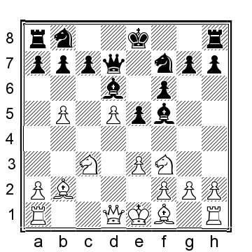

**11.e4** 11.Nh4!? Bg6 12.Be2 очень хорошо для белых. **11...Bg4 12.h3 Bxf3 13.Qxf3 0-0 14.Bd3 Qe7 15.0-0 Nd7 16.Bc2 Nh6** 16...Ba3 с целью размена чернопольных слонов было лучшим выбором, но Пильсбери беспокоился о своей пешке c7, которая станет мишенью на открытой линии c, и поэтому выбрал более пассивную расстановку. **17.Qe2 g5 18.a4 Kh8 19.Nd1 Rg8 20.Ne3 Nf8 21.Qh5 Qg7**

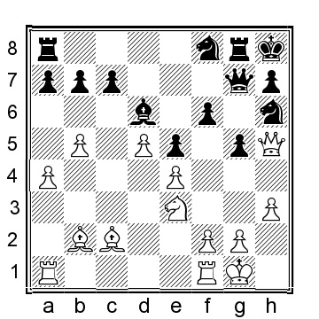

22.Ng4 Черные полностью переиграны и лишены контригры. Энглиш здесь решил разменять коней, чтобы вскрыть вертикаль h, но гораздо лучше было бы терпеливее играть на прорыв на ферзевом фланге, например, 22.g3 Ng6 23.Kh1 (чтобы пресечь возможные трюки с ...Nf4 у черных) 23...Raf8 24.Rac1 b6 25.Bd3 Rf7 26.Nc4 Bc5 27.Ba3 Bxa3 28.Nxa3 и белые выигрывают. 22...Nxg4 23.hxg4 Ng6 24.g3 Ne7 25.Kg2 Qg6 26.Rh1 Qxh5 27.Rxh5 Ng6 28.Rah1 Rg7 29.Ra1?! Здесь Энглиш начал немного терять интригу, видимо, расстроившись, что не может найти выход. Лучшим вариантом было 29.Rh6 Kg8 30.Bd3 b6 31.Bc3 с последующим a4-a5 с давлением на ферзевый фланг. Прорыв вряд ли произойдет сразу, потому что черные сильны, но они будут долго мучиться, прежде чем белые согласятся на ничью. 29...Nf8 30.Rhh1 Nd7 31.Kf1?! a6 32.Ke2, и здесь игроки согласились на ничью. У черных уже не хуже. Возможным продолжением может быть 32...axb5 33.axb5 Rgg8 34.Bc3 Nb6 и белые уже не смогут добиться прогресса. ½-½.

По словам Сокольского, Энглиш играл и другие партии с 1.b4, но я нигде не смог найти записи о них.

В другой партии, тоже 1896 года, также между двумя лучшими игроками мира, наблюдалось следующее действие:

Карл Шлехтер - Зигберт Тарраш
Нюрнберг 1896

1.b4 d5 2.Bb2 Bf5 3.e3 e6 4.b5 Nf6 5.Nf3 c5 6.bxc6?! Непонимание позиции. Конечно, 6.c4 или 6.Be2 были лучшими вариантами. 6...Nxc6 7.Be2 Bd6 7...Be7!? 8.0-0 h6 9.c4 0-0 10.cxd5 Nxd5 11.Nc3 Nxc3 12.Bxc3 Rc8 13.Qb3 Qe7 14.Nd4? 14.a4 с последующим Qb2 - гораздо лучший выбор. После этого хода ферзь белых попадает в беду. 14...Nxd4 15.Bxd4 Bc2! 16.Qb5 a6 17.Qh5 Bg6 17...b5!? 18.Qf3 e5 Здесь в единственном доступном источнике партия записана как ничья, но, как упоминает Сокольский, у черных лучшие шансы, причем явно лучшие. Так что ничья в этой конкретной позиции кажется маловероятной. ½-½

Следующим игроком мирового класса в этой позиции был польский гроссмейстер Савелий Тартаковер. Он применил ее в матче 1919 года против венгра Рихарда Рети.

**Савелий Тартаковер - Ричард Рети**
Vienna 1919

**1.b4 e5 2.Bb2 f6 3.e4 Bxb4 4.Bc4 Ne7 5.f4**

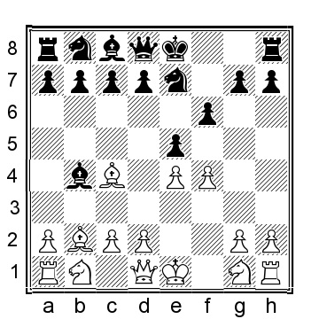

Это приводит игру к странному варианту королевского гамбита. **5...d5 6.exd5 Bd6 6...exf4**, как сыграл Колль в более поздней партии, также является вариантом. **7.fxe5 fxe5 8.Qh5+ Ng6 9.Nf3 Nd7**

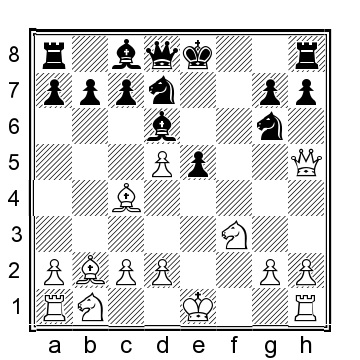

**10.0-0?** Белые продолжают в романтической манере королевского гамбита, но данный ход, на самом деле, не особенно хорош. Неопробованный вариант - 10.Qg5!? Be7 (если 10...Qxg5, то 11.Nxg5 0-0 12.Nc3 Rf4 13.Be2 дает белым незначительный перевес) 11.Qe3 с интересной позицией; мой компьютер теперь предлагает несколько совершенно безумных позиций, например, 11...Nb6 (или 11...b5!?) 12.Bb3 Nxd5 13.Qe4 c6 14. 0-0 Rf8 15.Nxe5 Qb6+ 16.Bd4 Rxf1+ 17.Kxf1 Bf5 18.Qxd5 cxd5 19.Bxb6 axb6 20.Nf3 с равными шансами в эндшпиле по мнению кремниевого зверя; я менее убедителен, но при таком количестве дисбалансов трудно оценить точно. **10…0-0 11.Nc3 Rf4 12.d3?! Nf6 13.Qg5 h6?** Черные могли улучшить путем 13...Qe8!, угрожая 14.-- 14 h6 15.Qg3 Rxc4 16.dxc4 e4 с большим перевесом у черных. 14.Qg3 e4? Ненужное и преждевременное. После 14...Bd7 у черных был бы комфортный перевес. **15.Nxe4 Nxe4 16.dxe4 Bg4 17.Qe1?** Белые могут улучшить ситуацию путем 17.Bd3! Bh5 (еще хуже 17...Rxe4?? 18.Qf2! и белые выигрывают) 18.e5 и у белых явное преимущество. **17...Bxf3 18.Rxf3 Rxf3 19.gxf3 Qg5+**

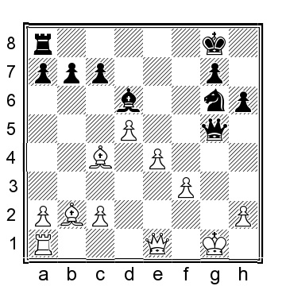

У белых лишняя пешка и пара слонов, что звучит как огромный плюс для белых, но с другой стороны, король белых открыт, слон на с4 беден, а у черных отличный контроль над темными клетками. По мнению компьютера, шансы примерно равны, но я должен признать, что в этой позиции я бы предпочел играть черными. **20.Kh1 Qh5 21.Qf2 Rf8 22.Be2 Be5 23.Bxe5 Qxe5 24.Rg1 Nf4** Компенсация черных не вызывает сомнений: конь на f4 великолепен, а белопольный слон белых по-прежнему жалок. **25.Bf1 Rf6?!** Теперь черные начинают играть менее точно. При 25...Qc3 черные держат белых на привязи, хотя компьютер находит привлекательной ничью после 26.Bd3 (возвращая лишнюю пешку) 26...Nxd3 (можно рассмотреть и 26...g5!?) 27.cxd3 Qxd3 28.Rxg7+!!! Kxg7 29.Qg3+ с вечным шахом. **26.Qxa7 Rb6?!**

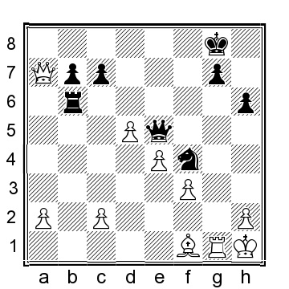

Черным следовало играть 26...Qc3 27.Qf2 g5 с полной компенсацией за пожертвованную пешку. 27.d6!? лучше было сыграть 27.Qa5!, намереваясь вернуть ферзя на d2 с явным преимуществом. 27...Qxd6??? ужасная ошибка: черным следовало сыграть 27...Rxd6! 28.Qb8+ Kh7 29.Qxc7 Ne6 30.Qb8 Qf4 31.Be2 и у белых, возможно, чуть лучше, но у черных все равно очень разумная компенсация за пожертвованную пешку. 28.Bc4+! Kh7 29.Qb8! это, несомненно, то, чего не хватало черным. Теперь белые выигрывают относительно легко. 29...Ne6 30.Bxe6 Qxe6 31.Qxc7 Qf6 32.Rxg7+ Qxg7 33.Qxb6 черные сдались. 1-0
Эта партия вдохновила Рети попробовать дебют в одной из своих партий белыми:

Ричард Рети - Абрахам Спейер
Шевенинген 1923

1.b4 d5 2.Bb2 Nf6 3.f4? Слишком экстравагантно. 3...Qd6! немедленно используя тот факт, что невозможно держать обе пешки под защитой. 4.Be5 Qb6?! нет ничего плохого в 4...Qxb4! 5.Bxc7 Nbd7, когда у черных уже очень большой перевес. 5.e3 Bg4?! и снова напрашивалось 5...Qxb4!? 6.Nf3 Nbd7 7.Nc3 e6 8.Bd4 Qd6 9.Nb5 теперь у белых положение уже лучше. 9...Qc6 10.Nxa7 Rxa7 11.b5 Qd6 12.Bxa7 b6 пытаясь поймать слона на a7. Непосредственной угрозой является ...Qa3. 13.a4 Ne4? Лучшим вариантом было 13...Bxf3 14.Qxf3 Be7, когда черные все еще в игре. 14.a5 Be7 15.Be2 Bf6 16.c3 белые близки к победе. 16...0-0 17.Nd4 Bxe2 18.Qxe2 e5 19.Nc6 exf4 20.0-0 fxe3 21.Qxe3 Bg5 22.Qd4 Bxd2 23.axb6 Bxc3 24.Qxd5 Bxa1 25.Qxe4 Nf6 26.Qc4 Re8 27.b7 и черные сдались.
1-0

До следующей партии Тартаковера с 1.b4 было несколько связанных и значимых партий. Они были очень в духе эпохи гипермодерна.

Арон Нимцович - Ричард Рети
Карловы Вары (Карлсбад) 1923

1.Nf3 Nf6 2.c4 g6 3.b4 теперь мы вступаем на "территорию орангутангов", избегая популярных линий индийской королевской, и вместо этого вступаем в линии, которые классифицируются как английский дебют.

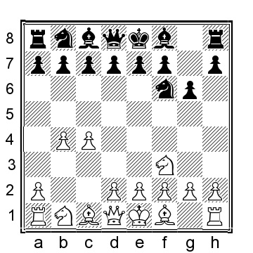

**3...a5** это продвижение невероятно распространено, даже в наши дни и у сильных игроков, но, на мой взгляд, оно ошибочно, позволяя белым свободно играть b4-b5. Лучше обычное 3...Bg7. 4.b5 Bg7 5.Bb2 порядок ходов, выбранный белыми в партии, дает белым дополнительную возможность, которую нельзя получить через порядок ходов, используемый в нашем репертуаре: 5.e3 0-0 и теперь вместо обычного 6.Bb2, которая привела бы нас к нашим репертуарным позициям, у белых есть увлекательное, провокационное, и некоторые даже могут сказать "похожее на Нимцовича" 6.Ba3!? d6 (или 6...d5 7.Nc3 c6 8.d4, где слон довольно хорошо расположен на a3, фактически, достигая позиции из Грюнфельда, где белые получили довольно массивные 5.5/6 в моей базе данных!) 7.Nc3 e5 8.Be2 Nbd7 (или 8...e4 9.Nd4 Re8 10.0-0 Nbd7 11.h3 Nc5 12.Rb1 Bd7 13.f4 и у белых хорошая игра) 9.0-0 Re8 10.d3, где белые достигли улучшенного варианта по сравнению с нашими рекомендациями в Главе 4. **5...0-0 6.e3 d6 7.d4 Nbd7 8.Be2 e5 9.0-0 exd4 10.exd4 Re8**

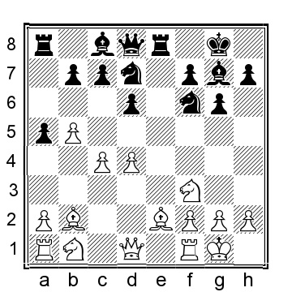

Хотя у белых больше пространства, позиция черных вполне играбельна, и, объективно говоря, шансы примерно равны. 11.Nbd2 Nf8 12.Re1 Ne6 13.g3 h6!? 14.Bf1 Ng5 15.Nxg5 hxg5 16.Bg2 d5 17.Rxe8+ Qxe8 18.cxd5 Qxb5 19.Qb3 Bd7 20.Qxb5 Bxb5 черные успешно решили свои дебютные проблемы и теперь шансы как минимум равны. Однако, что весьма примечательно, в оставшейся части партии, которую я оставлю без комментариев, стрелка едва удаляется от отметки равенства. 21.Rc1 Re8 22.Rxc7 Re1+ 23.Nf1 Bxf1 24.Bxf1 Nxd5 25.Rxb7 Rb1 26.Rb8+ Kh7 27.Rb5 Nc7 28.Rb7 Ne6 29.Kg2 Bxd4 30.Rxf7+ Kg8 31.Re7 Rxb2 32.Bc4 Rxf2+ 33.Kh3 Rf6 34.Bxe6+ Kf8 35.Rd7 Rxe6 36.Rxd4 Re5 37.Rd6 Kf7 38.Ra6 Rc5 39.Kg4 Rd5 40.Kh3 Kg7 41.a4 g4+ 42.Kxg4 Rd4+ 43.Kg5 Rd5+ 44.Kh4 Rc5 45.Kh3 Kh6 46.Rf6 Rc4 47.Rf4 Rb4 48.Kg4 g5 49.Rxb4 axb4 50.a5 b3 ½-½

К веселью присоединился даже будущий чемпион мира Алехин:

Александр Алехин - Джон Артур Джеймс Древитт
Портсмут (Southsea) 1923

**1.Nf3 d5 2.b4 e6 3.Bb2 Nf6 4.a3 c5 5.bxc5 Bxc5 6.e3 0-0 7.c4 Nc6 8.d4 Bb6?!** Слону не место на b6; лучше было вернуть слона в другом направлении: 8...Be7. **9.Nbd2 Qe7 10.Bd3 Rd8 11.0-0 Bd7 12.Ne5 Be8 13.f4 Rac8 14.Rc1 Nd7?!** Лучшим вариантом было 14...Ba5. 15.Nxc6 Rxc6? Нужно было играть 15...bxc6 16.c5 Bc7 17.Bc3 Rb8, когда черные еще в игре. 16.c5 Nxc5 17.dxc5 Bxc5 18.Rf3 Bxa3? 19.Rxc6 Bxc6 20.Bxh7+ Kxh7 21.Rh3+ Kg8 22.Bxg7 это не самый сильный ход, но его хватило, чтобы заставить черных сдаться. Еще лучше было сыграть 22.Qh5 f6 23.Bxa3 Qxa3 24.Qh8+, выиграв ладью. 1-0

Затем состоялся турнир в Нью-Йорке 1924 года, где Тартаковер, после посещения зоопарка Центрального парка и встречи с живущим там орангутангом Сьюзи, почувствовал достаточное вдохновение, чтобы снова сыграть 1.b4 и назвать дебют "Орангутанг". В результате получился отличный поединок.

Савелий Тартаковер - Геза Мароци
Нью-Йорк 1924

1.b4 Nf6 2.Bb2 e6 3.b5 d5 4.e3 Be7 5.f4 В этом ходе есть определенная логика, поскольку белые укрепляют контроль над полем e5, но он также делает общую пешечную структуру белых более уязвимой, например, добавляет черным возможности сыграть ...c7-c5 с последующим ...d5-d4 в некоторых позициях.
Поэтому я не рекомендую белым игрокам выбирать эту линию.

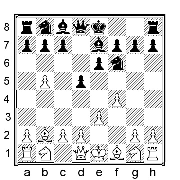

5...0-0 6.Bd3 a6 7.a4 axb5 8.axb5 Rxa1 9.Bxa1 Nbd7 10.Nf3 Ne4 11.0-0 f5?! Черные пытаются зацепиться за поле е4, но это оставляет черным взамен несколько постоянно слабых темных полей. Лучшим выбором для черных было 11...Ndc5 12.Bd4 b6, которое компьютер оценивает как примерно равное, хотя, должен признаться, позиция белых мне все же нравится больше. 12.Be2!? У белых будет небольшой, но явный позиционный перевес после 12.c4 Ndc5 13.Be2, когда слабые темные поля очевидны. 12...Nd6 13.Qc1 Bf6 14.Na3 c6 15.bxc6 bxc6 У черных типичная пешечная структура Стоунволла, и темные слоны вот-вот уйдут с доски, оставив черным долгосрочные проблемы.

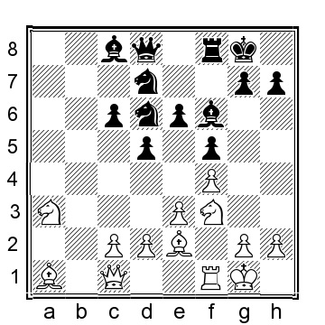

16.Ne5?! Стандартная идея в стоунволле: поставить коня на е5, но Тартаковер явно либо пропустил, либо недооценил ответ черных. Лучшим выбором было 16.Nd4!? Bxd4 17.exd4, когда у белых чуть лучшие шансы. 16...Bxe5! Это неочевидное решение, но это смелый и очень хороший размен, несмотря на отказ от чернопольного слона. 17.fxe5 Nf7 18.d4 Ng5 Таков был план черных. Конь оказывается на e4, где он поддержит возможный прорыв ...c6-c5. Слон белых на темных полях (?) не является счастливой фигурой, и кажется маловероятным, что он вернется к жизни в ближайшее время. 19.c4?! Усугубляя ситуацию. Белым следовало сыграть 19.Nb1 Qa5 20.Bc3 Qa4 21.Qa3 Qxa3 22.Nxa3 Ne4 23.Nb1 c5, когда шансы примерно равны. 19...Ba6! Сильный ход, не позволяющий белым разменяться на d5 или сыграть c4-c5 из-за блокады пешки c4, а также из-за того, что размен легких слонов навсегда отдаст поле e4 коням черных, а белые останутся с несчастным слоном на a1. 20.Re1 Qa8! Еще один сильный ход, защищающий слона и одновременно подготавливающий ...Rb8 и ...Nb6. 21.Bc3 Rb8 22.Qc2 Ne4 22...Nb6!? возможно, еще сильнее. 23.Bd3 Rb7?!

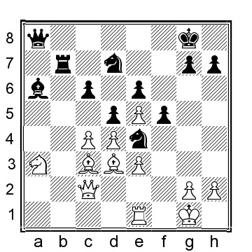

И снова сильнее 23...Nb6!??, когда 24.Ra1 Qb7 25.Rb1 Qc8 дало бы черным минимальный перевес. 24.Rc1?! Плохой выбор. Вместо этого 24.Bxe4 fxe4 25.Qa4 Ra7 26.Qb4 сохранило бы шансы примерно равными. Данный ход - первый из нескольких некачественных ходов. 24...Nb6 25.Be1?! h6! 26.Bxe4?! dxe4? Здесь 26...fxe4! оставляло черным явное позиционное преимущество, так как белые теперь сталкиваются с реальными проблемами на вертикали f, где ладья, поддерживаемая недавно проснувшимся слоном на a6, может нанести реальный ущерб. 27.Qc3 27.Qd2 Na4 28.Ra1 оставляет шансы примерно равными.
27...Nd7 28.Rb1 Или 28.Ra1 Ra7 29.Rb1 и у белых все в порядке. 28...Rxb1 29.Nxb1 Qb7 30.Na3 Qb6 31.Bd2 Kf7 32.g3? Отвратительное решение, очевидно, направленное на то, чтобы помешать черным в какой-то момент сыграть ...f5-f4, но 32.Be1 было бы лучшим выбором. Теперь у черных снова положение лучше. 32...Nf8 32...c5! было бы гораздо лучше, не позволяя белым играть Qb4. Возможным продолжением было бы 33.d5 Bb7 34.Nb5 exd5 35.Qa5 (но не 35.Nd6+??Ke6!, когда черные выигрывают) 35...Kg6 36.Qxb6+ Nxb6 37.Nd6 Nxc4 38.Nxc4 dxc4 с вероятной ничьей, но белым все равно пришлось бы некоторое время помучиться. 33.Qb4 Qxb4 34.Bxb4 Теперь, похоже, партия закончится банальной ничьей. Но два игрока, оба из которых были еще живы и получили гроссмейстерское звание, когда ФИДЕ в 1950 году раздавала первые звания гроссмейстеров, все же сумели сделать партию легкой благодаря некоторым неточностям с обеих сторон. 34...Nd7 35.Ba5 g5 36.Kf2 Ke8 Или 36...Kg6 37.Ke2 c5 38.Nb5 Kf7 39.Kd2 cxd4 40.exd4 f4 41.Nd6+ Kg6 42.Kc3 e3 43.Kd3 Nb8?!
Не лучший вариант, черным следовало искать контригру королем, например, 43...Kh5!? 44.Ke4 Kg4 45.gxf4 gxf4 46.h3+ Kg3 47.Be1+ Kxh3 48.Kxf4 e2 49.d5 Nf8 и черные, похоже, держатся. 44.Ke4 Nc6 45.Bc3 e2? Очевидно, но плохо. Вместо этого 45...fxg3 46.hxg3 Ne7 47.Kxe3 Nf5+ 48.Kf3 h5 49.Bb2 Ne7, несмотря на потерю пешки, должно устроить черных. 46.gxf4 gxf4

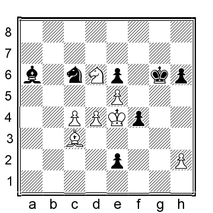

47.Bd2? Белые упускают свои шансы. Здесь 47.d5 f3 48.Be1 Ne7 49.dxe6 Nc6 50.Kf4 Kg7 51.Bh4 давало бы белым отличные шансы на победу, но такой тип позиции не поддается точной оценке, особенно в конце длинной, трудной партии. 47...f3 У черных несколько путей к ничьей, но этот кажется самым простым. 48.Kxf3 Nxd4+ 49.Ke3 Nf5+ 50.Kxe2 Nxd6 51.exd6 Bxc4+ 52.Ke3 Bb5 53.Kd4 h5 54.Kc5 Ba4 и игроки согласились на ничью. ½-½

А спустя всего два дня в том же турнире Рихарду Рети понадобилось оружие против действующего чемпиона мира Хосе Рауля Капабланки, и он решил, что его опыт игры черными против Нимцовича и Тартаковера достаточен для реализации идеи в этой решающей встрече.

Рихарт Рети - Хосе Рауль Капабланка
Нью-Йорк 1924

1.Nf3 Nf6 2.c4 g6 3.b4 Bg7 4.Bb2 0-0 5.g3

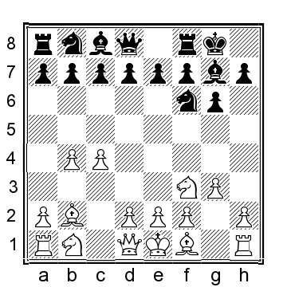

Ведя игру в ином направлении, чем Нимцович против самого Рети в партии, которую мы обсуждали выше, где белые сыграли 5.e3. 5...b6 6.Bg2 Bb7 7.0-0 d6 альтернативой является 7...c5 8.a3 (за белых можно рассматривать и 8.b5, и 8.bxc5) 8...d6 и теперь 9.d3 или 9.Qb3 ведут к позициям, где компьютер оценивает их как примерно равные, но где белые имеют тенденцию набирать очень хорошие очки. 8.d3 Nbd7 9.Nbd2 e5 10.Qc2 Re8 11.Rfd1 a5 12.a3 h6 13.Nf1 Белые могут рассмотреть и 13.e4!?, но Рети имел в виду другое расширение центра. 13...c5?

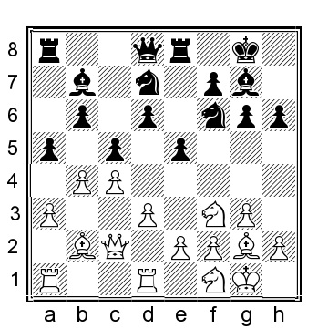

Это продвижение является ошибкой, допускающей относительно простую тактику. Вместо этого черные могли уравнять путем 13...e4 14.dxe4 Nxe4 15.Bxg7 Kxg7 16.Ne3 Qf6 с шансами для обеих сторон. 14.b5?! Удивительно, но Рети не осуждает Капабланку за этот блеф/ошибку. После 14.Nxe5! Bxg2 15.Nxd7, белые выигрывают пешку, так как попытка сохранить слона за черных путем 15...Bc6 только ухудшает положение черных после 16.Nxf6+ Bxf6 17.Bxf6 Qxf6 18.b5 Bb7 19.e4 и у белых большой перевес. 14...Nf8 15.e3 Qc7 16.d4?! белые начинают расширение центра, то, что мы, игроки Ретивого дебюта (как белые), сегодня хорошо знаем, является частью плана игры. Однако в данной позиции это не особенно хорошо. Вместо этого, 16.N1d2 Ne6 17.Ne4 было бы лучше, хотя и не особенно проблематично для черных; шансы должны быть близки к равным. 16...Be4!? 16...e4! хорошо для черных. 17.Qc3 exd4 18.exd4 N6d7? здесь 18...Ne6! было бы неприятно для белых. 19.Qd2 cxd4 20.Bxd4 у белых позиционный перевес, который, возможно, и побудил кубинского чемпиона мира пойти на авантюру, съев белую пешку с4...

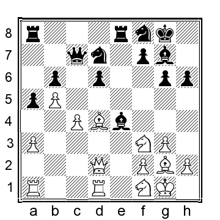

20...Qxc4? не лучшая идея. Безопаснее было сыграть 20...Nf6 21.Qb2 N8d7 22.Rac1, когда у белых приятный перевес, но черные далеко не проиграли. 21.Bxg7 Kxg7 22.Qb2+ Kg8 23.Rxd6 белые могли сделать еще лучше, например, 23.N3d2! 23...Qc2 24.Qxc2 Bxc2 25.Bxa8 Bxd1 26.Rxd1 Rxa8 27.Ne3 и белые отыграют пешку d с явным позиционным преимуществом благодаря гораздо лучше расположенным фигурам. 23...Qc5 24.Rad1 Ra7?! 25.Ne3 Qh5

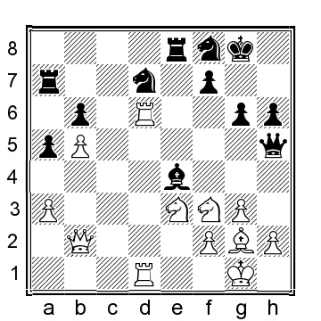

26.Nd4!? 26.R1d5! еще сильнее, например, 26...Bxd5 27.g4! Rxe3 28.gxh5 и белые выигрывают. 26...Bxg2 27.Kxg2 Qe5 Или 27...Rxe3 28.fxe3 Qxd1 (также никуда не ведет 28...Ne5 29.Qe2) 29.Nf5 и белые выигрывают. 28.Nc4 Qc5 29.Nc6 Rc7 30.Ne3 Ne5 31.R1d5 черные сдались. Возможным продолжением было 31...Nc4 32.Rxc5 Nxb2 33.Nd5 bxc5 34.Nxc7 и белые выигрывают. 1-0

Была еще одна партия Тартаковера с орангутаном, сыгранная через два года после нью-йоркского турнира:

Савелий Тартаковер - Эдгард Колл
Бардеёв (Бартфельд) 1926

1.b4 e5 2.Bb2 f6 3.e4 Bxb4 4.Bc4 Ne7 5.f4 d5 6.exd5 exf4 Рети сыграл 6...Bd6 против Тартаковера в их ауте. 7.Qf3? Лучше было сыграть 7.Qh5+!? Ng6 8.Ne2 Qe7 (В гораздо более поздней партии черные попали в беду после 8...Nd7?! 9.Nxf4 Ndf8?? (промах, но даже лучший вариант, 9...Qe7+ 10.Kd1 Qf7 11.Ne6 выглядит довольно страшным для черных) 10.0-0 Bd6 11.Re1+ Kf7 12.Nxg6? (гораздо лучше было сыграть 12.Ne6! Nxe6 13.dxe6+ Ke7 14.Nc3 c6 15.Bb3 и у белых решающий перевес) 12...Nxg6 13.Nc3 Bd7 (или 13...Rf8 14.Nb5 Kg8 15.Nd4 с явным преимуществом у белых) 14.Ne4 Ba4? (зачем туда направляется слон?) 15.Qf5 Re8 16.Ng5+ Kg8 17.Nxh7 Ne5 18.Bxe5 Bxe5 19.d6+ Kh8 20.Qh5 g6 21.Qh6 Bf4 22.Ng5#, 1-0, Шумило-Литинская, Польша 1977) 9.Bb3 Bd6 10.0-0 0-0 11.Nbc3 Nd7 с шансами для обеих сторон. 7...Bd6 8.Ne2 Ng6 9.d4

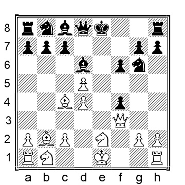

9...Qe7?! В более поздней партии черные против Шиффлера, с которым мы познакомимся в следующем разделе, продолжили 9...0-0!? 10.Bc1 b6 11.Bd3 Nh4 12.Bxh7+??? (заманчиво, но в итоге плохо; лучше было сыграть 12.Qf2) 12...Kxh7 13.Qh5+ Kg8 14.Qxh4 Re8 (или 14...Na6 15.a3 g5 и у черных должно быть гораздо лучше) 15. Kf2 g5 16.Qh5 Kg7 17.Qf3 Bf5 18.c4 c6 (18...Qd7!) 19.Bxf4 gxf4?! (или 19...Rxe2+ 20.Qxe2 gxf4 и черные выигрывают) 20.Nxf4 Bxf4 21. Qxf4 Bg6 22.Nc3 cxd5 23.Nxd5 Re4 24.Qc7+ Qd7?? (24...Nd7 все еще выигрывало за черных) 25.Rhe1 Re8?? (25...Kh8!) 26.Rxe8 Bxe8 27.Re1! (это, вероятно, ход, который черные пропустили; теперь белые выигрывают) 27...Bf7 28.Re7 и черные сдались, 1-0, Шиффлер-Сазерленд, корр. 1950. 10.Bc1?! Белым следовало отдать предпочтение 10.Nbc3!? Bf5 11.0-0 0-0 и теперь умное 12.Ba3! дало бы белым хороший перевес. 10...Bf5 11.Bd3 Bxd3 12.Qxd3 0-0 13.0-0 Re8 14.Nxf4 Nxf4 15.Bxf4 Bxf4 16.Rxf4 Na6

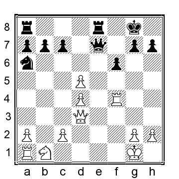

17...Nb4 1817.Nd2? Ошибка. Аналогично, на 17.Nc3? отвечает 17...Nb4 18.Qc4 Nxc2 и у черных гораздо лучше. Однако 17.a3 Qe1+ 18.Rf1 Qe3+ 19.Qxe3 Rxe3 20.Ra2 Rd8 21.c4 удерживает белых в игре, даже если у них хорошие шансы на защиту. 17...Qe3+ Черные могли получить явный перевес путем 17...Nb4! 18.Qb3 Qe3+ 19.Qxe3 Rxe3 20.c4 Rae8 и фигуры черных гораздо лучше расположены в эндшпиле; белым повезет выжить. 18.Qxe3 Rxe3 19.Rb1 Rc3 20.Rb2 b6?! или 20...Ra3 21.c4 с большим пространством для белых в эндшпиле, но черные должны защищаться. 21.Rf3! Размен активной ладьи черных для перехода в выгодный эндшпиль. 21...Rxf3 22.gxf3 Также можно было сыграть 22.Nxf3.
22...Rd8 23.c4 Nb8?! черным следовало играть 23...c6 24.dxc6 Rxd4 с более легкой защитной задачей. 24.Kf2 Kf7 25.a4 c6 26.dxc6 Nxc6 27.d5 Na5 28.Ke3 Nb7?! 28...g5 29.Kd4 было лучшим выбором. 29.Kd4 Rc8 30.Ne4 белые могли сыграть точнее 30.h4 h6 31.h5 g5 32.hxg6+ Kxg6 33.Ne4 и у белых явно лучше. 30...h6??

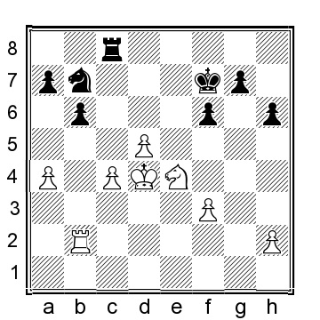

Черные могли защищаться путем 30...f5 31.Nc3 Na5 32.Rb4, когда у белых лучше, но очень далеко от победы. 31.a5! Используя шаткое положение коня на b7 и связку пешки b6. 31...f5 или 31...Nxa5 32.Nd6+, форсируя короля и ладью. 32.axb6 fxe4 33.bxa7 черные сдались. 1-0

В последующие годы, однако, дебют в основном исчез из топовых партий, в основном его использовали, по словам Сокольского, польские игроки. Поэтому в некоторых кругах его называют польским дебютом.

## Шиффлер и Сокольский - авторы и практики

Первая книга об этом дебюте вышла из рук Леонхарда Шиффлера, игрока из Восточной Германии, который написал о своем опыте игры с этим дебютом. Книга "Orang Utan-Eröffnung" (Дебют орангутанга) была опубликована в 1953 году тиражом 5000 экземпляров, которые были быстро распроданы. В следующем году было заказано и выпущено второе, расширенное издание. На фотографии вы видите мой экземпляр второго издания книги.

Следует признать, что игры Шиффлера не отличались особенно высоким качеством. Тем не менее, они были увлекательными и служили для структурирования современного понимания дебюта и создания фундамента, используемого последующими авторами.

Одной из партий Шиффлера является следующая, которую он аннотировал в своей книге

Леонард Шиффлер - Хунгер
Восточная Германия Correspondence ch 1950

1.b4 d5 2.Bb2 Nd7 3.Nf3 Nb6 своеобразный ход. 4.e3 Bg4 5.h3 Bxf3 6.Qxf3 Qd6?! 6...c6 было бы лучше. 7.b5 естественно, но белые могли сделать еще лучше 7.c4!, например, 7...Qxb4 8.Bd4 e5 9.Bxe5 Nxc4 10.Bc3 Qc5 11.Bd4 Qc6 12.Nc3 с сильной инициативой у белых. 7...Nf6 8.Ba3?! 8.a4!? 8...Qd7 9.Nc3 или 9.c4 e5 10.c5 e4 11.Qf4 Na4 12.d4 с небольшим плюсом для белых. 9...g6 10.Rb1 Bg7 11.d4 0-0 12.Bd3 Ne8?! 13.Bc5 Nf6?! или 13...c6 14.a4 - очень хорошо для белых.
14.a4 Qe6?! 15.0-0 Nbd7 16.Ba3 Rfe8 17.Ne2 17.g4! 17...Nb6? если 17...Bh6, то 18.Rfc1 с явным преимуществом у белых. 18.a5 Nc8 19.Nf4 Qd7 20.c4 e6 21.c5 Или 21.cxd5 exd5 22.Rfc1 и у белых значительно лучше. 21...c6 22.bxc6 bxc6 23.a6 вторжение на 7-й горизонтали теперь неизбежно. 23...Ne7 24.Rb7 Qc8 25.Rfb1 черные полностью разбиты и лишены контригры. 25...Kf8 26.g4 Neg8 27.g5 Nd7 28.Rxd7 Qxd7 29.Rb7 выигрывая ферзя черных за счет 29...Qc8 30.Nxg6+ с матом. 29...Qe7 30.Rxe7 Kxe7 31.Qg3 Red8 32.Bb4 Ke8 33.Ba5 Rd7 34.Bc2 Rc8 35.Nd3 Ke7 36.Ba4 черные окончательно сдались. 1-0
Здесь также упоминается статья Алексея Павловича Сокольского (1908-1969) в июньском номере журнала "Шахматы в СССР" за 1953 год. Сокольский к тому времени играл в этот дебют уже более 15 лет и затем использовал его для победы над гроссмейстером Сало Флором в полуфинале чемпионата СССР:

Алексей Павлович Сокольский - Сало Флор
Полуфинал СССР (Москва) 1953

1.b4 a5 Интересно, что в своей книге по дебюту Сокольский приводит совершенно другой порядок ходов 1...e5 2.Bb2 d6 3.c4 a5 4.b5 Nf6 5.e3. 2.b5 Nf6 3.Bb2 d6 4.e3 e5 5.c4 Be7 6.Nf3 0-0 7.Be2 c6 8.Nc3 Re8 9.0-0

9...e4?! как указывает Сокольский, это активное продвижение пешки ошибочно, поскольку не согласуется с пассивной расстановкой. Вместо этого Сокольский предлагает 9...Nbd7 с последующим ...Nf8. Однако лучшим является 9...Bf5 10.d3 Nbd7 11.Rc1, когда у белых положение несколько лучше. 10.Nd4 c5 черные выталкивают коня белых из центра, но это лишь создает дополнительные слабости. Однако предложение Сокольского 10...Qc7 довольно ужасно для черных, например, 11.Rc1 Nbd7 12.Qc2 Nc5 13.f3 exf3 14.Rxf3 и белые явно лучше. 11.Nc2 Nbd7 12.d3 Вскрывая вертикаль d, обращая внимание на отсталую d-пешку черных. 12...exd3 13.Qxd3 Ne5 Или 13...Nb6 14.e4 Be6 15.Ne3 с пассивной позицией без особых надежд на контригру за черных. 14.Qd2 Be6 15.Na3! конь на a3 расположен не особенно удачно, но он защищает важную пешку c4 и дает белым время для атаки пешки d6. Конь на e5 - единственная полуактивная фигура черных, но его легко отбить. 15...Bf5 16.f3 Ned7 17.e4 Bg6 18.Rad1 Nb6 19.Nc2

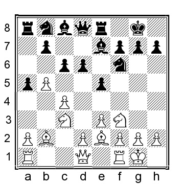

Черные полностью переиграны (?разгромлены, выдохлись). Теперь наступает отчаяние... 19...d5!? 20.exd5?! белые должны были захватить коня, но, понятно, думали, что размены фигур помогут черным, но это вряд ли так: 20.Nxd5 Nbxd5 21.exd5 Bd6 22.f4?! (белые могут улучшить 22.g3 Bxc2 23.Qxc2 Be5 24.Bc1 (или 24. Bxe5 Rxe5 25.f4 Re7 26.d6 Rd7 27.Bf3 и у белых положение гораздо лучше) 24...b6 25.Kg2 и у белых лишняя пешка, пара слонов и явное преимущество) 22...Ne4 дает черным инициативу, по мнению Сокольского, но 23.Qe1 явно лучше у белых. Сокольский считал, что 20.cxd5 Bd6 окажет опасное давление на диагональ h2-b8, но 21.Ne3 Qc7 22.g3 и у черных нет ничего похожего на адекватную компенсацию. 20...Bd6 21.f4!? Или 21.g3 Be5 22.Bd3 Qd6 23.Bc1 Bd4+ 24.Kh1 Qe5 25.Nb1 Rac8 26.Rfe1 и у белых явно лучше. 21...Qc7 22.g3 Bh5 23.Ne3? Не 23.Bxh5??, так как черные выигрывают после 23...Nxc4. Вместо этого 23.Qd3! выигрывает за белых, например, 23...Na4 24.Ba1 Nxc3 25.Bxh5 Nxd1 26.Bxf6 gxf6 27.Bxd1 и позиция черных - полная катастрофа. 23...Bxe2 Если 23...Qe7, то 24.Bxh5! выигрывает за белых (менее убедительно 24.Nf5 Qd7) 24...Qxe3+ 25.Qxe3 Rxe3 26.Be2 Rae8 27.Bd3 и ладья на e3 уйдет, оставляя белым выигрышную позицию. 24.Nxe2 Ne4??? черные возвращают победу. Черные полностью вернулись бы в игру, если бы сыграли 24...Qe7 25.Nf5 Qxe2 26.Qxe2? (26.Nxd6 Qxd2 27.Rxd2 Ne4 28.Nxe4 Rxe4 не хуже для черных) 26...Rxe2 27.Bxf6 Bf8! (27...gxf6 28.Nxd6 явно лучше у белых; 27...Nxc4 28.Bxg7 Rxa2 29.Bf6 и белые выигрывают) 28.Be5 g6 29.Nh4 Rxa2 и у черных явно лучше за счет пропущенной пешки "а". 25.Qd3 Qd7 26.Kg2 h5 27.Nc3 Nf6 28.Nb1 Ng4 29.Nxg4 Qxg4 30.Nc3 f5

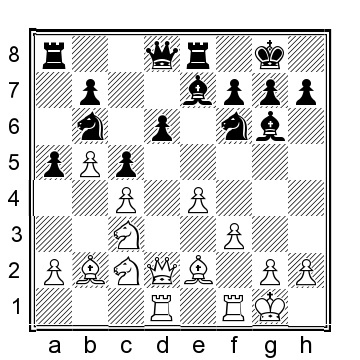

31.Rde1 Белые отдают пешку для продвижения ладьи. 31...Rxe1 32.Rxe1 Bxf4 33.Re6 Bc7 Или 33...Nd7 34.h3 Qg5 35.Ne2 Bc7 36.d6 Bb6 37.Qd5 Kh7 38.Bc1 и позиция черных полностью рушится. 34.d6 Bd8 35.h3 Qxc4 36.Qxf5 Bf6

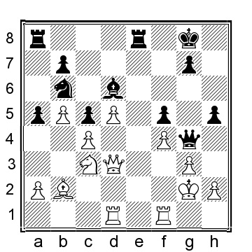

37.Rxf6! белые решительно прорываются. 37...gxf6 38.Qg6+ Kf8 39.Qxf6+ Qf7 40.Qh6+ Ke8 41.Ne4 Qd5 42.Qh8+ и черные сдались. 1-0

Десять лет спустя, в 1963 году, вышла книга Сокольского "Дебют 1.b2-b4 (Дебют Сокольского)" с предисловием известного советского гроссмейстера и теоретика дебютов Исака Болеславского. В следующем году книга была переведена на немецкий язык и опубликована в 1965 году восточногерманским издательством Sportsverlag под названием "Die Eröffnung b2-b4 (Sokolski- Eröffnung)" (Дебют b2-b4 - дебют Сокольского). Сокольский был международным мастером и гораздо более сильным игроком, чем Шиффлер. Поэтому анализ партий в книге был гораздо более тщательным, в нем было представлено множество блестящих анализов и идей, сформировавших современное понимание дебюта. В книге много партий Сокольского, как его зачетных, так и заочных, а также партий его ученика Бориса Николаевича Каталымова (1932-2013), который, кстати, много лет спустя, в 1995 году, стал серебряным призером чемпионата мира по шахматам среди взрослых.

## Настоящее время

После Сокольского было меньше людей, несущих постоянный факел дебюта. Тем не менее, несколько человек все же вспоминается. Оригинальные умы, такие как международные мастера Михаил Басман из Англии и Герард Веллинг из Голландии, играли его с определенной частотой; то же самое можно сказать и о международном мастере Юрии Лапшуне, который также написал книгу об этом дебюте.

Другие сильные игроки, гроссмейстеры и международные мастера играли его время от времени.

Некоторые игроки по переписке также играли его регулярно, среди которых Павел Дегтерев, Азиз Курал и Генрих Мури, вероятно, наиболее примечательны. Особенно первый из них несколько раз всплывал в процессе написания этой книги, в то время как два последних имеют поистине огромное количество партий в моей базе данных. Снимаю шляпу перед ними обоими за их усилия по сохранению дебюта в качестве жизнеспособного выбора для белых.

В сетевом мире некоторые имена регулярно встречаются в связи с орангутангом: гроссмейстер Хикару Накамура (который, похоже, часто играет все в онлайновом блице), женский гроссмейстер и международный мастер Юлия Осьмак из Украины и голландский международный мастер Марк Тиммерманс, оба из которых, похоже, являются настоящими приверженцами, играющими его регулярно и с хорошими результатами.

Стоит ли мне добавить ваше имя в этот список для следующего издания этой книги? Только время покажет, но если вы не начнете сейчас, то этого точно не произойдет.
